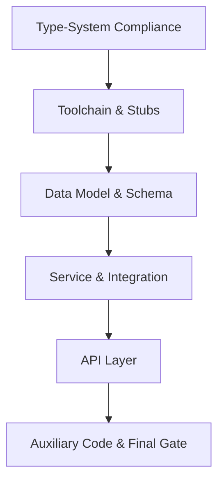

# Overall Plan — Centralized Requirements Traceability Platform

## Objectives
- Build a centralized platform linking requirements → implementation → verification with auditable provenance.
- Deliver RTM matrix (sparse, server-side pagination) and graph/flow views with exports (CSV/XLSX/PDF).
- Automate link creation via rules and parsers across Jira, Confluence, Git; support optional CI/Tests, DOORS/Excel.
- Ensure scalability (10k+ requirements, 100k+ links), non-blocking async I/O, and extensible connectors.

## Scope & Phases (Roadmap)
- P0: Foundation — data model, roles/semantics, link provenance, connectors baseline, non-blocking I/O, cache invalidation hooks.
- P1: RTM Matrix API (sparse) + coverage correctness (direction=both), saved projections, exports (async).
- P2: UI/UX — Matrix (server paginated), Graph/Flow, rule builder, drill-downs, health dashboards.
- P3: Tests/Baselines — test artifacts ingestion, baselines/snapshots, compliance exports.

## High-Level Deliverables
- Core data model: Artifacts (roles/types), Links (types/confidence/provenance), Projections/Baselines, Sync tasks, Connector configs.
- Integration connectors: Jira, Confluence, Git (webhooks/import), optional CI/Test, DOORS/Excel.
- Rule engine: user-defined linking rules, derived/materialized links, validation rules.
- Analytics: coverage/uncovered, trends, quality gates, impact analysis.
- UI: RTM matrix, graph/flow, exports, filters/search, saved projections.
- Security/Governance: authz, secret management, audit log, guardrails on imports.

## Cross-Cutting Concerns
- Performance: sparse matrix queries, indices, cache with invalidation on link changes/sync completion.
- Reliability: circuit breakers, retries, background tasks (Celery), observability (metrics/logs/traces).
- Extensibility: connector abstractions, pluggable link types/roles, modular rule executors.

## Risks & Mitigations
- Event-loop blocking: enforce async/httpx or offload to threads; add lint/check.
- Data correctness: bidirectional coverage semantics; provenance stored; baselines for audit.
- Scale: enforce pagination, column limits, indices on artifacts/links; cache matrix.
- UX performance: virtualized grids, server-side pagination; limit columns, grouping/search.

## Visualizations
- High-level architecture (API/UI/workers/connectors/DB/cache/metrics).
- ERD: Artifacts, ArtifactLinks, Projections, Baselines, SyncTasks, ConnectorConfigs.
- Traceability flow: Confluence page → Jira requirement → Git commit/PR → Test case/run (link types/directions).
- Roadmap swimlane: P0→P1→P2→P3.

## Plan Addendum — Full Type-System Compliance

### Addendum Goal
- Achieve a fully green static type check across core code, tests, scripts, and migrations.
- Enforce strict typing with no local opt-outs or bypasses.

### Addendum Task Decomposition Tree
```text
plan_01 Overall Plan
`-- plan_09 Type-System Compliance (estimated XX hours)
    |-- plan_10 Toolchain and Stubs Alignment (estimated XX minutes)
    |-- plan_11 Data Model and Schema Typing (estimated XX minutes)
    |-- plan_12 Service and Integration Typing (estimated XX minutes)
    |-- plan_13 API Layer Typing (estimated XX minutes)
    `-- plan_14 Auxiliary Code Typing (tests/scripts/migrations) (estimated XX minutes)
```

### Addendum Task List (by execution order)
- plan_09 - Type-system compliance module (full static-check green).
- plan_10 - Type checker configuration, stubs, and plugin alignment.
- plan_11 - Data model and schema typing normalization.
- plan_12 - Service and integration typing alignment.
- plan_13 - API layer typing alignment.
- plan_14 - Tests, scripts, and migrations typing alignment with final gate.

## Plan Status Table

| Plan | Status (Completion) |
| --- | --- |
| plan_01_Overall_Plan | draft (0%) |
| plan_02_Architecture_and_Data_Model | completed (100%) |
| plan_03_Integrations_and_Sync | in_progress (20%) |
| plan_04_Trace_Links_and_Rule_Engine | draft (0%) |
| plan_05_Analytics_and_RTM_Matrix_API | draft (0%) |
| plan_06_UI_UX_Matrix_Graph_and_Exports | draft (0%) |
| plan_07_Security_Governance_and_Audit | draft (0%) |
| plan_08_Ops_Performance_and_Observability | draft (0%) |
| plan_09_Type_System_Compliance | completed (100%) |
| plan_10_Toolchain_and_Stubs_Alignment | completed (100%) |
| plan_11_Data_Model_and_Schema_Typing | completed (100%) |
| plan_12_Service_and_Integration_Typing | completed (100%) |
| plan_13_API_Layer_Typing | completed (100%) |
| plan_14_Auxiliary_Code_Typing | completed (100%) |

### Addendum Visualization (Minimal)

