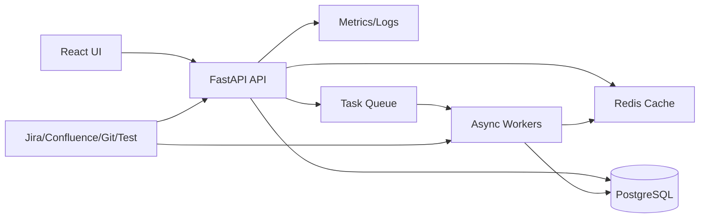

# Architecture & Data Model

## Goals
- Define target architecture (API, workers, connectors, cache, DB, metrics).
- Establish core data model for artifacts, links, projections, baselines, sync tasks, connector configs.
- Enforce non-blocking I/O and clean layering.

## Work Packages
- Target architecture doc: components, data flow (sync + webhooks), cache, background jobs.
- Data model: roles/types, link semantics (implements/tests/verifies/relates/derives), provenance/confidence, projections/baselines.
- Import/layering guardrails: service→API import rules; async/httpx standards.
- Indexing/perf strategy for artifacts/links and matrix queries.

## Target Architecture (Draft)

### Components
- UI (React): dashboards, traceability matrix/graph, rule builder, exports.
- API (FastAPI): REST + WebSocket, validation, orchestration, caching hints.
- Workers (Celery/async tasks): sync runs, analytics recompute, report generation.
- Connectors: Jira/Confluence/Git/Test providers; webhooks + scheduled sync.
- Cache: Redis (tiered), cache-aside for analytics/traceability views.
- Database: PostgreSQL (primary), SQLite for local/dev; Alembic migrations.
- Metrics/Logs: Prometheus-style metrics endpoint + structured logs.

### Key Flows
- Sync flow: Connector → Worker → DB (Artifacts/Links/SyncTask/SyncState) → Cache invalidate → UI refresh.
- Webhook flow: Provider → API → Queue job → Update DB → Recompute metrics → Invalidate cache.
- Traceability flow: UI → API → DB (Artifacts/Links/Baselines/Projections) → Cache → UI.
- Analytics flow: UI → API → DB + Cache → Metrics aggregation → UI.

### Async & Layering Guardrails
- API depends on services; services do not import API modules.
- External I/O uses async clients (`httpx.AsyncClient`) or `asyncio.to_thread` for blocking libs.
- DB access via `AsyncSession`; blocking operations isolated behind worker boundaries.

### Architecture Diagram (Draft)


## Current Inventory (As-Is)

### Models (backend/app/models)
- Core domain: `User`, `Role`, `Project`, `Task`, `Sprint`, `WorkLog`, `SprintSnapshot`.
- Integrations: `IntegrationSetting`, `ConfluencePage`, `Repository`, `Commit`, `PullRequest`, `JiraFieldMapping`, `ProjectRepository`.
- Traceability: `Artifact`, `ArtifactLink`, `Source`, `SyncState`, `LegacyMapping`, `AuditLog`, `SuggestedLink`.
- Quality/Testing/Capacity: `QualityGateHistory`, `EscapedDefect`, `DefectMetrics`, `TestResult`, `CoverageReport`, `FileCoverage`, `CapacitySettings`, `TeamHealthCheck`, `CFDSnapshot`.
- Audit: `BusinessValueAudit`.

### Schemas (backend/app/schemas)
- Present: `project`, `project_repository`, `settings`, `user`, `task`, `traceability_rule`, `quality`, `testing`, `capacity`, `pagination`.
- Missing (relative to current models): traceability artifact/link schemas, suggested link schemas, sync/source schemas.

### Services (backend/app/services)
- Analytics: budget, capacity, coverage trends, DORA, forecasts, burndown, risk, quality, velocity, WIP, team health.
- Integrations: Jira (auth/circuit breaker/http client), Confluence, Git (import/webhooks), Bitbucket.
- Traceability engine: node registry, validators, flow execution (`services/traceability/engine`).
- Platform services: cache, report generation, repository resolver, rule execution, task manager, sync services.

### Documentation
- `docs/architecture-report.md`: broad system/module overview (includes traceability and API map).
- `docs/PERFORMANCE_OPTIMIZATION_ARCHITECTURE.md`: caching tiers and performance strategy.
- `docs/internal/PROJECT_STATUS.md` and `docs/internal/CONSOLIDATED_PROJECT_STATUS.md`: status/gaps and traceability flow references.

## Gaps / Open Questions
- No explicit data model for projections/baselines (mentioned in plan goals).
- No explicit sync task/job tracking model (beyond `SyncState`) or connector config entity (beyond `IntegrationSetting`/`Source`).
- Traceability flow DB model appears in docs, but no `TraceabilityFlow`-like model/schema is present.
- Traceability API schemas cover rules only; artifacts/links/suggestions lack dedicated request/response schemas.
- Link provenance is partial (confidence factors exist, but no explicit creator/source/method fields on `ArtifactLink`).

## Target Data Model (Draft)

### Core Entities
- Artifact: atomic traceability node (requirement, jira_issue, commit, pr, test_case, test_run, confluence_page, deployment, etc).
- ArtifactLink: directed edge between artifacts with a typed relationship.
- SuggestedLink: pending/auto link suggestions with similarity scores and review status.
- Source: connector instance metadata (provider, base_url, auth, scopes, settings).
- SyncTask: execution tracking for sync runs (scope, status, timing, counters, errors).
- SyncState: cursor/etag/lag state for incremental sync per source/project.
- ConnectorConfig: normalized configuration per integration provider and project.
- Baseline: frozen snapshot of traceability graph for a project at a point in time.
- BaselineItem: membership table for artifacts/links included in a baseline.
- Projection: saved subset of the graph (filters, roles, views) for reporting.
- ProjectionItem: membership table for artifacts/links included in a projection.
- TraceabilityRule: flow definition for auto-linking.
- TraceabilityRuleExecution: run history of rule executions.

### Relationships (Target)
- Project has many Artifacts, ArtifactLinks, Baselines, Projections, SyncTasks, ConnectorConfigs, TraceabilityRules.
- ArtifactLink references Artifact (from_artifact_id, to_artifact_id); links belong to Project and Tenant.
- SuggestedLink references Artifact (from/to) and optional reviewer (User).
- Source belongs to Project/Tenant; SyncState references Source and Project.
- SyncTask references Source, Project, and optionally TraceabilityRule.
- Baseline has many BaselineItems; Projection has many ProjectionItems.
- TraceabilityRule has many TraceabilityRuleExecutions.

### Link Types (Draft)
- implements, verifies, tests, deploys, derives_from, relates_to, blocks, depends_on, fixes.

### Provenance (Target Fields)
- ArtifactLink: created_by_id, created_via (manual|rule|sync), source_system, source_reference_id,
  method (keyword|semantic|api|import), confidence, confidence_factors.
- Artifact: created_by_id, source_system, source_reference_id, ingestion_run_id.
- SuggestedLink: method, similarity_score, reason, reviewed_by_id, review_note.

### Baselines and Projections
- Baseline: name, project_id, created_by_id, created_at, filters_json, description.
- BaselineItem: baseline_id, artifact_id, link_id, included_at.
- Projection: name, project_id, created_by_id, created_at, filters_json, description.
- ProjectionItem: projection_id, artifact_id, link_id, included_at.

### Sync Tasks
- SyncTask: source_id, project_id, task_type, status, started_at, finished_at, duration_ms,
  cursor_in, cursor_out, item_counts, error_code, error_message, trigger (manual|schedule|webhook).

### Connector Configs
- ConnectorConfig: provider, project_id, is_enabled, settings_json, auth_ref, rate_limit_policy,
  created_at, updated_at.

### ERD (Draft)
```mermaid
erDiagram
    PROJECT ||--o{ ARTIFACT : has
    PROJECT ||--o{ ARTIFACT_LINK : has
    PROJECT ||--o{ BASELINE : has
    PROJECT ||--o{ PROJECTION : has
    PROJECT ||--o{ SYNC_TASK : has
    PROJECT ||--o{ CONNECTOR_CONFIG : has
    PROJECT ||--o{ TRACEABILITY_RULE : has

    ARTIFACT ||--o{ ARTIFACT_LINK : from
    ARTIFACT ||--o{ ARTIFACT_LINK : to
    ARTIFACT ||--o{ BASELINE_ITEM : in
    ARTIFACT ||--o{ PROJECTION_ITEM : in
    ARTIFACT ||--o{ SUGGESTED_LINK : from
    ARTIFACT ||--o{ SUGGESTED_LINK : to

    SOURCE ||--o{ SYNC_STATE : tracks
    SOURCE ||--o{ SYNC_TASK : runs

    BASELINE ||--o{ BASELINE_ITEM : contains
    PROJECTION ||--o{ PROJECTION_ITEM : contains

    TRACEABILITY_RULE ||--o{ TRACEABILITY_RULE_EXECUTION : runs
```

## ORM Mapping vs Target (Delta)

| Target Entity | ORM Model | Status | Notes |
| --- | --- | --- | --- |
| Artifact | `app.models.traceability.Artifact` | implemented | Provenance fields added (created_by_id/source_system/source_reference_id/ingestion_run_id). |
| ArtifactLink | `app.models.traceability.ArtifactLink` | implemented | Provenance fields added (created_by_id/created_via/source_system/source_reference_id/method). |
| SuggestedLink | `app.models.traceability.SuggestedLink` | implemented | Matches draft (similarity + review fields). |
| Source | `app.models.traceability.Source` | implemented | Represents connector instance metadata. |
| SyncState | `app.models.traceability.SyncState` | implemented | Cursor/etag/lag tracking. |
| SyncTask | `app.models.traceability.SyncTask` | implemented | New; tracks sync execution status/metrics. |
| ConnectorConfig | `app.models.traceability.ConnectorConfig` | implemented | New; stores provider/project settings; overlaps with `IntegrationSetting`/`Source` scope. |
| Baseline | `app.models.traceability.Baseline` | implemented | New; snapshot header. |
| BaselineItem | `app.models.traceability.BaselineItem` | implemented | New; membership table. |
| Projection | `app.models.traceability.Projection` | implemented | New; saved graph subset. |
| ProjectionItem | `app.models.traceability.ProjectionItem` | implemented | New; membership table. |
| TraceabilityRule | `app.models.traceability_rule.TraceabilityRule` | implemented | Exists with scheduling + ownership. |
| TraceabilityRuleExecution | `app.models.traceability_rule.TraceabilityRuleExecution` | implemented | Execution logs. |
| TraceabilityFlow | — | missing | Docs mention flows; no model/schema present. |

## Change List (Add/Remove/Rename/Indexes)

### Implemented
- Added provenance fields to `Artifact` and `ArtifactLink` (creator/source/method fields).
- Added new entities: `Baseline`, `BaselineItem`, `Projection`, `ProjectionItem`, `SyncTask`, `ConnectorConfig`.
- Added schemas for traceability entities: `backend/app/schemas/traceability.py`.
- Added migration `027_add_traceability_baselines_projections_sync.py` with indexes.
- Added traceability API endpoints for baselines/projections/connector configs/sync tasks and item-level CRUD.

### Outstanding / To Decide
- Define `TraceabilityFlow` model (if flow persistence is still required).
- Decide on consolidation between `IntegrationSetting`, `Source`, and `ConnectorConfig` to avoid overlap.
- Consider unique constraints for `baseline_items` and `projection_items` to prevent duplicates.
- Consider indexes on `sync_tasks.status`, `sync_tasks.started_at` for monitoring queries.
- Confirm whether `ArtifactLink` should enforce provenance non-null for auto-links vs manual links.

## Indexing & Performance Strategy (Draft)

### Artifacts
- Composite index for identity lookup: `(tenant_id, project_id, type, source, external_id)`.
- Query indexes: `(project_id, type)`, `(project_id, status)`, `(project_id, updated_at)` for dashboards.
- Full-text search candidates (if enabled): `title`, `display_key`, `external_id` (use DB FTS where supported).

### Links
- Directional indexes: `(from_artifact_id, link_type, to_artifact_id)` and `(to_artifact_id, link_type, from_artifact_id)`.
- Project scoping index: `(project_id, link_type)` for matrix/coverage queries.
- Confidence filter index: `(project_id, confidence)` to speed high-confidence filtering.

### Matrix Queries
- Denormalized materialized view/cache keyed by `(project_id, filters_hash)` for large matrices.
- Limit column/row cardinality (server-side pagination + column limits).
- Precompute link counts per artifact_type pair to speed coverage summaries.

### Baselines/Projections
- Membership indexes: `(baseline_id, artifact_id)`, `(baseline_id, link_id)`; same for projections.
- Optional uniqueness constraints on `(baseline_id, artifact_id)` and `(baseline_id, link_id)` to prevent duplicates.

### Sync & Monitoring
- Sync task indexes: `(project_id, status, started_at)` and `(source_id, started_at)` for dashboards.
- Source/connector lookup: `(project_id, provider)` for config retrieval.

### Caching
- Cache keys by scope: `traceability:matrix:{project_id}:{filters_hash}`, `traceability:coverage:{project_id}`.
- Invalidate on link/artifact mutations and sync completion.

## Decisions

### TraceabilityFlow
- Decision: use `TraceabilityRule` (with `flow_json`) as the persisted flow definition.
- Rationale: aligns with INoT decision report (ARCH-2026-001); avoids breaking changes without clear use cases.
- Revisit triggers: shared/template flows, full versioning requirements, or >1000 rules with content queries.

### IntegrationSetting vs Source vs ConnectorConfig
- Decision: treat `ConnectorConfig` as project-scoped configuration and routing policy; `Source` as runtime connector instance (auth/base_url/scopes).
- Keep `IntegrationSetting` for backward compatibility and admin-wide settings; plan a migration path to `ConnectorConfig` + `Source`.
- Follow-up: document precedence (project config overrides global setting) and consolidate usage in sync services.

## Progress Update
- Inventory completed for models, schemas, services, and docs.
- Draft target data model and ERD captured.
- Implemented model/schema changes for baselines/projections/sync tasks/connector configs and provenance fields.
- Import guardrail script enhanced to support multiple roots and forbid prefixes.
- Migration added for new tables/columns: `backend/alembic/versions/027_add_traceability_baselines_projections_sync.py`.
- Added traceability API endpoints for baselines/projections/connector configs/sync tasks and item-level CRUD.
- Consolidated IntegrationSetting/ConnectorConfig usage in sync services and documented precedence.
- Verification run: `backend/scripts/lint.sh`, `backend/scripts/typecheck.sh`, `PYTHONPATH=backend ... pytest backend/tests -q` (130 passed).
- Alembic upgrade completed against the dev Docker Postgres database.
- TraceabilityFlow decision recorded per `analysis_output/inot_runs/20260123_173331_traceability_flow/report.md`.

## Remaining Steps
- None.

## Visualizations
- Component diagram: UI, API, workers, connectors, DB, cache, metrics.
- ERD: Artifacts, ArtifactLinks, Projections, Baselines, SyncTasks, ConnectorConfigs.
- Traceability flow (artifact path): Confluence → Jira → Git → Tests.

## Acceptance
- Architecture approved; data model covers roles, link types, provenance, baselines; indices defined; non-blocking standards documented.
