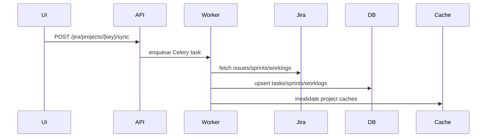
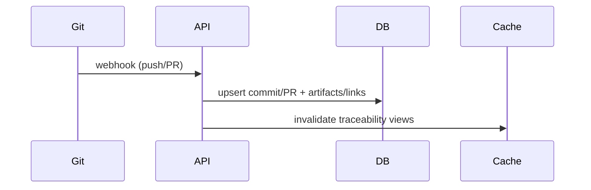

# Integrations & Sync

## Goals
- Provide connectors for Jira, Confluence, Git (webhooks/import); optional CI/Test and DOORS/Excel.
- Implement scheduled sync + webhook-driven updates with retries and circuit breakers.
- Track task progress/status; ensure non-blocking network calls.

## Work Packages
- Connector contracts: auth modes, pagination, rate limits, mapping to artifacts/roles.
- Sync engine: polling cadence, backfill, incremental updates, deduping, retries.
- Webhooks: Git push/PR/MR handling, derived links triggers.
- Task tracking: status/progress, cache invalidation hooks post-sync.
- Optional: CI/Test ingestion (JUnit/Allure/TestRail), DOORS/Excel import pathways.

## Current Inventory (As-Is)

### Connectors & Services
- Jira: `services/jira/*` (http client, circuit breaker, auth strategy, version resolver, project/board services), `jira_field_mapper`, `jira_service` facade.
- Jira sync: `services/sync/*` orchestration + `services/jira_sync.py`.
- Confluence: `services/confluence_service.py` (requests-based; endpoints use `asyncio.to_thread`).
- Git: `services/git_import_service.py` (polling import), `services/git/webhook_processor.py` (webhooks).
- Integration config: `services/integration_config.py` for project-level overrides.

### API Endpoints
- Jira: `/api/v1/jira/*` (connect/status/projects/issues/sync/boards/worklogs).
- Confluence: `/api/v1/confluence/*` (connect/status/search/spaces/pages/sync + SSE + Celery).
- Git: `/api/v1/git/*` (webhooks, metrics, CI results ingest, repositories, health).
- Repos: `/api/v1/projects/{id}/repositories/*` binding for provider/slug routing.
- Settings/health: `/api/v1/settings/*`, `/api/v1/health`.

### Tasks & Scheduling
- Celery tasks: `tasks/jira_tasks.py`, `tasks/jira_sync.py`, `tasks/confluence_tasks.py`.
- Celery beat container exists; scheduled Confluence sync stubbed.
- Task progress: in-memory task manager and SSE channels for Jira/Confluence.

### Models/State
- Integration settings: `IntegrationSetting` (global credentials).
- Project-level overrides: `ConnectorConfig` (new).
- Runtime state: `Source`, `SyncState` (present but unused), `SyncTask` (present; no producer yet).
- Git linkage: `Repository`, `ProjectRepository`, `Commit`, `PullRequest`.

## Observed Flows (As-Is)
- Jira sync: API trigger → Celery/async task → `ProjectSyncOrchestrator` → Task/Worklog/Sprint updates.
- Confluence sync: API trigger → page fetch + upsert → SSE progress optional.
- Git: webhooks ingest commits/PRs → artifacts/links → metrics/CI ingest.
- Git polling import: `git_import_service.sync_project` (called from traceability backfill).

## Gaps / Open Questions
- Jira/Confluence webhooks not implemented (polling/manual sync only).
- Scheduled sync is not wired (celery beat jobs are missing/placeholder).
- `SyncTask`/`SyncState` are not updated by sync workers (no durable progress history).
- Jira API calls are mostly sync (requests) and some endpoints call them directly → potential event-loop blocking.
- Git polling import not scheduled; no retry policy or backoff for API rate limits.
- TestRail integration exists only as settings + traceability node (no ingestion).
- CI ingest supports JUnit/Cobertura/JaCoCo but lacks mapping to baseline/projection workflows.

## Decisions (Draft)
- Keep `IntegrationSetting` as global default and allow `ConnectorConfig` to override per project (aligned with plan_02).
- Use Celery for long-running sync; FastAPI background tasks only as fallback.
- Jira/Confluence sync uses polling via Celery beat (no webhooks); see `analysis_output/inot_runs/20260123_180256_jira_webhooks_polling/report.md`.
- CI/Test scope: keep current CI ingestion formats (JUnit/Cobertura/JaCoCo) and add read-only TestRail cases+results integration with hybrid artifact mapping; see `analysis_output/inot_runs/20260123_183924_ci_test_scope/report.md`.

## Connector Contract (Draft)

### Auth Modes (per provider)
- Jira: PAT (Bearer) or Basic (email+token); stored in `IntegrationSetting` with optional per-project overrides in `ConnectorConfig.settings_json`.
- Confluence: Basic (email+token) or PAT (Bearer for Data Center); stored in `IntegrationSetting` with overrides in `ConnectorConfig.settings_json`.
- GitHub/GitLab: token-based; stored in `IntegrationSetting` with overrides in `ConnectorConfig.settings_json`.
- CI/Test: provider-specific tokens (e.g., Jenkins/GHA/GitLab CI/TestRail) stored in `IntegrationSetting` until a dedicated `Source` model is used.

### Required Fields (baseline)
- Jira: `base_url`, `api_token`, optional `email` (if Basic).
- Confluence: `base_url`, `api_token`, optional `email` (if Basic).
- GitHub/GitLab: `api_token`, optional `base_url` (self-hosted).
- Test/CI: `base_url` + token when using external provider.

### TestRail Jira Key Mapping (configurable)
- `ConnectorConfig.settings_json.testrail_jira_key_field` or `testrail_jira_key_fields` controls which
  TestRail field(s) contain Jira keys for linking; default is `refs`.

### Rate Limits (policy knobs)
- Store per-provider rate-limit policy in `ConnectorConfig.settings_json`:
  - `rate_limit_rps` or `rate_limit_per_minute`
  - `rate_limit_burst`
  - `retry_after_header`
  - `request_timeout_seconds`, `max_retries`, `backoff_base_seconds`, `backoff_max_seconds`
- Defaults (if overrides not set):
  - Jira: `rate_limit_per_minute=60`, `rate_limit_burst=10`, `max_retries=2`,
    `backoff_base_seconds=1`, `backoff_max_seconds=30`, `retry_after_header=true`.
  - Confluence: `rate_limit_per_minute=30`, `rate_limit_burst=5`, `max_retries=2`,
    `backoff_base_seconds=1`, `backoff_max_seconds=30`, `retry_after_header=true`.
  - GitHub: `rate_limit_per_minute=60`, `rate_limit_burst=10`, `max_retries=2`,
    `backoff_base_seconds=1`, `backoff_max_seconds=30`, `retry_after_header=true`.
  - GitLab: `rate_limit_per_minute=60`, `rate_limit_burst=10`, `max_retries=2`,
    `backoff_base_seconds=1`, `backoff_max_seconds=30`, `retry_after_header=true`.
  - TestRail: `rate_limit_per_minute=30`, `rate_limit_burst=5`, `max_retries=2`,
    `backoff_base_seconds=1`, `backoff_max_seconds=30`, `retry_after_header=true`.

### Retry/Backoff Policy
- Retry on timeouts/5xx with exponential backoff and max attempts.
- Record retries and last error in `SyncTask` for observability.
- Circuit breaker per provider (existing Jira breaker; add for Git/Confluence if needed).
- Settings: `INTEGRATION_HTTP_TIMEOUT`, `INTEGRATION_HTTP_MAX_RETRIES`,
  `INTEGRATION_HTTP_BACKOFF_SECONDS`, `INTEGRATION_HTTP_BACKOFF_MAX_SECONDS` (non‑Jira);
  `JIRA_HTTP_*` for Jira-specific behavior.

### Storage of Contract
- Global defaults: `IntegrationSetting` (encrypted token, base_url, email).
- Per-project overrides: `ConnectorConfig.settings_json` (provider-specific keys).
- Runtime state/health: `Source` + `SyncState` (future wiring); `SyncTask` for each run.

## Progress Update
- Inventory captured for connectors, endpoints, tasks, and model state.
- Identified missing scheduling/webhooks and lack of sync-state persistence.
- SyncTask/SyncState recording added for Jira sync, Git webhooks, and CI ingest.
- Jira/Confluence polling decision captured (ARCH-2026-002).
- Celery beat schedule added; scheduled Jira/Confluence/Git polling tasks implemented.
- Jira API endpoints now offload blocking calls to background threads.
- CI/Test ingestion scope decision captured (ARCH-2026-002 per report).
- ConnectorConfig settings schema documented with explicit keys in code.
- Required fields validation added for Jira/Confluence/GitHub/GitLab settings.
- Unified retry/backoff config added for non-Jira integrations and applied in clients.

## Remaining Steps
- Implement TestRail integration (client, sync, linker, endpoints) per CI/Test scope decision.

## Visualizations (Draft)

## Acceptance
- Connectors operational with non-blocking I/O; sync/backfill idempotent; webhook and scheduled sync paths covered; task status observable.
