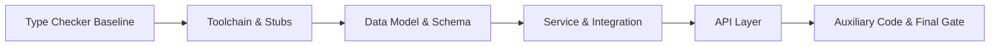
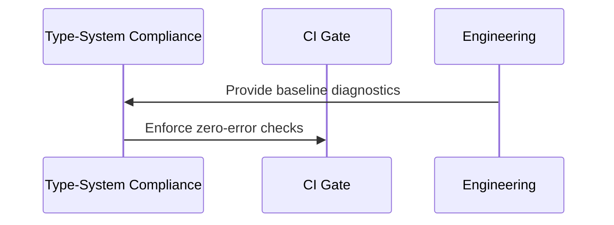

# Module: Type-System Compliance (Full Static Check Green)

## Module Overview

### Module Goal
Normalize and complete static typing across the codebase so the type checker reports zero errors across core code, tests, scripts, and migrations, without local opt-outs.

### Position in Project
This module is a cross-cutting quality gate that stabilizes long-term maintainability and prevents regressions during refactors.

---

## Dependencies

### Prerequisites
- **Prerequisite Tasks**: [plan_08 - Operations and Quality Gates]
- **Prerequisite Data**: [Current type checker reports and baseline diagnostics]
- **Prerequisite Environment**: [Type checker tooling installed and CI environment ready]

### Downstream Impact
- **Downstream Tasks**: [All future refactor and feature modules]
- **Output Data**: [Zero-error type check reports and enforced gates]

### External Dependencies
- **Third-Party Services**: [Type stubs and plugins ecosystem]
- **Database**: [No new schema required]
- **API Interfaces**: [No external interface changes]

---

## Subtask Breakdown

- [x] plan_10 - Toolchain and Stubs Alignment (estimated XX minutes)
  - Brief: Align type checker configuration, stubs, and plugins across the repository.
- [x] plan_11 - Data Model and Schema Typing (estimated XX minutes)
  - Brief: Normalize typing for data models and schema layers with strict optionality.
- [x] plan_12 - Service and Integration Typing (estimated XX minutes)
  - Brief: Fix typing in service and integration layers with consistent contracts.
- [x] plan_13 - API Layer Typing (estimated XX minutes)
  - Brief: Correct API layer typing and resolve mismatches with model contracts.
- [x] plan_14 - Auxiliary Code Typing (tests/scripts/migrations) (estimated XX minutes)
  - Brief: Bring auxiliary code under the same strict type standards and finalize gates.

## Status Table

| Plan | Status | Evidence/Notes |
| --- | --- | --- |
| plan_09 | completed | Backend lint/typecheck re-run: `backend/scripts/lint.sh` and `backend/scripts/typecheck.sh` pass; full-scope verification not re-run. |
| plan_10 | completed | Tooling configs present (`backend/mypy.ini`, `backend/ruff.toml`); local scripts added (`backend/scripts/lint.sh`, `backend/scripts/typecheck.sh`); local checks pass. |
| plan_11 | completed | Status recorded in plan metadata; no fresh verification in this pass. |
| plan_12 | completed | Status recorded in plan metadata; no fresh verification in this pass. |
| plan_13 | completed | Status recorded in plan metadata; no fresh verification in this pass. |
| plan_14 | completed | Status recorded in plan metadata; auxiliary scope not re-verified in this pass. |

---

## Visualization Output

### Module Flowchart


### System Flow ASCII Diagram (for cross-service/data pipelines)
```
+---------------------------+
| Type Checker Baseline     |
+-------------+-------------+
              |
              V
+---------------------------+
| Core Layers Alignment     |
+-----+---------------------+
      |
+-----+---------------------+        +---------------------------+
| Auxiliary Layers          |  ...   | Gate Verification         |
+-----+---------------------+        +-------------+-------------+
      V                                 V
+---------------------------------------------------------------+
| Zero-Error Report + Enforced CI Gate                           |
+---------------------------------------------------------------+
```

### Interface Collaboration Diagram


### Resource Allocation Table
| Resource Type | Owner | Time Window | Key Output | Risk/Notes |
| --- | --- | --- | --- | --- |
| Type tooling | Engineering | Phase window | Green checks | Large surface area |

---

## Technical Solution

### Architecture Design
Apply layered remediation: configuration and tooling first, then data models, services, API layer, and auxiliary code.

### Core Technology Selection
- Technology 1: [Primary type checker]
  - Selection Reason: [Consistency and ecosystem support]
  - Alternative: [Secondary checker if needed]

### Data Model
[Type contracts for core data representations and schema validation]

### Interface Design
[Layer contracts defined with explicit optionality and strict typing]

---

## Execution Summary

### Input
- [Baseline type diagnostics]
- [Existing code contracts]

### Processing
- [Sequential remediation by layer]
- [Strict policy: no local opt-outs]

### Output
- [Zero-error type check reports]
- [CI gate enforced for all relevant scopes]

---

## Risks and Challenges

### Technical Challenges
- [Wide surface area: resolve incrementally by layer]

### Time Risks
- [High volume of type issues]

### Dependency Risks
- [Third-party stubs quality]

---

## Acceptance Criteria

### Functional Acceptance
- [Type checker reports zero errors across core and auxiliary code]
- [No local ignore directives or bypasses]

### Performance Acceptance
- [Type check runtime within acceptable CI limits]

### Quality Acceptance
- [Consistent type contracts across layers]
- [CI gate blocks regressions]

---

## Deliverables List

### Code Files
- [Type annotations added or normalized]

### Configuration Files
- [Type checker configuration and plugin settings]

### Documentation
- [Typing policy and maintenance guide]

### Test Files
- [Updated tests aligned with strict typing]
