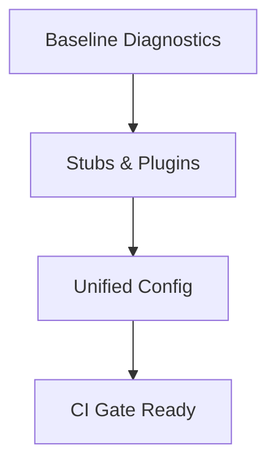

# Task: Toolchain and Stubs Alignment

## Task Overview

### Task Description
Align the type checker configuration, type stubs, and plugins to enable strict checks across all target scopes.

### Task Purpose
Establish a consistent toolchain foundation so downstream typing fixes are deterministic and stable.

---

## Dependencies

### Prerequisites
- **Prerequisite Tasks**: [plan_09]
- **Required Resources**: [Current toolchain configuration and dependency manifests]
- **Environment Requirements**: [Type checker installed in CI and local env]

### Downstream Impact
- **Downstream Tasks**: [plan_11, plan_12, plan_13, plan_14]
- **Provided Output**: [Aligned toolchain settings and stubs]

---

## Execution Steps

### Step 1: Baseline Inventory
- **Action**: Capture current type checker outputs across all scopes.
- **Input**: [Existing diagnostics and CI logs]
- **Output**: [Baseline error catalog]
- **Notes**: [Record counts and categories]

### Step 2: Stub and Plugin Strategy
- **Action**: Select and enable required stubs/plugins to reduce false positives.
- **Input**: [Dependency list and ecosystem coverage]
- **Output**: [Selected stubs/plugins set]
- **Notes**: [Avoid local ignore directives]

### Step 3: Configuration Unification
- **Action**: Consolidate strict settings and scopes into a single policy.
- **Input**: [Existing configs]
- **Output**: [Unified strict configuration]
- **Notes**: [No opt-out flags]

### Step 4: CI Gate Definition
- **Action**: Define consistent CI steps for type checking across scopes.
- **Input**: [CI pipeline definitions]
- **Output**: [Reliable, repeatable checks]
- **Notes**: [Fail-fast behavior]

---

## Visualization Aids

### Step Flowchart

### Risk Monitoring Table
| Risk Item | Level | Trigger Signal | Mitigation Strategy | Owner |
| --- | --- | --- | --- | --- |
| Incomplete stubs | Medium | Repeated false positives | Add/replace stubs | Engineering |

### File Operations List

#### Files to Create
- [Type checker policy document]
  - Type: [Documentation]
  - Purpose: [Define strict typing rules]
  - Content: [Policy overview and scope]

#### Files to Modify
- [Type checker configuration]
  - Modification Location: [Global settings]
  - Modification Content: [Strict settings and scopes]
  - Modification Reason: [Consistency across layers]

#### Files to Read
- [Dependency manifests]
  - Read Purpose: [Identify stub requirements]
  - Usage: [Select compatible stubs/plugins]

---

## Implementation List

### Functional Modules
- [Toolchain alignment]
  - Functionality: [Consistent static checking]
  - Interface: [CI gate inputs/outputs]
  - Responsibility: [Enforce strict checks]

### Data Structures
- [Error catalog]
  - Purpose: [Track remediation progress]
  - Fields: [Category, count, scope]

### Algorithm Logic
- [Baseline aggregation]
  - Purpose: [Summarize type errors]
  - Input: [Type checker output]
  - Output: [Categorized summary]
  - Complexity: [Linear in error count]

### Interface Definitions
- [CI gate contract]
  - Type: [Pipeline step]
  - Parameters: [Target scopes]
  - Return: [Pass/Fail]
  - Description: [Enforce zero errors]

---

## Execution Summary

### Input
- [Baseline diagnostics]
- [Toolchain configuration]

### Processing
- [Align stubs, plugins, and configs]

### Output
- [Unified toolchain and CI gate]

---

## Testing Requirements

### Unit Tests
- Test Scope: [Configuration validation]
- Test Cases: [Baseline parsing]
- Coverage Requirement: [N/A]

### Integration Tests
- Test Scope: [CI gate run]
- Test Scenarios: [Clean and failing runs]

### Manual Tests
- Test Point 1: [Local type check pass]
- Test Point 2: [CI type check pass]

---

## Acceptance Criteria

### Functional Acceptance
- [Type checker runs with unified config]
- [Stubs/plugins enabled and documented]

### Quality Acceptance
- [No local ignore directives]
- [CI gate enforced]

### Documentation Acceptance
- [Typing policy documented]

---

## Notes

### Technical Notes
- [Keep strict optionality consistent]

### Security Notes
- [None]

### Performance Notes
- [Type check runtime constraints]

### References
- [Toolchain documentation]
