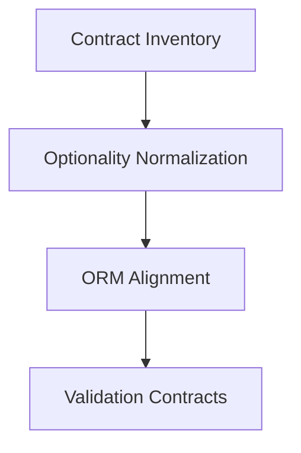

# Task: Data Model and Schema Typing

## Task Overview

### Task Description
Normalize typing of core data models and schema layers with explicit optionality and consistent field contracts.

### Task Purpose
Prevent type checker errors rooted in model/schema ambiguity and ensure consistent data contracts across layers.

---

## Dependencies

### Prerequisites
- **Prerequisite Tasks**: [plan_10]
- **Required Resources**: [Model and schema definitions]
- **Environment Requirements**: [Type checker configured for strict optionality]

### Downstream Impact
- **Downstream Tasks**: [plan_12, plan_13]
- **Provided Output**: [Stable typed contracts for data models]

---

## Execution Steps

### Step 1: Contract Inventory
- **Action**: Identify model and schema fields with ambiguous optionality.
- **Input**: [Data model definitions]
- **Output**: [Contract delta list]
- **Notes**: [Record fields needing explicit typing]

### Step 2: Optionality Normalization
- **Action**: Make optionality explicit and consistent across models and schemas.
- **Input**: [Model and schema definitions]
- **Output**: [Aligned field types]
- **Notes**: [Avoid implicit optional defaults]

### Step 3: Column vs. Runtime Types
- **Action**: Align ORM field typing with runtime data access patterns.
- **Input**: [ORM field declarations]
- **Output**: [Validated type compatibility]
- **Notes**: [Ensure runtime usage matches declared types]

### Step 4: Validation Contracts
- **Action**: Confirm schema validation types match model expectations.
- **Input**: [Schema definitions]
- **Output**: [Consistent validation contracts]
- **Notes**: [No type coercion without explicit intent]

---

## Visualization Aids

### Step Flowchart

### Risk Monitoring Table
| Risk Item | Level | Trigger Signal | Mitigation Strategy | Owner |
| --- | --- | --- | --- | --- |
| Contract drift | Medium | Persistent type mismatches | Align schema/model contracts | Engineering |

### File Operations List

#### Files to Create
- [Contract mapping reference]
  - Type: [Documentation]
  - Purpose: [Track field-level contracts]
  - Content: [Field optionality and usage rules]

#### Files to Modify
- [Model definitions]
  - Modification Location: [Field declarations]
  - Modification Content: [Explicit optionality]
  - Modification Reason: [Remove implicit optional defaults]

#### Files to Read
- [Schema definitions]
  - Read Purpose: [Validate consistency]
  - Usage: [Align model/schema types]

---

## Implementation List

### Functional Modules
- [Data model typing]
  - Functionality: [Consistent runtime types]
  - Interface: [Model/schema contract]
  - Responsibility: [Maintain strict optionality]

### Data Structures
- [Contract matrix]
  - Purpose: [Record field contracts]
  - Fields: [Field name, type, optionality]

### Algorithm Logic
- [Type alignment checks]
  - Purpose: [Detect mismatches]
  - Input: [Field definitions]
  - Output: [Remediation list]
  - Complexity: [Linear in field count]

### Interface Definitions
- [Model access contract]
  - Type: [Data contract]
  - Parameters: [Field types]
  - Return: [Validated data types]
  - Description: [Runtime compatibility]

---

## Execution Summary

### Input
- [Model and schema definitions]

### Processing
- [Normalize optionality and contracts]

### Output
- [Aligned data model and schema typing]

---

## Testing Requirements

### Unit Tests
- Test Scope: [Model/schema validation]
- Test Cases: [Optionality and null handling]
- Coverage Requirement: [Core contracts covered]

### Integration Tests
- Test Scope: [Model usage in services]
- Test Scenarios: [Typed data flow]

### Manual Tests
- Test Point 1: [Type checker clean on model layer]
- Test Point 2: [Schema validation consistency]

---

## Acceptance Criteria

### Functional Acceptance
- [No type checker errors in model/schema layers]
- [Explicit optionality everywhere]

### Quality Acceptance
- [No local ignores or casts used]
- [Contract consistency validated]

### Documentation Acceptance
- [Contract mapping documented]

---

## Notes

### Technical Notes
- [Avoid implicit None defaults]

### Security Notes
- [No new security impact]

### Performance Notes
- [No runtime overhead added]

### References
- [Typing guidelines]
