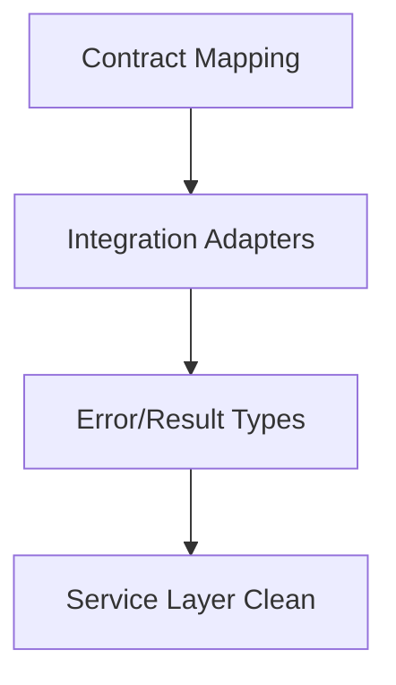

# Task: Service and Integration Typing

## Task Overview

### Task Description
Resolve type checker issues in service and integration layers by aligning contracts, return types, and error handling.

### Task Purpose
Stabilize core service boundaries so downstream API and analytics layers can rely on typed contracts.

---

## Dependencies

### Prerequisites
- **Prerequisite Tasks**: [plan_11]
- **Required Resources**: [Service layer contracts and integration adapters]
- **Environment Requirements**: [Toolchain configured with stubs/plugins]

### Downstream Impact
- **Downstream Tasks**: [plan_13, plan_14]
- **Provided Output**: [Consistent service interfaces]

---

## Execution Steps

### Step 1: Contract Mapping
- **Action**: Identify service interfaces with mismatched input/output types.
- **Input**: [Service definitions]
- **Output**: [Mismatch catalog]
- **Notes**: [Track high-impact paths first]

### Step 2: Integration Adapters
- **Action**: Align integration boundary types with external contracts.
- **Input**: [Adapter definitions]
- **Output**: [Normalized adapter typing]
- **Notes**: [No local cast-based bypasses]

### Step 3: Error and Result Types
- **Action**: Standardize result and error typing across services.
- **Input**: [Service error patterns]
- **Output**: [Consistent error contracts]
- **Notes**: [Explicit typed error models]

### Step 4: Service Layer Validation
- **Action**: Verify service layer type check is clean.
- **Input**: [Updated service definitions]
- **Output**: [Zero errors in service layer]
- **Notes**: [No ignore directives]

---

## Visualization Aids

### Step Flowchart

### Risk Monitoring Table
| Risk Item | Level | Trigger Signal | Mitigation Strategy | Owner |
| --- | --- | --- | --- | --- |
| Adapter drift | Medium | External type mismatch | Align adapter contracts | Engineering |

### File Operations List

#### Files to Create
- [Service contract reference]
  - Type: [Documentation]
  - Purpose: [Track service signatures]
  - Content: [Input/output and error types]

#### Files to Modify
- [Service definitions]
  - Modification Location: [Service interfaces]
  - Modification Content: [Typed input/output]
  - Modification Reason: [Remove type checker errors]

#### Files to Read
- [Integration adapter specs]
  - Read Purpose: [Ensure correct mapping]
  - Usage: [Align adapter typing]

---

## Implementation List

### Functional Modules
- [Service contracts]
  - Functionality: [Typed service boundaries]
  - Interface: [Input/output/error types]
  - Responsibility: [Type-safe interactions]

### Data Structures
- [Result envelope]
  - Purpose: [Standardize success/error]
  - Fields: [Status, payload, error]

### Algorithm Logic
- [Contract validation]
  - Purpose: [Detect mismatch patterns]
  - Input: [Service signatures]
  - Output: [Remediation list]
  - Complexity: [Linear in service count]

### Interface Definitions
- [Service boundary contract]
  - Type: [Internal interface]
  - Parameters: [Typed inputs]
  - Return: [Typed outputs]
  - Description: [Stable boundaries]

---

## Execution Summary

### Input
- [Service definitions]

### Processing
- [Align service and integration contracts]

### Output
- [Service layer passes strict type checks]

---

## Testing Requirements

### Unit Tests
- Test Scope: [Service input/output typing]
- Test Cases: [Error handling and result typing]
- Coverage Requirement: [Critical services covered]

### Integration Tests
- Test Scope: [Service-integration boundaries]
- Test Scenarios: [External mapping validation]

### Manual Tests
- Test Point 1: [Type check clean on services]
- Test Point 2: [Integration contract consistency]

---

## Acceptance Criteria

### Functional Acceptance
- [No type checker errors in service/integration layers]
- [Contracts consistent across boundaries]

### Quality Acceptance
- [No ignore directives or ad-hoc casts]
- [Typed errors standardized]

### Documentation Acceptance
- [Service contract reference updated]

---

## Notes

### Technical Notes
- [Prefer explicit typing to inference in boundary code]

### Security Notes
- [No new security impact]

### Performance Notes
- [No runtime penalty expected]

### References
- [Service typing guidelines]
