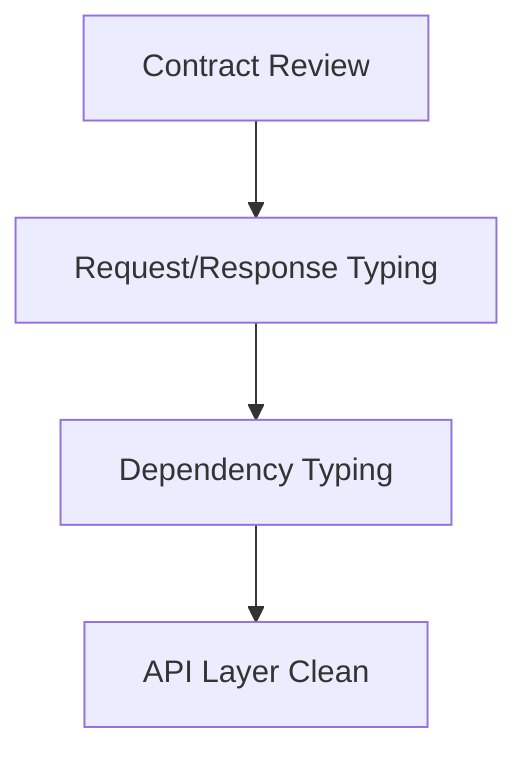

# Task: API Layer Typing

## Task Overview

### Task Description
Align API layer types with model and service contracts to eliminate type checker errors in request/response handling.

### Task Purpose
Ensure API boundaries are type-safe and consistent with service and data model layers.

---

## Dependencies

### Prerequisites
- **Prerequisite Tasks**: [plan_12]
- **Required Resources**: [API definitions and response schemas]
- **Environment Requirements**: [Strict type checking enabled]

### Downstream Impact
- **Downstream Tasks**: [plan_14]
- **Provided Output**: [API layer passes strict typing]

---

## Execution Steps

### Step 1: API Contract Review
- **Action**: Identify API handlers with mismatched types.
- **Input**: [API definitions]
- **Output**: [Mismatch inventory]
- **Notes**: [Focus on high-traffic endpoints]

### Step 2: Request/Response Typing
- **Action**: Align request validation and response types with schemas.
- **Input**: [Schema definitions]
- **Output**: [Typed request/response contracts]
- **Notes**: [Avoid runtime-only assumptions]

### Step 3: Dependency Typing
- **Action**: Type API dependencies and injected resources.
- **Input**: [Dependency definitions]
- **Output**: [Typed dependency interfaces]
- **Notes**: [Explicit types on injected objects]

### Step 4: API Layer Validation
- **Action**: Re-run type checks focused on API layer.
- **Input**: [Updated handlers]
- **Output**: [Zero API typing errors]
- **Notes**: [No local ignore directives]

---

## Visualization Aids

### Step Flowchart

### Risk Monitoring Table
| Risk Item | Level | Trigger Signal | Mitigation Strategy | Owner |
| --- | --- | --- | --- | --- |
| Contract mismatch | Medium | Errors in API typing | Align with schema/service contracts | Engineering |

### File Operations List

#### Files to Create
- [API contract mapping]
  - Type: [Documentation]
  - Purpose: [Map API to service contracts]
  - Content: [Endpoint, request, response types]

#### Files to Modify
- [API handlers]
  - Modification Location: [Request/response typing]
  - Modification Content: [Typed inputs/outputs]
  - Modification Reason: [Resolve type mismatches]

#### Files to Read
- [Schema definitions]
  - Read Purpose: [Validate API contracts]
  - Usage: [Align API types]

---

## Implementation List

### Functional Modules
- [API contract enforcement]
  - Functionality: [Typed API boundaries]
  - Interface: [Request/response types]
  - Responsibility: [Consistent API typing]

### Data Structures
- [API contract catalog]
  - Purpose: [Trace endpoint typing]
  - Fields: [Endpoint, request type, response type]

### Algorithm Logic
- [Mismatch resolution]
  - Purpose: [Fix type incompatibilities]
  - Input: [API signatures]
  - Output: [Aligned types]
  - Complexity: [Linear in endpoints]

### Interface Definitions
- [API boundary contract]
  - Type: [HTTP interface]
  - Parameters: [Typed request models]
  - Return: [Typed response models]
  - Description: [Type-safe API behavior]

---

## Execution Summary

### Input
- [API definitions and schemas]

### Processing
- [Align API typing with service/model contracts]

### Output
- [API layer passes strict type checking]

---

## Testing Requirements

### Unit Tests
- Test Scope: [API schema validation]
- Test Cases: [Request/response type coverage]
- Coverage Requirement: [Critical endpoints]

### Integration Tests
- Test Scope: [API-service interaction]
- Test Scenarios: [Contract compatibility]

### Manual Tests
- Test Point 1: [Type check clean on API layer]
- Test Point 2: [No regressions in API behavior]

---

## Acceptance Criteria

### Functional Acceptance
- [API layer has zero type errors]
- [Request/response types aligned]

### Quality Acceptance
- [No ignore directives]
- [Consistent dependency typing]

### Documentation Acceptance
- [API contract mapping updated]

---

## Notes

### Technical Notes
- [Avoid implicit casts in API handlers]

### Security Notes
- [No new security impact]

### Performance Notes
- [No runtime penalty expected]

### References
- [API typing guidelines]
