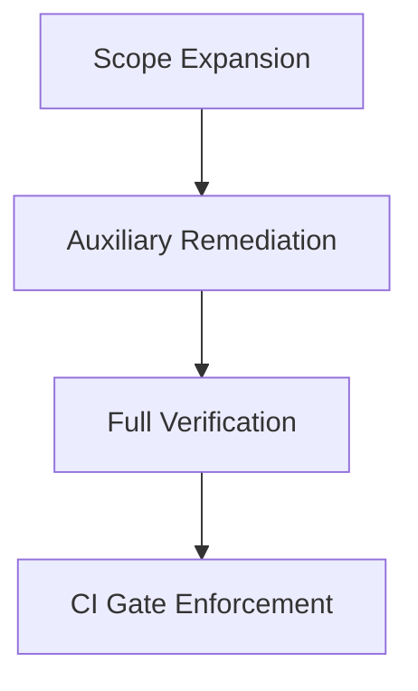

# Task: Auxiliary Code Typing (Tests/Scripts/Migrations)

## Task Overview

### Task Description
Extend strict typing to auxiliary code, including tests, scripts, and migrations, and verify end-to-end zero-error results.

### Task Purpose
Complete full-scope type compliance so the entire repository passes strict checks without exceptions.

---

## Dependencies

### Prerequisites
- **Prerequisite Tasks**: [plan_13]
- **Required Resources**: [Auxiliary code modules]
- **Environment Requirements**: [Type checker configured for full scope]

### Downstream Impact
- **Downstream Tasks**: [Quality gates in CI]
- **Provided Output**: [Full-scope green type check]

---

## Execution Steps

### Step 1: Scope Expansion
- **Action**: Enable strict checks for tests, scripts, and migrations.
- **Input**: [Scope configuration]
- **Output**: [Expanded check coverage]
- **Notes**: [No opt-out flags]

### Step 2: Auxiliary Typing Remediation
- **Action**: Resolve type errors in auxiliary code.
- **Input**: [Type error list]
- **Output**: [Clean auxiliary code typing]
- **Notes**: [No ignore directives or ad-hoc casts]

### Step 3: End-to-End Verification
- **Action**: Run full type check across all scopes.
- **Input**: [Updated codebase]
- **Output**: [Zero-error report]
- **Notes**: [Record final summary]

### Step 4: Regression Guardrails
- **Action**: Confirm CI gates enforce full scope checks.
- **Input**: [CI configuration]
- **Output**: [Stable enforcement]
- **Notes**: [Fail fast on regressions]

---

## Visualization Aids

### Step Flowchart

### Risk Monitoring Table
| Risk Item | Level | Trigger Signal | Mitigation Strategy | Owner |
| --- | --- | --- | --- | --- |
| Auxiliary drift | Medium | New errors in tests/scripts | Enforce gates and review | Engineering |

### File Operations List

#### Files to Create
- [Auxiliary typing checklist]
  - Type: [Documentation]
  - Purpose: [Track scope compliance]
  - Content: [Tests/scripts/migrations coverage]

#### Files to Modify
- [Auxiliary code modules]
  - Modification Location: [Type annotations]
  - Modification Content: [Explicit types]
  - Modification Reason: [Full-scope compliance]

#### Files to Read
- [CI scope configuration]
  - Read Purpose: [Verify full coverage]
  - Usage: [Ensure strict checks apply]

---

## Implementation List

### Functional Modules
- [Auxiliary typing alignment]
  - Functionality: [Typed tests and tools]
  - Interface: [Type-checker scope]
  - Responsibility: [Full compliance]

### Data Structures
- [Compliance checklist]
  - Purpose: [Track scope coverage]
  - Fields: [Scope, status, owner]

### Algorithm Logic
- [Final verification]
  - Purpose: [Confirm zero errors]
  - Input: [Type checker output]
  - Output: [Compliance summary]
  - Complexity: [Linear in error count]

### Interface Definitions
- [CI enforcement contract]
  - Type: [Pipeline step]
  - Parameters: [Full scopes]
  - Return: [Pass/Fail]
  - Description: [Prevent regressions]

---

## Execution Summary

### Input
- [Auxiliary code and configs]

### Processing
- [Resolve auxiliary errors and verify full scope]

### Output
- [Zero-error type check across repository]

---

## Testing Requirements

### Unit Tests
- Test Scope: [Auxiliary typing rules]
- Test Cases: [Representative scripts and migrations]
- Coverage Requirement: [Full scope included]

### Integration Tests
- Test Scope: [CI gating]
- Test Scenarios: [Pass/fail enforcement]

### Manual Tests
- Test Point 1: [Full type check pass]
- Test Point 2: [No ignore directives]

---

## Acceptance Criteria

### Functional Acceptance
- [Type checker zero errors across all scopes]
- [Strict checks applied to tests/scripts/migrations]

### Quality Acceptance
- [No ignore directives or ad-hoc casts]
- [Stable CI enforcement]

### Documentation Acceptance
- [Compliance checklist updated]

---

## Notes

### Technical Notes
- [Avoid weakening strict settings]

### Security Notes
- [No new security impact]

### Performance Notes
- [Manage type check runtime]

### References
- [Type checker scope documentation]
