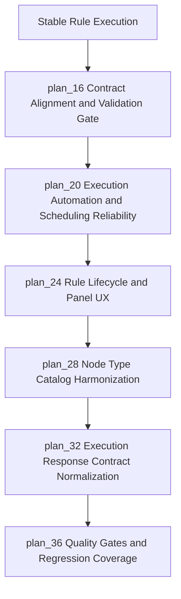
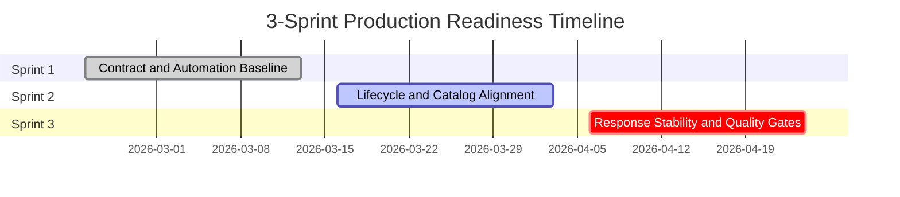
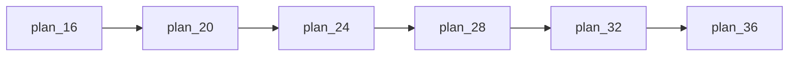

# Overall Plan: Traceability Rule Builder Production Readiness

## Project Overview

### Project Background
The rule builder capability already supports visual construction and execution, but contract misalignment and automation gaps introduce execution instability.

### Project Goals
Deliver a stable production-ready traceability rule lifecycle over 3 sprints with execution-first reliability: unified contracts, predictable scheduling, complete user lifecycle, and high-confidence regression coverage.

### Project Value
A stable and auditable rule execution capability reduces manual rework, lowers runtime failures, and improves trust in automated traceability operations.

---

## Visualization Views

### System Logic Diagram

### Module Relationship Matrix
| Module | Main Input | Main Output | Responsible Role | Dependencies |
| --- | --- | --- | --- | --- |
| plan_16 Contract Alignment and Validation Gate | Current rule contracts and validation baseline | Unified contract policy | Platform and API owners | plan_15 |
| plan_20 Execution Automation and Scheduling Reliability | Scheduling and trigger requirements | Reliable automated execution flow | Runtime reliability owners | plan_16 |
| plan_24 Rule Lifecycle and Panel UX | User lifecycle requirements | List-open-edit rule lifecycle | UX and product owners | plan_20 |
| plan_28 Node Type Catalog Harmonization | Node catalog and activation policy | Aligned UI/runtime node scope | Platform architecture owners | plan_24 |
| plan_32 Execution Response Contract Normalization | Response payload variability | Stable response contract | API contract owners | plan_28 |
| plan_36 Quality Gates and Regression Coverage | Critical release scenarios | Release readiness evidence | QA and release owners | plan_32 |

### Project Timeline

---

## Requirements Definition

### Functional Requirements
- Align field contracts between visual configuration and execution runtime.
- Realize confidence-threshold decision behavior as canonical runtime behavior.
- Ensure scheduler and trigger controls execute only through valid schedule policy.
- Provide complete rule lifecycle operations in the user panel experience.
- Normalize execution response payloads for stable consumer behavior.
- Validate critical scenarios through contract and end-to-end regression checks.

### Non-Functional Requirements
- Performance Requirements: Consistent rule execution latency with bounded variance.
- Security Requirements: Trigger governance and validation boundaries for execution requests.
- Availability: Scheduled and manual execution remain reliable under operational load.
- Maintainability: Contract changes are traceable with clear ownership.
- Compatibility: UI and runtime support a shared active node catalog.

---

## Task Decomposition Tree

```text
plan_15 Overall Plan
|-- plan_16 Contract Alignment and Validation Gate (estimated 22 hours)
|   |-- plan_17 Field Contract Unification (estimated 360 minutes)
|   |-- plan_18 Decision Confidence Threshold Contract Realization (estimated 420 minutes)
|   +-- plan_19 Server Validation Gate Before Save and Execute (estimated 300 minutes)
|-- plan_20 Execution Automation and Scheduling Reliability (estimated 20 hours)
|   |-- plan_21 Scheduler Contract Repair (estimated 360 minutes)
|   |-- plan_22 Schedule and Webhook Control Surface (estimated 300 minutes)
|   +-- plan_23 Execution Stability Safeguards (estimated 420 minutes)
|-- plan_24 Rule Lifecycle and Panel UX (estimated 20 hours)
|   |-- plan_25 Rule Catalog and Open Flow (estimated 360 minutes)
|   |-- plan_26 Rule Edit and Persistence Flow (estimated 420 minutes)
|   +-- plan_27 Panel Responsiveness and UX Latency Controls (estimated 300 minutes)
|-- plan_28 Node Type Catalog Harmonization (estimated 16 hours)
|   |-- plan_29 Canonical Node Type Policy (estimated 240 minutes)
|   |-- plan_30 Toolbox and Node Metadata Expansion (estimated 420 minutes)
|   +-- plan_31 Runtime Compatibility for Expanded Node Types (estimated 360 minutes)
|-- plan_32 Execution Response Contract Normalization (estimated 14 hours)
|   |-- plan_33 Response Schema Standardization (estimated 300 minutes)
|   |-- plan_34 Client Consumption Alignment (estimated 300 minutes)
|   +-- plan_35 Execution Reporting and Observability Alignment (estimated 360 minutes)
-- plan_36 Quality Gates and Regression Coverage (estimated 18 hours)
    |-- plan_37 Decision Branch-Handle Execution Contracts (estimated 360 minutes)
    |-- plan_38 Bidirectional Reverse Link and Scheduling Contracts (estimated 360 minutes)    +-- plan_39 End-to-End Regression Gates Across 3 Sprints (estimated 420 minutes)
```
## Task List (by execution order)
- plan_16 - Contract Alignment and Validation Gate
- plan_17 - Field Contract Unification
- plan_18 - Decision Confidence Threshold Contract Realization
- plan_19 - Server Validation Gate Before Save and Execute
- plan_20 - Execution Automation and Scheduling Reliability
- plan_21 - Scheduler Contract Repair
- plan_22 - Schedule and Webhook Control Surface
- plan_23 - Execution Stability Safeguards
- plan_24 - Rule Lifecycle and Panel UX
- plan_25 - Rule Catalog and Open Flow
- plan_26 - Rule Edit and Persistence Flow
- plan_27 - Panel Responsiveness and UX Latency Controls
- plan_28 - Node Type Catalog Harmonization
- plan_29 - Canonical Node Type Policy
- plan_30 - Toolbox and Node Metadata Expansion
- plan_31 - Runtime Compatibility for Expanded Node Types
- plan_32 - Execution Response Contract Normalization
- plan_33 - Response Schema Standardization
- plan_34 - Client Consumption Alignment
- plan_35 - Execution Reporting and Observability Alignment
- plan_36 - Quality Gates and Regression Coverage
- plan_37 - Decision Branch-Handle Execution Contracts
- plan_38 - Bidirectional Reverse Link and Scheduling Contracts
- plan_39 - End-to-End Regression Gates Across 3 Sprints

---

## Dependencies

### Inter-Module Dependencies
- plan_16 -> plan_20 (contract alignment is prerequisite for reliable automation)
- plan_20 -> plan_24 (stable execution baseline is required before exposing lifecycle UX)
- plan_24 -> plan_28 (node catalog decisions depend on finalized user lifecycle)
- plan_28 -> plan_32 (response contract normalization depends on aligned node behavior)
- plan_32 -> plan_36 (quality gates validate finalized contract behavior)

### Critical Path
plan_16 -> plan_20 -> plan_24 -> plan_28 -> plan_32 -> plan_36


---

## Tech Stack

### Programming Languages
Typed frontend language and service-side language used by current platform components.

### Frameworks/Libraries
UI composition framework, API orchestration framework, asynchronous processing framework, and workflow visualization layer.

### Database
Relational persistence layer for rule definitions, execution records, and schedule metadata.

### Tools
- Development tools: static analysis and schema validation tooling.
- Testing tools: contract and end-to-end test runners.
- Deployment tools: pipeline-based release orchestration.

### Third-Party Services
Identity provider, webhook-capable integration endpoints, and asynchronous worker runtime.

---

## Data Flow

### Input Sources
- Rule lifecycle interactions from the rule builder panel.
- Scheduled execution triggers and webhook triggers.
- Runtime contract definitions for node execution behavior.

### Processing Flow
- Validate and normalize rule definitions before save/execute.
- Resolve execution path through scheduler/manual triggers.
- Emit execution outcomes through stable response contracts.
- Persist execution telemetry for stability and release decisions.

### Output Targets
- Execution results consumed by panel feedback surfaces.
- Historical execution records for operations and release quality gates.

---

## Acceptance Criteria

### Functional Acceptance
- Contract alignment is consistent across configuration and execution layers.
- Confidence-threshold decision behavior is enforced by runtime.
- Scheduling flow operates through schedule policy fields only.
- Rule lifecycle supports discover-open-edit-update paths.
- Execution responses are stable and contract-compliant.
- Critical branch and trigger scenarios are covered by automated tests.

### Performance Acceptance
- Rule execution latency variance remains within agreed operational envelope.
- User panel interaction feedback remains responsive for save/execute workflows.

### Quality Acceptance
- Contract checks and regressions pass for all P0 and P1 scenarios.
- Execution stability metrics remain above release threshold across sprint validation windows.

---

## Risk Assessment

### Technical Risks
- Risk 1: Contract drift between panel metadata and runtime behavior.
  - Impact: High
  - Mitigation: Canonical contract governance and validation gate enforcement.

### Resource Risks
- Risk 1: Parallel ownership gaps across UI, runtime, and QA tracks.
  - Impact: Medium
  - Mitigation: Sprint-level ownership matrix and dependency check-ins.

### Time Risks
- Risk 1: Late discovery of regression gaps in branch-handle or trigger flows.
  - Impact: High
  - Mitigation: Bring critical contract scenarios into early sprint gates.

---

## Project Statistics
- Total plan files: 25
- Level 2 tasks (modules): 6
- Level 3 tasks (specific tasks): 18
- Estimated total time: 110 hours
- Suggested execution period: 3 sprints

---

## Next Steps
- User reviews and confirms plan
- Adjust plan based on feedback
- Begin execution (use /plan-execute)

---

## Finalization Record (February 17, 2026)

### Delivery Outcome
- Planned scope for `plan_16` through `plan_38` has been implemented and consolidated into separate commits by responsibility area.
- P0/P1/P2 scope items defined in this plan were delivered in runtime, API, and UI layers.

### Verification Snapshot
- Targeted traceability contract tests: `42 passed` (`backend/tests/test_traceability_rule_builder_contracts.py` + `backend/tests/test_security_input_validation.py`).
- Full backend regression with synchronous export fallback (`CELERY_ENABLED=false`): `166 passed`.
- Full backend run with `CELERY_ENABLED=true` in local host context showed integration dependency on Redis host alias (`redis:6381`) for one export test.

### Environment Constraints
- Full Docker-based stage parity validation was blocked on host due unavailable Docker service permissions.
- Frontend/e2e local run was blocked by missing Node.js runtime on host.

### Acceptance Notes
- Release target metrics and thresholds were confirmed by product owner on February 17, 2026.
- Remaining stage-level runtime confirmation is operational validation, not implementation scope.


