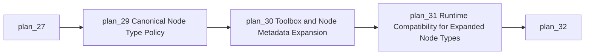
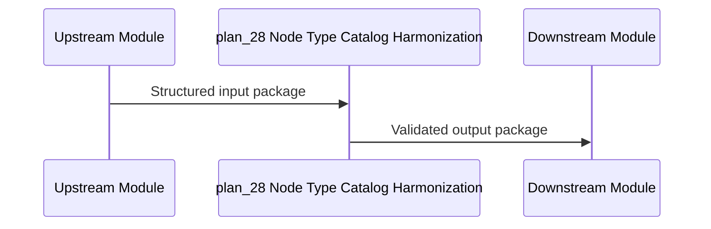

# Module: Node Type Catalog Harmonization

## Module Overview

### Module Goal
Establish stable and predictable outcomes for the node type catalog harmonization scope.

### Position in Project
This module is a core production-readiness gate and directly impacts execution stability objectives.

---

## Dependencies

### Prerequisites
- **Prerequisite Tasks**: plan_27
- **Prerequisite Data**: Available node families, activation strategy, compatibility matrix
- **Prerequisite Environment**: Stable execution environment and baseline observability channel

### Downstream Impact
- **Downstream Tasks**: plan_32
- **Output Data**: Canonical node catalog and aligned activation scope

### External Dependencies
- **Third-Party Services**: Node registry policy and runtime execution graph
- **Database**: Rule metadata and execution-history persistence structures
- **API Interfaces**: Contract boundary for rule lifecycle and execution feedback

---

## Subtask Breakdown

- [ ] plan_29 - Canonical Node Type Policy (estimated 240 minutes)
  - Brief: Deliver canonical node type policy outcome for node type catalog harmonization.
- [ ] plan_30 - Toolbox and Node Metadata Expansion (estimated 420 minutes)
  - Brief: Deliver toolbox and node metadata expansion outcome for node type catalog harmonization.
- [ ] plan_31 - Runtime Compatibility for Expanded Node Types (estimated 360 minutes)
  - Brief: Deliver runtime compatibility for expanded node types outcome for node type catalog harmonization.

---

## Visualization Output

### Module Flowchart

### System Flow ASCII Diagram (for cross-service/data pipelines)

```
+----------------------------+
| Upstream Inputs            |
+-------------+--------------+
              | Module Inputs
              V
+---------------------------+
| plan_28 Node Type Catalog Harmonization |
+-----+---------------------+
      |
+-----+---------------------+        +---------------------------+
| Validation and Controls   |  ...   | Execution and Feedback    |
+-----+---------------------+        +-------------+-------------+
      V                                 V
+---------------------------------------------------------------+
| Persisted Outputs and Operational Signals                     |
+---------------------------------------------------------------+
```
### Interface Collaboration Diagram

### Resource Allocation Table
| Resource Type | Owner | Time Window | Key Output | Risk/Notes |
| --- | --- | --- | --- | --- |
| Product and UX | Product owner | Sprint window | User-facing flow clarity | Scope pressure |
| Platform and API | Technical lead | Sprint window | Stable execution contract | Cross-layer coordination |
| QA and Release | QA owner | Sprint window | Regression evidence | Late scenario discovery |

### System Flow Diagram (Panel Scope)
```
+---------------------------+
| Rule Builder Panel Input  |
+-------------+-------------+
              |
              V
+---------------------------+
| Validation and Contracts  |
+-------------+-------------+
              |
              V
+---------------------------+
| Execution and Feedback    |
+-------------+-------------+
              |
              V
+---------------------------+
| History and Monitoring    |
+---------------------------+
```
### Core Metrics Mapping Table
| Frontend Area | Data Source | Core Metric | Decision Use |
| --- | --- | --- | --- |
| Rule List and Open | Rule catalog payload | Load success ratio | Lifecycle reliability |
| Edit Panel | Save/update outcomes | Update consistency | Contract confidence |
| Execute Panel | Execution payload | Success and rollback ratio | Release readiness |
| History View | Execution telemetry | Trend stability | Operational governance |

---

## Technical Solution

### Architecture Design
Apply explicit contract boundaries and staged validation checkpoints for module outcomes.

### Core Technology Selection
- Technology 1: Shared contract governance mechanism
  - Selection Reason: Reduces drift between producers and consumers
  - Alternative: Manual alignment process with higher operational risk

### Data Model
Use normalized entities for rule state, execution state, and observability markers.

### Interface Design
Define stable request/response structures with clear validation boundaries and lifecycle semantics.

---

## Execution Summary

### Input
- Available node families, activation strategy, compatibility matrix
- Outputs from prerequisite module

### Processing
- Normalize and validate module scope inputs
- Apply module-specific control rules
- Emit stable outputs for downstream modules

### Output
- Canonical node catalog and aligned activation scope
- Ready-to-consume data and behavior guarantees for downstream tasks

---

## Risks and Challenges

### Technical Challenges
- Contract and lifecycle drift during iterative delivery; mitigate with recurring contract checks.

### Time Risks
- Multi-team handoff latency; mitigate with sprint-level dependency checkpoints.

### Dependency Risks
- Runtime and panel coupling risk; mitigate with explicit ownership and acceptance gates.

---

## Acceptance Criteria

### Functional Acceptance
- All child tasks complete with validated module outcomes.
- Module outputs are consumable by the immediate downstream module.

### Performance Acceptance
- Module processing and interaction paths remain within agreed latency envelope.

### Quality Acceptance
- Child-task test obligations are met.
- No unresolved critical defects at module gate review.

---

## Deliverables List

### Code Files
- Execution and lifecycle artifacts: aligned implementation set
- Validation and contract artifacts: synchronized definitions

### Configuration Files
- Runtime policy and scheduling configuration artifacts

### Documentation
- Module-level decisions and acceptance evidence

### Test Files
- Contract tests, integration checks, and scenario regressions for module scope

