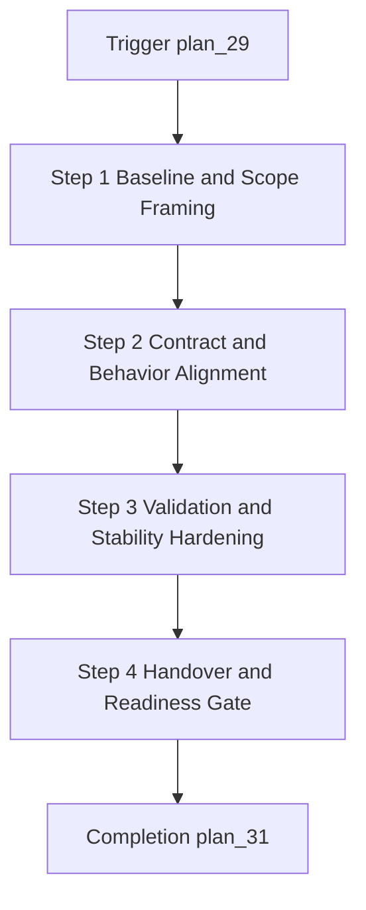

---
level: 3
file_id: plan_30
parent: plan_28
status: pending
created: 2026-02-16 20:55
estimated_time: 420 minutes
---

# Task: Toolbox and Node Metadata Expansion

## Task Overview

### Task Description
Deliver the toolbox and node metadata expansion capability within the node type catalog harmonization module boundary.

### Task Purpose
Reduce execution instability by enforcing consistent behavior for this task scope.

---

## Dependencies

### Prerequisites
- **Prerequisite Tasks**: plan_29
- **Required Resources**: Current contract baseline, execution telemetry baseline, and lifecycle criteria
- **Environment Requirements**: Operationally stable development and validation environment

### Downstream Impact
- **Downstream Tasks**: plan_31
- **Provided Output**: Verified task deliverables for dependent task consumption

---

## Execution Steps

### Step 1: Baseline and Scope Framing
- **Action**: Establish expected task boundary, data expectations, and acceptance checkpoints.
- **Input**: Prerequisite outputs and current behavior baseline.
- **Output**: Approved scope baseline for execution.
- **Notes**: Keep execution stability as first-order priority.

### Step 2: Contract and Behavior Alignment
- **Action**: Align behavior definitions and validation semantics across producer/consumer boundaries.
- **Input**: Current contracts and policy expectations.
- **Output**: Unified contract decisions for this task.
- **Notes**: Eliminate ambiguous semantics before runtime validation.

### Step 3: Validation and Stability Hardening
- **Action**: Validate expected and edge behavior using structured checks.
- **Input**: Candidate contract and behavior outputs.
- **Output**: Stability-evidenced behavior profile.
- **Notes**: Focus on failure prevention and deterministic outcomes.

### Step 4: Handover and Readiness Gate
- **Action**: Package outputs for downstream task consumption and gate review.
- **Input**: Hardened outputs and validation evidence.
- **Output**: Downstream-ready deliverable package.
- **Notes**: Preserve traceability of decisions and acceptance outcomes.

---

## Visualization Aids

### Step Flowchart

### Risk Monitoring Table
| Risk Item | Level | Trigger Signal | Mitigation Strategy | Owner |
| --- | --- | --- | --- | --- |
| Contract ambiguity | High | Divergent behavior interpretation | Formal contract decision log | Platform owner |
| Regression leakage | Medium | Repeated scenario failures | Scenario-based validation gates | QA owner |
| Delivery delay | Medium | Dependency handoff slips | Weekly dependency checkpoints | Module owner |

### File Operations List

#### Files to Create
- Contract decision artifacts
  - Type: Documentation artifact
  - Purpose: Capture agreed behavior boundaries
  - Content: Scope, constraints, and acceptance logic

#### Files to Modify
- Existing lifecycle and validation artifacts
  - Modification Location: Current task scope boundaries
  - Modification Content: Alignment and stabilization updates
  - Modification Reason: Ensure consistent runtime outcomes

#### Files to Read
- Baseline contract and telemetry artifacts
  - Read Purpose: Understand current behavior and drift
  - Usage: Drive task-level alignment and gate criteria

### System Flow Diagram (Panel Scope)
```
+--------------------------+
| Panel Interaction Event  |
+------------+-------------+
             |
             V
+--------------------------+
| Validation and Contract  |
+------------+-------------+
             |
             V
+--------------------------+
| Execution Feedback Loop  |
+------------+-------------+
             |
             V
+--------------------------+
| History and Metrics View |
+--------------------------+
```
### Core Metrics Mapping Table
| Frontend Area | Data Source | Core Metric | Intended Decision |
| --- | --- | --- | --- |
| Panel Entry | Rule metadata payload | Entry success ratio | Navigation reliability |
| Edit and Action Controls | Save/execute responses | Action success ratio | Stability confidence |
| Inline Feedback | Validation and warning stream | Error recurrence rate | Contract hardening |
| History/Status View | Execution telemetry | Trend consistency | Release readiness |

---

## Implementation List

### Functional Modules
- Task scope behavior module
  - Functionality: Enforce stable behavior for task boundary
  - Interface: Expose predictable outputs to downstream tasks
  - Responsibility: Maintain contract consistency and runtime stability

### Data Structures
- Task acceptance matrix
  - Purpose: Track expected behavior and outcomes
  - Fields: scenario, expected_result, observed_result, status

### Algorithm Logic
- Stability decision flow
  - Purpose: Resolve pass/fail readiness for task output
  - Input: Validation evidence and acceptance criteria
  - Output: Gate decision and escalation notes
  - Complexity: Controlled by scenario volume and dependency depth

### Interface Definitions
- Task handoff contract
  - Type: Integration boundary
  - Parameters: normalized input envelope
  - Return: normalized output envelope
  - Description: Transfers stable outcomes to downstream task

---

## Execution Summary

### Input
- Prerequisite task outputs
- Contract and telemetry baselines
- Stability-oriented acceptance expectations

### Processing
- Baseline framing
- Contract alignment
- Validation hardening
- Readiness gate packaging

### Output
- Validated task outputs
- Acceptance evidence package
- Downstream handoff readiness

---

## Testing Requirements

### Unit Tests
- Test Scope: Task-local validation decisions and guard behaviors
- Test Cases: Nominal path, edge path, and failure path
- Coverage Requirement: High-confidence scenario coverage for critical paths

### Integration Tests
- Test Scope: Task handoff with prerequisite and downstream modules
- Test Scenarios: Contract continuity and rollback/guard behaviors

### Manual Tests
- Test Point 1: Operator-visible behavior under nominal input
- Test Point 2: Behavior under invalid or partial input

---

## Acceptance Criteria

### Functional Acceptance
- Task outputs satisfy defined contract constraints.
- Downstream task consumes outputs without contract exceptions.
- Edge-case behavior remains deterministic.

### Quality Acceptance
- Critical tests pass with no unresolved blocking failures.
- Stability metrics meet release gate threshold for task scope.
- Validation evidence is complete and reviewable.

### Documentation Acceptance
- Task decision log is complete and auditable.
- Handoff criteria are explicit and unambiguous.

---

## Notes

### Technical Notes
- Keep contract ownership explicit at each boundary.
- Prioritize deterministic behavior over optional optimization.

### Security Notes
- Ensure execution boundaries reject invalid trigger patterns.
- Preserve minimal required exposure across integration boundaries.

### Performance Notes
- Track latency and variance during task verification.
- Escalate regressions exceeding agreed envelope.

### References
- Overall production-readiness plan and module-level acceptance policies
- Stability and regression governance checklist

