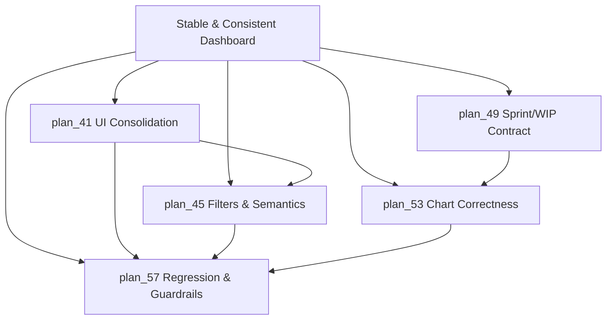
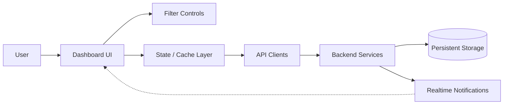
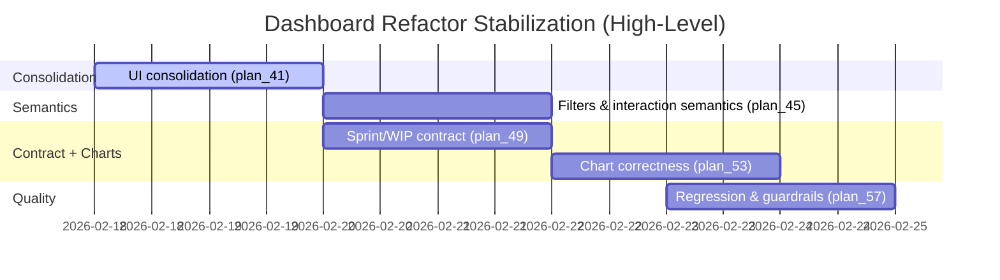
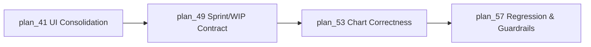

# Overall Plan: Dashboard Refactor Stabilization

## Project Overview

### Project Background
The current dashboard experience shows signs of an incomplete migration: duplicated sections, partially-stubbed filters, contract drift around sprint/WIP semantics, and chart infrastructure inconsistencies. This increases maintenance cost, breaks user expectations, and creates fragile test coupling.

### Project Goals
- Deliver a single coherent dashboard composition (no duplicated legacy vs new surfaces).
- Make filter controls meaningful by defining and enforcing consistent semantics.
- Align sprint/WIP consumption with a single canonical contract and stable fallbacks.
- Improve chart correctness and eliminate runtime warnings and text/encoding artifacts.
- Replace legacy DOM coupling with stable, behavior-driven regression coverage.

### Project Value
A stabilized dashboard reduces support burden, increases trust in the displayed metrics, and provides a reliable foundation for future iteration without reintroducing regressions.

---

## Visualization Views

### System Logic Diagram


### Dashboard System Flow (Data + Interaction)


### Core Metrics Mapping (Dashboard)
| Dashboard Area | Core Metric / Output | Primary Data Source | Secondary / Fallback | Notes |
| --- | --- | --- | --- | --- |
| KPI Summary | high-level KPIs | Project + task aggregates | cached state | Must respect filters |
| Velocity | trend over time | task completion signals or sprint analytics | cached historical | Labeling must be stable |
| Burndown | remaining scope vs time | sprint timeline analytics | derived approximation (explicitly labeled) | Prefer real timeline |
| Risk / Alerts | overdue, blockers, stale work | task attributes + dates | heuristic thresholds | Drilldowns must be stable |
| Upcoming | near-term work items | task due dates / priorities | prioritized backlog | Empty state required |
| WIP | active work count & limits | sprint analytics | hidden/disabled when unavailable | Must align with canonical sprint |

### Module Relationship Matrix
| Module | Main Input | Main Output | Responsible Role | Dependencies |
| --- | --- | --- | --- | --- |
| plan_41 | dashboard composition baseline | single layout + stable UI contract | Frontend | none |
| plan_45 | UI contract + user interaction needs | defined + enforced filter semantics | Frontend | plan_41 |
| plan_49 | sprint/wip payloads | canonical contract + stable selection | Frontend/Backend | plan_41 (integration points) |
| plan_53 | analytics requirements | correct charts + clean infra | Frontend | plan_49 |
| plan_57 | stabilized behavior | durable regression + guardrails | Frontend/QA | plan_41, plan_45, plan_53 |

### Project Timeline


---

## Requirements Definition

### Cross-Cutting Implementation Constraints
- Task-derived panels that claim project-wide scope must not use default `listTasks` semantics (`limit=50`) without explicit pagination strategy and scope docs.
- Sprint/WIP contract normalization must be shared with `ProjectDetail` and `SprintCapacity` to avoid duplicated active-sprint logic.
- Chart registration must stay single-sourced in `frontend/src/chart.ts`; page-level duplicate registration is a defect.

### Functional Requirements
- Dashboard renders exactly one coherent layout and removes duplicated/legacy sections.
- Filters are actionable: changing a filter produces deterministic changes in visible metrics.
- Project quick filters reflect real behavior (selection vs aggregation) without misleading labels.
- Sprint/WIP widgets correctly resolve and display active context (or explicitly disable with a clear empty state).
- Charts show correct data for the chosen semantics and do not emit runtime warnings.
- Regression coverage validates behaviors and does not rely on legacy-only DOM.
- Data-source and pagination behavior is explicit for all task-derived panels.

### Non-Functional Requirements
- Performance Requirements: dashboard initial render and filter updates remain responsive under a 1k-task benchmark:
  - `dashboard_init_ms_p95 <= 700`
  - `filter_apply_ms_p95 <= 300`
- Security Requirements: realtime interaction does not degrade authorization boundaries (no silent failures).
- Availability: dashboard degrades gracefully when partial data sources are unavailable.
- Maintainability: dashboard structure is modular and consistent with broader UI patterns.
- Compatibility: behavior is consistent across supported browsers and environments.

---

## Task Decomposition Tree

```text
plan_40 Overall Plan: Dashboard Refactor Stabilization
|-- plan_41 Dashboard UI Consolidation (estimated 7.5 hours)
|   |-- plan_42 Select Single Layout & Remove Duplication (estimated 150 minutes)
|   |-- plan_43 Decompose Dashboard Into Sections (estimated 180 minutes)
|   `-- plan_44 Normalize Loading/Empty/Error States (estimated 120 minutes)
|-- plan_45 Filters and Interaction Semantics (estimated 6.5 hours)
|   |-- plan_46 Define Filter Semantics & Persistence (estimated 90 minutes)
|   |-- plan_47 Apply Date Range & Chart View End-to-End (estimated 180 minutes)
|   `-- plan_48 Implement Project Quick Filters Behavior (estimated 120 minutes)
|-- plan_49 Sprint and WIP Contract Alignment (estimated 5.5 hours)
|   |-- plan_50 Unify Sprint Status & Identifier Contract (estimated 120 minutes)
|   |-- plan_51 Stabilize WIP and Sprint-Dependent Widgets (estimated 120 minutes)
|   `-- plan_52 Add Runtime Guards for Contract Drift (estimated 90 minutes)
|-- plan_53 Chart Data Correctness and Infrastructure Hygiene (estimated 6.5 hours)
|   |-- plan_54 Replace Synthetic Burndown With Real Timeline (estimated 180 minutes)
|   |-- plan_55 Standardize Velocity Computation and Labels (estimated 120 minutes)
|   `-- plan_56 Consolidate Chart Infrastructure and Fix Text Artifacts (estimated 90 minutes)
`-- plan_57 Regression Coverage and Operational Guardrails (estimated 8 hours)
    |-- plan_58 Update Tests to New DOM Contract (estimated 180 minutes)
    |-- plan_59 Add Regression Scenarios for Filters/Sprints/Charts (estimated 180 minutes)
    `-- plan_60 Add Observability and Performance Guardrails (estimated 120 minutes)
```

## Task List (by execution order)
- plan_41 - Establish a single dashboard composition baseline and remove duplication.
- plan_42 - Choose the target layout and remove parallel/legacy rendering.
- plan_43 - Modularize the dashboard into stable sections.
- plan_44 - Normalize loading, empty, and error states.
- plan_45 - Define and implement filter + interaction semantics.
- plan_46 - Specify meaning and scope of each filter and persistence behavior.
- plan_47 - Apply the semantics end-to-end across all impacted dashboard outputs.
- plan_48 - Make project quick filters reflect real behavior without mislabeling.
- plan_49 - Align sprint and WIP contract consumption.
- plan_50 - Define canonical sprint identity and active sprint semantics.
- plan_51 - Stabilize WIP and sprint-dependent widgets with fallbacks.
- plan_52 - Add runtime guards against contract drift.
- plan_53 - Make charts correct and infrastructure clean.
- plan_54 - Replace synthetic burndown with a real timeline-based representation.
- plan_55 - Standardize velocity computation, bucket labeling, and trend semantics.
- plan_56 - Consolidate chart registration/plugins and eliminate warnings/text artifacts.
- plan_57 - Ensure long-term stability via regression coverage and guardrails.
- plan_58 - Update tests to match the stabilized UI contract.
- plan_59 - Add regression scenarios across filters/sprints/charts.
- plan_60 - Add observability and performance guardrails to prevent regressions.

---

## Dependencies

### Inter-Module Dependencies
- plan_41 -> plan_45 (filters must bind to a single stable UI contract)
- plan_49 -> plan_53 (charts depend on canonical sprint/WIP semantics)
- plan_41, plan_45, plan_53 -> plan_57 (tests/guardrails depend on stabilized behavior)

### Critical Path
UI consolidation (plan_41) -> contract alignment (plan_49) -> chart correctness (plan_53) -> regression coverage (plan_57)



---

## Tech Stack

### Programming Languages
- Frontend: TypeScript
- Backend: Python (existing service)

### Frameworks/Libraries
- Frontend UI framework and component library (existing)
- State management (existing)
- Charting library (existing)

### Database
- Existing persistent storage (project/task/sprint analytics)

### Tools
- Frontend test runner and component testing framework (existing)
- Backend test runner (existing)
- CI pipeline (existing)

### Third-Party Services
- External integrations providing project/task/sprint data (as configured in the environment)

---

## Data Flow

### Input Sources
- Project catalog and project metadata
- Task lists and task attributes (status, estimates, due dates, timestamps)
- Sprint metadata and sprint analytics (WIP, burndown, velocity inputs)
- Integration connectivity status
- Realtime notifications/events (sync completion, failures)

### Processing Flow
- Fetch baseline data and cache appropriately.
- Apply filter semantics consistently across computations and visualizations.
- Resolve sprint context and compute sprint-dependent metrics.
- Render charts and lists with stable identifiers for testing and UX.
- Subscribe to realtime events to refresh data deterministically.

### Output Targets
- Dashboard panels (KPIs, charts, risk, upcoming, WIP)
- Drilldown experiences for actionable panels
- Clear loading/error/empty states and consistent refresh behavior

---

## Acceptance Criteria

### Functional Acceptance
- Only one dashboard composition is rendered; no duplicated legacy sections remain.
- Filters change dashboard output deterministically and are clearly scoped.
- Sprint/WIP widgets show correct state or explicitly display a non-error empty state.
- Burndown and velocity charts reflect the defined semantics and label them accurately.
- No runtime chart warnings or text/encoding artifacts appear in standard flows.

### Performance Acceptance
- Filter updates complete within `filter_apply_ms_p95 <= 300` on a 1k-task dataset.
- Realtime refresh does not create repeated/duplicate refresh loops.

### Quality Acceptance
- Regression suite validates dashboard behaviors (filters, drilldowns, sprint/WIP, charts).
- Tests do not depend on legacy-only DOM structure.
- Documentation/plan references remain consistent with the implemented behavior.

---

## Risk Assessment

### Technical Risks
- Risk: sprint payload contract differs across environments
  - Impact: High
  - Mitigation: plan_50 + plan_52 contract unification and runtime guards
- Risk: analytics endpoints provide partial or inconsistent timeseries data
  - Impact: Medium
  - Mitigation: explicit fallback modes + clear UI labeling

### Resource Risks
- Risk: parallel feature work changes dashboard surfaces mid-refactor
  - Impact: Medium
  - Mitigation: lock UI contract early (plan_42) and stabilize tests (plan_58)

### Time Risks
- Risk: chart correctness work expands due to data gaps
  - Impact: Medium
  - Mitigation: prioritize "correct + labeled fallback" before "perfect"


