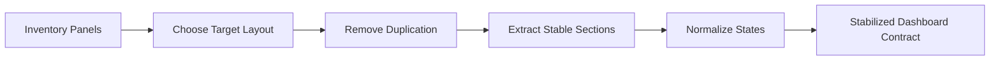
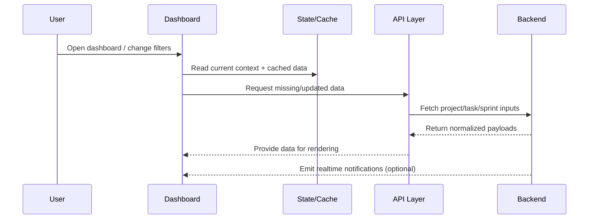

# Module: Dashboard UI Consolidation

## Module Overview

### Module Goal
Establish a single coherent dashboard UI composition by removing duplicated legacy/new surfaces, clarifying the dashboard panel contract, and improving maintainability through modular structure.

### Position in Project
This module is the foundation for all downstream work: filter semantics, sprint/WIP contract alignment, chart correctness, and regression tests depend on a stable dashboard UI contract.

---

## Dependencies

### Prerequisites
- **Prerequisite Tasks**: plan_40
- **Prerequisite Data**: Current dashboard behavior baseline and panel inventory
- **Prerequisite Environment**: Working development environment with at least 2 projects and >=100 tasks (including one legacy-dashboard projection visible for baseline comparisons).

### Downstream Impact
- **Downstream Tasks**: plan_45, plan_57
- **Output Data**: Single dashboard composition contract and stable panel surface identifiers

### External Dependencies
- **Third-Party Services**: External data providers for tasks/sprints (as configured)
- **Database**: Existing persisted project/task/sprint datasets
- **API Interfaces**: Existing project/task/sprint analytics and notifications

---

## Subtask Breakdown

- [x] plan_42 - Select Single Layout & Remove Duplication (estimated 150 minutes)
  - Brief: Choose the target layout and eliminate parallel rendering while preserving required capabilities.
- [x] plan_43 - Decompose Dashboard Into Sections (estimated 180 minutes)
  - Brief: Refactor the dashboard into stable sections to reduce coupling and simplify change control.
- [x] plan_44 - Normalize Loading/Empty/Error States (estimated 120 minutes)
  - Brief: Ensure consistent UX patterns for loading, empty data, and error recovery.

---

## Visualization Output

### Module Flowchart


### System Flow ASCII Diagram (Dashboard Context)
```
+---------------------+       +---------------------+       +---------------------+
| User Interaction    |  -->  | Dashboard UI        |  -->  | State / Cache Layer |
+---------------------+       +----------+----------+       +----------+----------+
                                     |                             |
                                     V                             V
                           +---------------------+       +---------------------+
                           | API Client Layer    |  -->  | Backend Services    |
                           +----------+----------+       +----------+----------+
                                     |                             |
                                     V                             V
                           +---------------------+       +---------------------+
                           | Realtime Events     |  <--  | Persistent Storage  |
                           +---------------------+       +---------------------+
```

### Interface Collaboration Diagram


### Core Metrics Mapping (UI Consolidation Focus)
| Panel Group | UI Contract Item | Input Data Category | Output Contract | Risk if Unstable |
| --- | --- | --- | --- | --- |
| KPI summary | visible KPIs | project + task aggregates | consistent labels & units | user trust loss |
| Charts | velocity, burndown | time series inputs | stable chart toggles | confusing UX |
| Action lists | risk, upcoming | derived task subsets | drilldown availability | fragile tests |
| Sprint widgets | WIP | sprint analytics | explicit empty state | broken expectations |

### Resource Allocation Table
| Resource Type | Owner | Time Window | Key Output | Risk/Notes |
| --- | --- | --- | --- | --- |
| Frontend engineer | AI-agent | one execution pass | UI consolidation + modular structure | avoid parallel layout drift |
| QA / reviewer | AI-agent | one execution pass | regression expectations review | align test intent early |

---

## Technical Solution

### Architecture Design
Adopt a single dashboard composition contract with clear section boundaries. Each section owns its rendering contract, while shared state and derived computations are centralized to prevent divergence.

### Core Technology Selection
- Technology 1: Existing UI framework and component system
  - Selection Reason: consistency with application-wide UI patterns
  - Alternative: none (use existing stack)

### Data Model
Dashboard consumes project/task/sprint-derived datasets and computes derived aggregates for display. Contract alignment and fallbacks are handled upstream to keep rendering deterministic.

### Interface Design
Define stable interaction surfaces for:
- selecting project context
- changing filters
- triggering refresh/retry
- opening drilldowns from actionable panels

---

## Execution Summary

### Input
- Current dashboard panel inventory
- Existing UI patterns (loading skeleton, alerts, empty states)

### Processing
- Remove duplicated surfaces
- Extract stable sections
- Normalize states and rendering contract

### Output
- Single coherent dashboard layout
- Stable identifiers for automation and regression tests
- Reduced coupling for future work

---

## Risks and Challenges

### Technical Challenges
- Maintaining feature parity while removing legacy surfaces

### Time Risks
- UI consolidation can expand if hidden dependencies exist in legacy sections

### Dependency Risks
- Downstream work depends on early stabilization of the dashboard contract

---

## Acceptance Criteria

### Functional Acceptance
- Exactly one dashboard composition is rendered.
- No duplicated charts/panels remain.
- Drilldowns and navigation remain functional.

### Performance Acceptance
- Removed duplication reduces unnecessary render and data processing.

### Quality Acceptance
- Dashboard structure is modular and readable.
- Stable identifiers exist for downstream regression coverage.

---

## Deliverables List

### Code Files
- `frontend/src/pages/Dashboard.tsx`: updated to a single stable layout
- `frontend/src/pages/dashboard/DashboardHeader.tsx`: extracted header + actions section
- `frontend/src/pages/dashboard/DashboardStatsSection.tsx`: extracted KPIs section
- `frontend/src/pages/dashboard/DashboardChartsSection.tsx`: extracted charts section
- `frontend/src/pages/dashboard/DashboardInsightsSection.tsx`: extracted insights/actions section

### Documentation
- `docs/dashboard-ui-contract.md`: documents stable panel and identifier expectations

### Test Files
- `frontend/src/pages/__tests__/Dashboard.test.tsx`: legacy-independent behavior contract assertions


