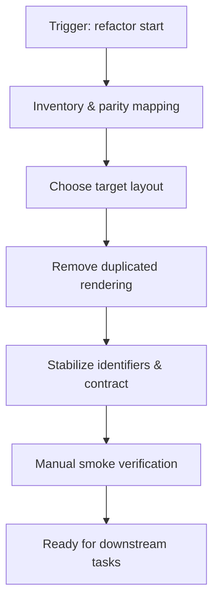
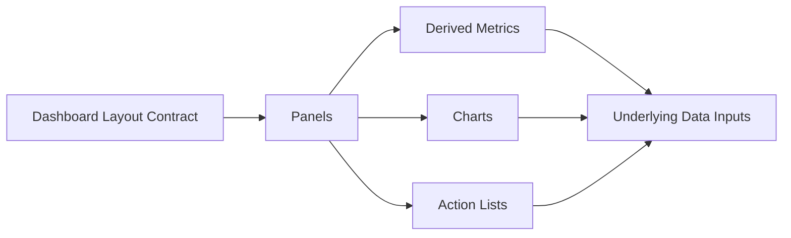

# Task: Select Single Layout and Remove Duplication

## Task Overview

### Task Description
Choose a single target dashboard layout (new vs legacy), ensure feature parity for required panels, and remove duplicated/parallel rendering paths that currently lead to unpredictable behavior.

### Task Purpose
Reduce confusion, improve performance, and create a stable UI contract that downstream filters, charts, and tests can rely on.

---

## Dependencies

### Prerequisites
- **Prerequisite Tasks**: plan_40
- **Required Resources**: Panel inventory checklist and current baseline screenshots/notes
- **Environment Requirements**: Dataset with 2+ projects and visible legacy duplicates for deterministic verification

### Downstream Impact
- **Downstream Tasks**: plan_43, plan_44, plan_46, plan_58
- **Provided Output**: Single layout selection and consolidated dashboard composition contract

---

## Execution Steps

### Step 1: Parity Inventory and Decision
- **Action**: Inventory panels present in both surfaces and decide the single target layout contract.
- **Input**: Current dashboard baseline behavior and panel list.
- **Output**: Approved target layout decision and parity checklist.
- **Notes**: Identify which panels are "must keep", "nice to keep", and "remove". Define legacy surface by locator pattern (`DashboardFilters` + non-target `Paper`/`Typography` blocks with old headings like `Velocity`, `Sprint Burndown`, `Task Distribution`, `Risk Assessment`, `Upcoming`) and remove those blocks in the target implementation.

### Step 2: Consolidate Rendering
- **Action**: Remove non-target rendering paths and ensure only the target layout is rendered.
- **Input**: Target layout decision and parity checklist.
- **Output**: One coherent dashboard surface with no duplicate charts/panels.
- **Notes**: Ensure panel ordering and naming is consistent and intentional.

### Step 3: Stabilize UI Contract for Automation
- **Action**: Define a stable set of identifiers and UI contracts for actionable panels and drilldowns.
- **Input**: Consolidated dashboard surface.
- **Output**: Stable automation contract (test identifiers + user-visible labels).
- **Notes**: Prefer behavior-driven identifiers over structure-driven ones.

### Step 4: Verification and Sign-off
- **Action**: Run a manual smoke pass and verify no empty/blank regions result from the consolidation.
- **Input**: Consolidated dashboard surface.
- **Output**: Verified baseline for downstream refactors.
- **Notes**: Capture known gaps explicitly for follow-up tasks.

---

## Visualization Aids

### Step Flowchart

### Dashboard System Flow (Context)

### Core Metrics Mapping (Impacted by Layout Consolidation)
| Surface Item | Expected Behavior | Primary Data Category | Failure Mode | Acceptance Signal |
| --- | --- | --- | --- | --- |
| Velocity chart | single source of truth | timeseries inputs | duplicate render / mismatch | only one chart shown |
| Burndown chart | single source of truth | sprint timeline inputs | duplicate render / mismatch | only one chart shown |
| Risk panel | stable drilldowns | derived task subsets | unstable identifiers | drilldowns consistent |
| Upcoming panel | stable empty state | task due dates | blank region | explicit empty state |

### Risk Monitoring Table
| Risk Item | Level | Trigger Signal | Mitigation Strategy | Owner |
| --- | --- | --- | --- | --- |
| Hidden dependency on removed legacy block | Medium | missing panel behavior after removal | parity checklist + manual smoke + backend verification | AI-agent |
| Tests coupled to removed DOM | High | failing CI on dashboard tests | update tests + stable identifiers | AI-agent |

### File Operations List

#### Files to Create
 - No new files required (current scope)

#### Files to Modify
- `frontend/src/pages/Dashboard.tsx`
  - Modification Location: layout composition section
  - Modification Content: remove non-target/legacy rendering and keep one surface
  - Modification Reason: eliminate duplicated UI

#### Files to Read
- `frontend/src/pages/__tests__/Dashboard.test.tsx`
  - Read Purpose: understand current automation assumptions
  - Usage: preserve intent while stabilizing identifiers

## Acceptance Criteria

### Functional Acceptance
- Dashboard renders exactly one chart/section layout path across all states, with legacy surface locators (`Velocity`, `Sprint Burndown`, `Task Distribution`, `Risk Assessment`, `Upcoming`) absent from runtime output.
- Layout parity checklist is explicit for all formerly duplicated panels: KPI, Velocity, Burndown, Distribution, Risk, Upcoming, and drilldowns.
- Manual smoke run in a dataset with multiple projects shows exactly matching section count to the target layout contract (no duplicate legacy panels).

### Quality Acceptance
- `frontend/src/pages/Dashboard.tsx` contains no unreachable duplicate sections for `Velocity`, `Burndown`, `Risk`, or `Upcoming`.
- `frontend/src/pages/__tests__/Dashboard.test.tsx` assertions are migrated to the target layout contract and no longer depend on removed legacy selectors.

