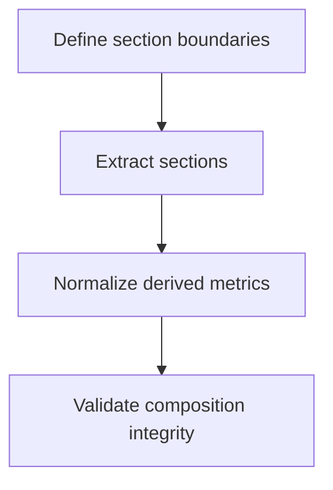
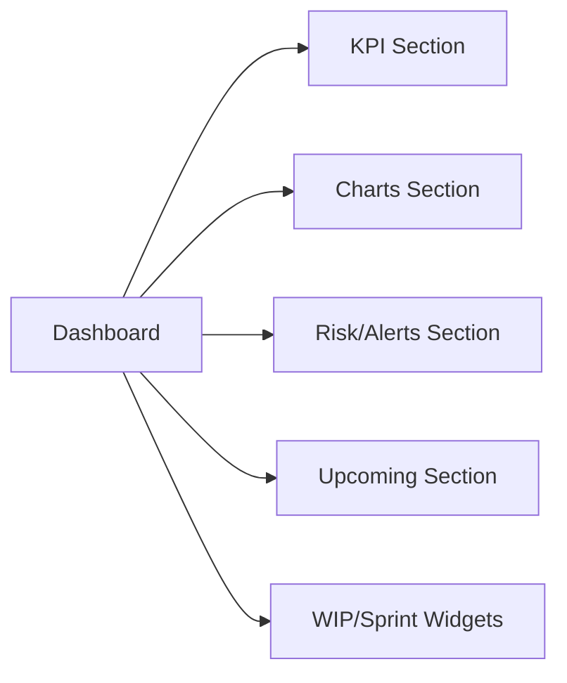

# Task: Decompose Dashboard Into Sections

## Task Overview

### Task Description
Refactor the dashboard into stable, well-defined sections to reduce monolithic complexity and align the implementation with the application's broader component patterns.

### Task Purpose
Improve maintainability, reduce accidental coupling between panels, and make future iteration safer by localizing changes to the affected section.

---

## Dependencies

### Prerequisites
- **Prerequisite Tasks**: plan_42
- **Required Resources**: Target layout contract and panel inventory
- **Environment Requirements**: Minimum 2 projects, with at least 2 active/closed sprint states and 2k total tasks total for composition verification

### Downstream Impact
- **Downstream Tasks**: plan_44, plan_47, plan_58
- **Provided Output**: Modular section structure with clear inputs/outputs

---

## Execution Steps

### Step 1: Define Section Boundaries
- **Action**: Identify dashboard sections (KPIs, charts, alerts, lists, widgets) and define each section's inputs/outputs.
- **Input**: Consolidated layout contract from plan_42.
- **Output**: Section boundary map and ownership rules.
- **Notes**: Avoid cross-section implicit dependencies.

### Step 2: Extract and Normalize Sections
- **Action**: Extract sections into reusable units aligned with app patterns.
- **Input**: Boundary map.
- **Output**: Extracted sections with stable props and minimal shared state.
- **Notes**: Keep derived computations centralized when shared by multiple sections.

### Step 3: Centralize Derived Metrics
- **Action**: Normalize where computed metrics live so charts/lists share consistent definitions.
- **Input**: Existing derived computations.
- **Output**: Single source of truth for derived dashboard metrics.
- **Notes**: Ensure this respects the future filter semantics (plan_45).

### Step 4: Validate Composition Integrity
- **Action**: Verify all sections render correctly with realistic data combinations.
- **Input**: Extracted section structure.
- **Output**: Verified modular dashboard baseline.
- **Notes**: Ensure section rendering does not depend on implicit order.

---

## Visualization Aids

### Step Flowchart

### Dashboard Section Structure Diagram

### Core Metrics Mapping (Section Ownership)
| Section | Owned Outputs | Inputs | Shared Dependencies | Validation |
| --- | --- | --- | --- | --- |
| KPI | summary KPIs | task + project aggregates | filters | stable units + labels |
| Charts | velocity, burndown | timeseries inputs | sprint context | no duplicate rendering |
| Alerts | risk insights | derived task subsets | thresholds | stable drilldowns |
| Upcoming | near-term list | task due dates | filters | explicit empty state |
| WIP | WIP status | sprint analytics | sprint selection | correct active context |

### Risk Monitoring Table
| Risk Item | Level | Trigger Signal | Mitigation Strategy | Owner |
| --- | --- | --- | --- | --- |
| Over-extraction creates prop drilling | Medium | excessive wiring complexity | define clear section contracts + memoized selectors | AI-agent |
| Derived metrics diverge across sections | High | inconsistent KPI vs chart outputs | centralized derivation helpers only | AI-agent |

### File Operations List

#### Files to Create
- `frontend/src/pages/dashboard/DashboardHeader.tsx`
- `frontend/src/pages/dashboard/DashboardChartsSection.tsx`
- `frontend/src/pages/dashboard/DashboardInsightsSection.tsx`
- `frontend/src/pages/dashboard/DashboardStatsSection.tsx`
- `frontend/src/pages/dashboard/dashboardDerivations.ts`
  - Type: UI components
  - Purpose: encapsulate panels into stable units
  - Content: section rendering + minimal local logic

#### Files to Modify
- `frontend/src/pages/Dashboard.tsx`
  - Modification Location: layout composition + data preparation
  - Modification Content: wire extracted sections and centralize metrics
  - Modification Reason: reduce monolith

#### Files to Read
- `frontend/src/pages/Projects.tsx`
  - Read Purpose: align dashboard structure with shared conventions
  - Usage: align dashboard behavior and section loading patterns

## Acceptance Criteria

### Functional Acceptance
- Dashboard container file is reduced to orchestration: state orchestration, data preloading, and section composition only.
- Computation of core metrics (`velocity`, `burndown`, `risk`, `upcoming`, `wip`) is implemented in shared derivation helpers.
- Section composition preserves existing business capabilities while eliminating duplicate rendering paths.

### Quality Acceptance
- Any one section can be updated without editing unrelated section files.
- Section boundary checks confirm each section consumes only required data props.

