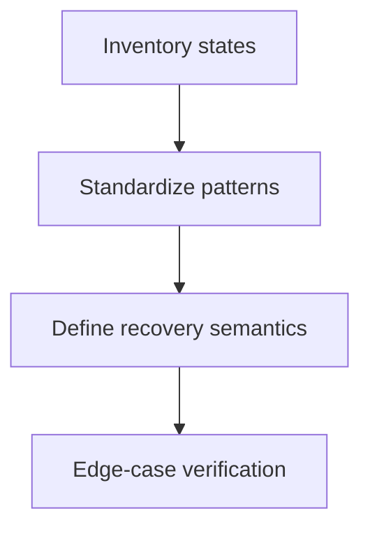

# Task: Normalize Dashboard States (Loading, Empty, Error)

## Task Overview

### Task Description
Normalize how the dashboard handles loading, empty, and error states across all panels so the page never appears "blank" and users always see actionable recovery paths.

### Task Purpose
Improve UX reliability and reduce support/debug time by standardizing states and aligning them with app-wide patterns.

---

## Dependencies

### Prerequisites
- **Prerequisite Tasks**: plan_42, plan_43
- **Required Resources**: Existing application UX patterns for skeleton/loading and alerts
- **Environment Requirements**: Ability to simulate missing/partial data sources

### Downstream Impact
- **Downstream Tasks**: plan_57
- **Provided Output**: Consistent state model and user-facing recovery flows

---

## Execution Steps

### Step 1: State Inventory
- **Action**: Identify dashboard states for each section (loading, partial data, empty, error).
- **Input**: Current dashboard behaviors.
- **Output**: Unified state matrix by section.
- **Notes**: Include mixed states (some panels loaded, some failing).

### Step 2: Standardize UX Patterns
- **Action**: Apply consistent skeleton/empty/error patterns across sections.
- **Input**: State matrix.
- **Output**: Standard rendering behavior per state.
- **Notes**: Ensure error states include retry and do not block unrelated panels.

### Step 3: Define Recovery and Refresh Semantics
- **Action**: Normalize when auto-refresh triggers and how manual retry works.
- **Input**: Current refresh behavior baseline.
- **Output**: Predictable refresh rules.
- **Notes**: Avoid repeated refresh loops on realtime events.

### Step 4: Verify With Edge Cases
- **Action**: Validate behavior when there are no projects, no tasks, missing sprint, or partial analytics.
- **Input**: Simulated datasets.
- **Output**: Verified non-blank dashboard across edge cases.
- **Notes**: Ensure every section has an explicit empty state.

---

## Visualization Aids

### Step Flowchart

### Dashboard State Matrix (Visualization)
| Section | Loading | Empty | Error | Partial Data |
| --- | --- | --- | --- | --- |
| KPIs | skeleton | explicit empty | alert + retry | show available subset |
| Charts | skeleton | empty message | alert + retry | degrade gracefully |
| Alerts | skeleton | "no risks" | non-blocking warning | show computed subset |
| Upcoming | skeleton | "no upcoming" | non-blocking warning | show computed subset |
| WIP | skeleton | "not available" | non-blocking warning | hide optional details |

### Core Metrics Mapping (State-Dependent Outputs)
| Output | Required Inputs | Allowed Fallback | User Message Requirement |
| --- | --- | --- | --- |
| KPIs | tasks + project | cached values (labeled) | no silent stale data |
| Burndown | sprint analytics | "not available" state | explicit availability |
| Velocity | timeseries inputs | computed from tasks | label the mode |

### Risk Monitoring Table
| Risk Item | Level | Trigger Signal | Mitigation Strategy | Owner |
| --- | --- | --- | --- | --- |
| Blank dashboard when context is missing | High | empty screen / missing headers | explicit empty states | AI-agent |
| Error blocks unrelated panels | Medium | full-page error for partial failure | isolate errors per section with local error boundaries | AI-agent |

### File Operations List

#### Files to Create
 - No new files required (current scope)

#### Files to Modify
- `frontend/src/pages/Dashboard.tsx`
- `frontend/src/components/DashboardSkeleton.tsx`
  - Modification Location: state rendering branches
  - Modification Content: standard skeleton/empty/error behaviors
  - Modification Reason: prevent blank/ambiguous states

#### Files to Read
- `frontend/src/components/EmptyState.tsx`
  - Read Purpose: align recovery patterns for missing data states
  - Usage: reuse stable empty-state behavior in dashboard sections
- `frontend/src/components/BackendStatusAlert.tsx`
  - Read Purpose: align partial-error messaging with existing app patterns
  - Usage: reuse error copy and recovery action treatment
- `frontend/src/components/DashboardSkeleton.tsx`
  - Read Purpose: align loading shape and skeleton timing
  - Usage: keep loading UX consistent across dashboard sections

## Acceptance Criteria

### Functional Acceptance
- Dashboard remains informative under context absence (no selected project, no tasks, no sprint, backend partial failures).
- Section-level error does not remove unrelated sections and shows actionable retry text.
- Empty states are explicit and localized to owning section.

### Performance Acceptance
- No more than one fallback skeleton per section appears during initial project context switch.
- Recovery actions (refresh/retry) do not clear unrelated section state.

### Quality Acceptance
- Loading/empty/error rendering is represented as reusable patterns used by at least three sections.

