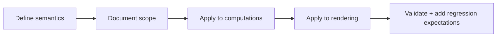
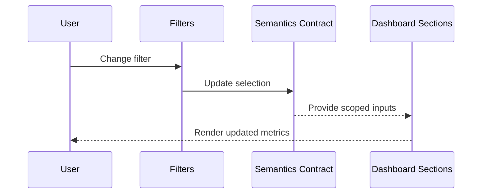

# Module: Filters and Interaction Semantics

## Module Overview

### Module Goal
Make dashboard filters meaningful by defining explicit semantics (what each filter means, which panels it affects, and how it persists) and applying them consistently across KPIs, charts, lists, and widgets.

### Position in Project
This module turns the filter UI from a placeholder into a reliable interaction contract. It also prevents future drift by documenting scope and adding regression expectations.

---

## Dependencies

### Prerequisites
- **Prerequisite Tasks**: plan_41
- **Prerequisite Data**: Current filter UI inventory and expected user workflows
- **Prerequisite Environment**: Minimum 2 projects and 2000 tasks with controlled pagination pages

### Downstream Impact
- **Downstream Tasks**: plan_53, plan_57
- **Output Data**: Stable filter semantics contract and consistent application across dashboard outputs

### External Dependencies
- **Third-Party Services**: External data providers and sync cadence (as configured)
- **Database**: Existing persisted datasets with timestamps and sprint metadata
- **API Interfaces**: Existing endpoints providing project/task/sprint analytics

---

## Subtask Breakdown

- [ ] plan_46 - Define Filter Semantics & Persistence (estimated 90 minutes)
  - Brief: Specify meaning and scope for date range, chart view, and project quick filters.
- [ ] plan_47 - Apply Date Range & Chart View End-to-End (estimated 180 minutes)
  - Brief: Ensure filters affect all computed metrics and visible sections consistently.
- [ ] plan_48 - Implement Project Quick Filters Behavior (estimated 120 minutes)
  - Brief: Make "all/active/recent" behavior real and non-misleading.

## Execution Steps

### Step 0: Fix Task Data Scope Before Filter Semantics
- **Action**: Define and implement a single deterministic task data strategy that avoids default pagination truncation.
- **Input**: dashboard task-derived panel list and existing `listTasks` usage.
- **Output**: explicit strategy for scope (full pagination or explicit partial-mode).
- **Notes**: filter claims are blocked until dashboard task scope is deterministic.
- **Implementation Contract**: add/adjust a bounded fetch loop with `listTasksPaginated` (`skip += limit`) until `meta.has_next === false` or explicit cap (`maxPages` or `maxTotalTasks`) and persist scope metadata (`taskScope.total`, `taskScope.fetched`, `taskScope.isPartial`) by project context.

---

## Visualization Output

### Module Flowchart


### Dashboard Data Source and Pagination Contract
| Input Surface | Canonical Source | Risk if Misused |
| --- | --- | --- |
| KPI/analytics (velocity, risks, burndown for charts) | `/v1/analytics/...` endpoints with project and sprint context | Incomplete or duplicated summaries |
| Task-derived counts/lists (`upcoming`, `distribution`, risk scoring) | `listTasksPaginated` with deterministic `skip/limit` plan, or backend aggregate endpoint for full-project totals | Filter semantics become non-deterministic when only first 50 tasks are loaded |

Current state: existing dashboard logic reads all tasks from `listTasks` defaults and therefore only receives first page (`skip=0`, `limit=50`). Full deterministic scope is required before enabling any filter behavior claims.

Chosen strategy: fetch all dashboard-relevant tasks via `listTasksPaginated` loops for the active project and expose scope metadata (`total`, `fetched`, `hasNext`, `isPartial`) for explicit partial-mode labeling.

### Dashboard System Flow (Filter-Centric)
```
+------------------+     +--------------------+     +----------------------+
| Filter Controls  | --> | Semantics Contract | --> | Derived Computations |
+------------------+     +--------------------+     +----------+-----------+
                                                               |
                                                               V
                                                     +------------------+
                                                     | Rendered Panels  |
                                                     +------------------+
```

### Core Metrics Mapping (Filter Scope)
| Filter | Scope (Panels) | Primary Effect | Non-Effect (Explicit) | Persistence |
| --- | --- | --- | --- | --- |
| Date range | KPIs, velocity, burndown, risks, upcoming | timeseries + list windowing rules | project selector defaults | saved |
| Chart view | chart and chart labels | visibility + source selection | KPI/action list content | saved |
| Project quick filter | project context + derived panel source inputs | selected project set and source scope | unrelated panel memory (toasts/notifications) | saved |

### Interface Collaboration Diagram


### Resource Allocation Table
| Resource Type | Owner | Time Window | Key Output | Risk/Notes |
| --- | --- | --- | --- | --- |
| Frontend engineer | AI-agent | one execution pass | semantics + application | avoid partial application |
| Product/QA reviewer | QA engineer | one execution pass | validate semantics with user flows | prevent misleading UX |

---

## Technical Solution

### Architecture Design
Define an explicit filter semantics contract and apply it uniformly to derived computations and rendering. Persistence is handled consistently to avoid surprising behavior across sessions.

### Data Model
Filter selections are first-class inputs to all derived metrics and chart/list subsets. Each dashboard section consumes scoped inputs rather than re-deriving logic independently.

### Data Scope Rule
- Dashboard task-derived panels must not use default `listTasks` limits.
- Default implementation uses `listTasksPaginated` loop until `meta.has_next === false`.
- If full scope cannot be fetched in bounded mode, the dashboard must render explicit partial-scope state and disable completion claims for affected KPIs.

### File Operations List

#### Files to Modify
- `frontend/src/store/dataThunks.ts`
  - Modification Location: dashboard task fetch path and cache metadata
  - Modification Content: add deterministic full-task fetch helper with stop condition and scope counters
  - Modification Reason: ensure one-time filters operate on complete task scope
- `frontend/src/pages/__tests__/Dashboard.test.tsx`
  - Modification Location: test fixtures and assertions
  - Modification Content: add assertions that full-task scope or partial-scope state is respected
  - Modification Reason: protect against return to first-page logic

#### Files to Read
- `frontend/src/pages/dashboard/dashboardContract.ts`
  - Read Purpose: expose and consume task-scope mode labels in UI and tests
  - Usage: prevent unaligned behavior after refactors

---

## Acceptance Criteria

### Functional Acceptance
- Each filter has a documented meaning and an explicit scope.
- Changing a filter consistently changes visible outputs as expected.
- "Quick filters" do not misrepresent behavior (selection vs aggregation).
- For task-derived panels, dashboard must state and enforce the source strategy:
  - either `listTasksPaginated` with deterministic full-project windowing,
  - or dedicated analytics endpoints.
  - If task pagination remains constrained, no filter semantics claim is considered complete until full-project aggregation is implemented.
- Dashboard task fetching exports deterministic scope metadata (`total`, `hasNext`, `isPartial`) and never silently consumes only the first page.
- Filter-based behavior claims are incomplete unless task scope is full (`isPartial === false`) or dashboard renders explicit `partial scope` label in affected panels.

### Quality Acceptance
- Regression checks prevent reintroducing "filter UI that does not affect data."
- Source-of-truth and pagination behavior is implemented through `dashboardContract.ts` + tests before gates pass.


