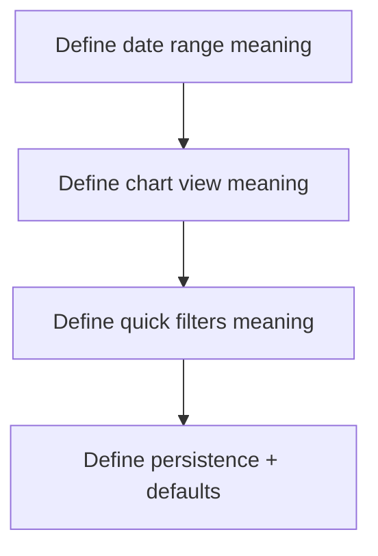
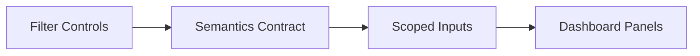

# Task: Define Filter Semantics and Persistence Contract

## Task Overview

### Task Description
Define explicit semantics for dashboard filters: what each control means, which dashboard outputs it affects, and how preferences persist across sessions.

### Task Purpose
Prevent misleading UI controls and remove ambiguity for both users and future maintainers.

---

## Dependencies

### Prerequisites
- **Prerequisite Tasks**: plan_42
- **Required Resources**: Current filter UI inventory, stakeholder expectations, and test baseline
- **Environment Requirements**: Minimum 2 projects and task timeline variation across at least 3 distinct date windows for filter validation

### Downstream Impact
- **Downstream Tasks**: plan_47, plan_48, plan_58
- **Provided Output**: Written semantics contract and validation checklist

---

## Execution Steps

### Step 1: Define Date Range Semantics
- **Action**: Specify which timestamp field(s) the date range applies to and which panels it scopes.
- **Input**: Dashboard panel inventory and required UX outcomes.
- **Output**: Date range semantics statement and scope table.
- **Notes**: Use `resolved_date` as primary filter key, fallback to `updated_date`; include "scope not changed" explicitly for metadata and static settings.

### Step 2: Define Chart View Semantics
- **Action**: Define what chart view toggles control (visibility vs data selection) and which charts are included.
- **Input**: Current chart surfaces.
- **Output**: Chart view inclusion/exclusion list.
- **Notes**: Ensure the toggle cannot be bypassed by hidden or legacy renders.

### Step 3: Define Project Quick Filter Semantics
- **Action**: Decide if quick filters represent aggregation or selection shortcuts, and define "active" and "recent".
- **Input**: Product expectations and data availability.
- **Output**:
  - `all`: show all available projects in dropdown and keep explicit project selection mode (no aggregation).
  - `active`: pick projects where `status === 'active'`, fallback to `state === 'active'`, then last used project.
  - `recent`: pick project from persisted recent list; fallback to current or first.
- **Notes**: If aggregation is not supported, quick labels must remain selection-oriented.

### Step 4: Persistence and Defaults
- **Action**: Define how preferences persist (per user vs local device) and what defaults are applied.
- **Input**: Existing persistence patterns in the app.
- **Output**: Persistence contract and default matrix.
- **Notes**: Ensure persistence does not override explicitly selected project context unexpectedly.

---

## Visualization Aids

### Step Flowchart

### Dashboard System Flow (Filters as Contract)

### Core Metrics Mapping (Filter-to-Panel Scope)
| Filter | KPI Summary | Velocity | Burndown | Risk | Upcoming | WIP |
| --- | --- | --- | --- | --- | --- | --- |
| Date range | YES | YES | YES | YES | YES | NO |
| Chart view | NO | YES | YES | NO | NO | NO |
| Project quick filter | YES | YES | YES | YES | YES | YES |

### Risk Monitoring Table
| Risk Item | Level | Trigger Signal | Mitigation Strategy | Owner |
| --- | --- | --- | --- | --- |
| Filters defined but not enforced | High | visible outputs do not change | plan_47 end-to-end enforcement + acceptance gates | AI-agent |
| Quick filter labels misleading | Medium | user expects aggregation | clarify semantics + selection wording in UI copy | AI-agent |

### File Operations List

#### Files to Create
- `frontend/src/pages/dashboard/dashboardContract.ts`
  - Type: typed contract module
  - Purpose: serve as single source of truth for filter behavior
  - Content: enums (`DateRangeOption`, `ChartViewOption`, `QuickFilterOption`), storage keys, scope matrix, and defaults

#### Files to Modify
- `frontend/src/components/DashboardFilters.tsx`
  - Modification Location: quick filter action map and date-range/Chart view handlers
  - Modification Content: enforce contract-driven behavior
  - Modification Reason: remove placeholder logic
  - Modification Location: storage wiring
  - Modification Content: persist and restore contract-defined keys (`dashboard_recent_project_ids`, `dashboard_last_project_id`, `dashboard_chart_view`, `dashboard_quick_filter`, `dashboard_date_range`)
  - Modification Reason: make filter behavior stable across reloads

#### Files to Read
- `frontend/src/utils/storage.ts`
  - Read Purpose: align filter persistence with the rest of the app
  - Usage: reuse consistent patterns
- `frontend/src/pages/dashboard/dashboardContract.ts`
  - Read Purpose: consume canonical option enums and defaults
  - Usage: ensure shared constants are not duplicated

## Acceptance Criteria

### Functional Acceptance
- Date-range semantics are explicit for each panel type and documented in `dashboardContract.ts`.
- `all/active/recent` quick filters are deterministic and do not fallback to hardcoded first project values.
- Chart-view semantics exclude all legacy chart duplicates.

### Quality Acceptance
- `dashboardContract.ts` is imported by both Dashboard and tests (not loaded via markdown parsing).
- No behavior-only refactoring path leaves placeholder branch logic in `DashboardFilters.tsx`.

