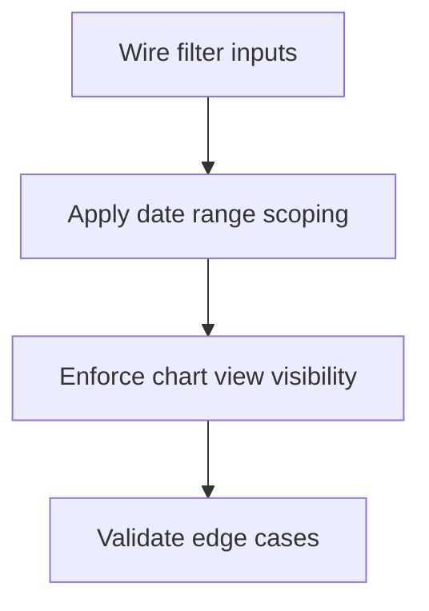
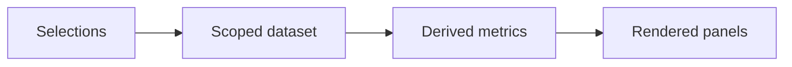

# Task: Apply Date Range and Chart View End-to-End

## Task Overview

### Task Description
Implement the agreed filter semantics end-to-end so date range and chart view controls deterministically affect all relevant dashboard computations and render surfaces.

### Task Purpose
Eliminate "filter UI that does not change anything" and prevent partial application that creates confusing UX.

---

## Dependencies

### Prerequisites
- **Prerequisite Tasks**: plan_46
- **Required Resources**: Semantics contract and validation checklist
- **Environment Requirements**: Dataset with enough historical depth to validate time windows

### Downstream Impact
- **Downstream Tasks**: plan_48, plan_58, plan_59
- **Provided Output**: Enforced filter behavior and stable regression expectations

---

## Execution Steps

### Step 1: Wire Filter Inputs as First-Class Dependencies
- **Action**: Ensure filter selections are treated as inputs to derived computations and scoped subsets.
- **Input**: Semantics contract from plan_46.
- **Output**: Computations and sections consume scoped inputs.
- **Notes**: Avoid independent re-derivation of filter logic inside panels.

### Step 2: Apply Date Range Consistently
- **Action**: Apply date range scoping to all impacted KPIs, charts, and lists.
- **Input**: Scope mapping table.
- **Output**: Visible dashboard outputs change with date range selection.
- **Notes**: Use resolved date windows (`resolved_date`) with explicit fallback to `updated_date`; avoid silent empty windows by showing empty states.

### Step 3: Enforce Chart View Visibility Contract
- **Action**: Ensure chart view toggles control visibility consistently for all chart surfaces.
- **Input**: Chart inclusion list.
- **Output**: No hidden or legacy chart surface bypasses the toggle.
- **Notes**: Prevent duplicate charts and inconsistent tooltips/legends.

### Step 4: Validate and Document Edge Cases
- **Action**: Validate behavior with empty windows, partial data, and extreme selections.
- **Input**: Validation checklist.
- **Output**: Verified behavior and documented fallback rules.
- **Notes**: Ensure empty results show explicit empty states rather than blank panels.

---

## Visualization Aids

### Step Flowchart

### Dashboard Filter Data Flow

### Core Metrics Mapping (Date Range Validation)
| Output | Expected Change When Date Range Changes | Validation Method | Fallback |
| --- | --- | --- | --- |
| KPI summary | values update | compare windowed totals | show "no data" |
| Risk alerts | subset changes | validate derived set | empty "no risks" |
| Upcoming list | subset changes | validate due-window subset | empty "no upcoming" |
| Velocity | timeseries changes | verify bucket window | show "not enough data" |

### Risk Monitoring Table
| Risk Item | Level | Trigger Signal | Mitigation Strategy | Owner |
| --- | --- | --- | --- | --- |
| Partial application leads to inconsistent panels | High | KPIs change but charts do not | centralize scoping and share inputs | AI-agent |
| Empty window shows blank panels | Medium | empty chart without message | explicit empty states + "No data" copy | AI-agent |

### File Operations List

#### Files to Create
 - No new files required (current scope)

#### Files to Modify
- `frontend/src/pages/Dashboard.tsx`
- `frontend/src/pages/dashboard/dashboardDerivations.ts`
  - Modification Location: metric derivation and scoped subsets
  - Modification Content: apply filter inputs consistently
  - Modification Reason: enforce semantics contract

#### Files to Read
- `frontend/src/pages/dashboard/dashboardSemanticsContract.md`
  - Read Purpose: ensure implementation matches agreed semantics
  - Usage: map selection -> panel outputs

## Acceptance Criteria

### Functional Acceptance
- Date-range change updates at least one KPI, one chart data series, and one list-derived panel in the same interaction.
- `chartView` values (`velocity`, `burndown`, `both`, `distribution`) render only matching chart sections and no implicit extras.
- When date window returns no matches, sections show deterministic empty states instead of blank space.

### Technical Acceptance
- Filtering logic is shared through one derivation entrypoint used by all panels.
- No legacy chart section remains visible when `chartView` excludes it.

