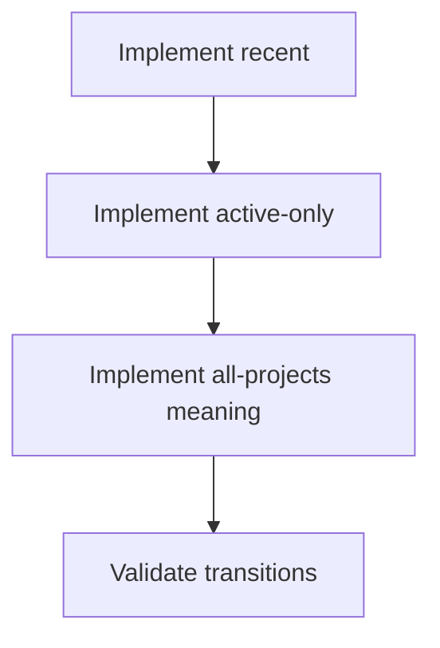
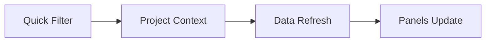

# Task: Implement Project Quick Filters Behavior

## Task Overview

### Task Description
Implement meaningful behavior for project quick filters (e.g., all/active/recent) as defined in the semantics contract, ensuring labels match the actual behavior (selection vs aggregation).

### Task Purpose
Prevent misleading UX and ensure project context changes are predictable and traceable.

---

## Dependencies

### Prerequisites
- **Prerequisite Tasks**: plan_46, plan_47
- **Required Resources**: Quick filter behavior spec and validation examples
- **Environment Requirements**: Multiple projects with different activity profiles

### Downstream Impact
- **Downstream Tasks**: plan_58, plan_59
- **Provided Output**: Correct quick filter behavior with stable UX signals

---

## Execution Steps

### Step 1: Implement "Recent" Selection Policy
- **Action**: Implement deterministic "recent" behavior using user-selected project history (recommended KISS rule).
- **Input**: Semantics spec.
- **Output**: Deterministic project selection behavior for "recent".
- **Notes**: `recent` uses LRU list persisted in `dashboard_recent_project_ids` (max 5 ids), updated on each `onProjectChange`.
- **Notes**: boot fallback order is deterministic: first valid LRU id -> `dashboard_last_project_id` -> first project by `id` ascending.
- **Notes (Typing)**: `Project` typing used by filters must include `status?: string` to support deterministic active-only selection.

### Step 2: Implement "Active Only" Policy
- **Action**: Define and implement "active" criteria and selection behavior.
- **Input**: Active criteria spec.
- **Output**: Deterministic selection behavior for "active only".
- **Notes**: Use `status === 'active'` when available, otherwise use `state === 'active'`; if multiple candidates exist, keep current if still active else choose first by `name` ascending.

### Step 3: Implement "All Projects" Meaning
- **Action**: Implement non-aggregation "all projects" semantics (recommended).
- **Input**: Contract decision from plan_46.
- **Output**: "All Projects" shows full selectable project list while dashboard remains single-project scoped.
- **Notes**: Aggregated cross-project metrics are explicitly out of scope for this module.

### Step 4: Validate UX and Regression Expectations
- **Action**: Validate quick filter transitions and ensure they do not unintentionally reset other preferences.
- **Input**: Validation examples.
- **Output**: Verified and documented behavior.
- **Notes**: Ensure project context changes trigger the expected data refresh behavior.

---

## Visualization Aids

### Step Flowchart

### Dashboard System Flow (Project Context Switch)

### Core Metrics Mapping (Project Context)
| Project Context Mode | Data Inputs | Expected UI Outcome | Risk |
| --- | --- | --- | --- |
| Single project | project + tasks + sprint | full dashboard | baseline |
| "Active only" selection | subset of projects | stable selection | ambiguous criteria |
| "All projects" selection | full project list, single selected project context | explicit selection scope, no aggregation | label mismatch if undocumented |

### Risk Monitoring Table
| Risk Item | Level | Trigger Signal | Mitigation Strategy | Owner |
| --- | --- | --- | --- | --- |
| "All projects" label implies aggregation but does not aggregate | High | user confusion / bug reports | explicit copy and docs; only enable aggregation in follow-up plan | AI-agent |
| Context switch resets unrelated filters | Medium | unexpected dashboard jumps | isolate persistence keys per control | AI-agent |

### File Operations List

#### Files to Create
 - No new files required (current scope)

#### Files to Modify
- `frontend/src/components/DashboardFilters.tsx`
  - Modification Location: quick filter handler and persisted context
  - Modification Content: deterministic selection for all/active/recent and explicit non-aggregation mode for `all`
  - Modification Reason: remove placeholder logic
  - Modification Location: local/project type imports
  - Modification Content: include project status/state fields used by filter selection logic
  - Modification Reason: prevent untyped access to `status`/`state` in quick-filter resolution

#### Files to Read
- `frontend/src/pages/dashboard/dashboardContract.ts`
  - Read Purpose: match behavior to the agreed scope and labels
  - Usage: validate against examples

## Acceptance Criteria

### Functional Acceptance
- `recent` restores context from recent list before fallback and does not always pick first project.
- `all` no longer silently maps to current project; it updates filter scope as documented.
- `active` uses explicit project activity markers and has deterministic fallback behavior.
- `recent` list size is capped at 5 and order reflects most recently selected projects first.

### Quality Acceptance
- Quick-filter changes only update project-related persistence keys (`dashboard_last_project_id`, `dashboard_recent_project_ids`).
- No regression in manual project selection UX (`Select` control still authoritative).
- Selection tie-breakers are deterministic and documented (`id` sort for initial fallback, `name` sort for active candidates).

