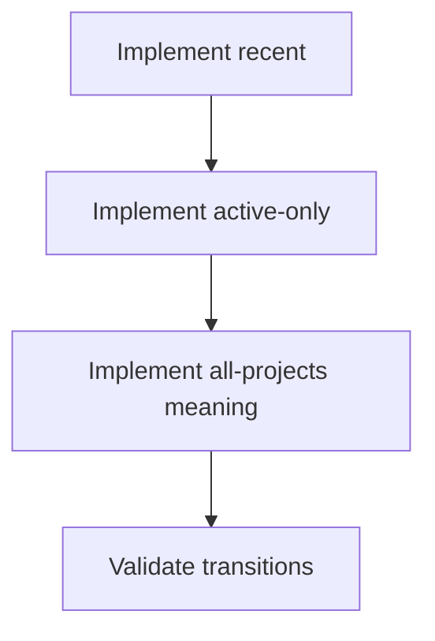
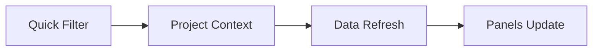

# Task: Implement Project Quick Filters Behavior

## Task Overview

### Task Description
Implement meaningful behavior for project quick filters (e.g., all/active/recent) as defined in the semantics contract, ensuring labels match the actual behavior (selection vs aggregation).

### Task Purpose
Prevent misleading UX and ensure project context changes are predictable and traceable.

---

## Dependencies

### Prerequisites
- **Prerequisite Tasks**: plan_46, plan_47
- **Required Resources**: Quick filter behavior spec and validation examples
- **Environment Requirements**: Multiple projects with different activity profiles

### Downstream Impact
- **Downstream Tasks**: plan_58, plan_59
- **Provided Output**: Correct quick filter behavior with stable UX signals

---

## Execution Steps

### Step 1: Implement "Recent" Selection Policy
- **Action**: Define and implement what "recent" means (e.g., last viewed, recently updated, etc.).
- **Input**: Semantics spec.
- **Output**: Deterministic project selection behavior for "recent".
- **Notes**: Persist `dashboard_recent_project_ids` in `localStorage`; on boot or missing values, fallback to current project.

### Step 2: Implement "Active Only" Policy
- **Action**: Define and implement "active" criteria and selection behavior.
- **Input**: Active criteria spec.
- **Output**: Deterministic selection behavior for "active only".
- **Notes**: Use `status === 'active'` when available, otherwise use `state === 'active'`, then fallback to last selected.

### Step 3: Implement "All Projects" Meaning
- **Action**: If aggregation is supported, implement aggregation; otherwise adjust labels to avoid implying aggregation.
- **Input**: "All projects" semantics decision.
- **Output**: Non-misleading behavior that matches UX labels.
- **Notes**: First phase scope = all projects in filter list without aggregation; dashboard retains selected project context.

### Step 4: Validate UX and Regression Expectations
- **Action**: Validate quick filter transitions and ensure they do not unintentionally reset other preferences.
- **Input**: Validation examples.
- **Output**: Verified and documented behavior.
- **Notes**: Ensure project context changes trigger the expected data refresh behavior.

---

## Visualization Aids

### Step Flowchart

### Dashboard System Flow (Project Context Switch)

### Core Metrics Mapping (Project Context)
| Project Context Mode | Data Inputs | Expected UI Outcome | Risk |
| --- | --- | --- | --- |
| Single project | project + tasks + sprint | full dashboard | baseline |
| "Active only" selection | subset of projects | stable selection | ambiguous criteria |
| Aggregated (if supported) | multi-project aggregates | aggregated KPIs/charts | performance + complexity |

### Risk Monitoring Table
| Risk Item | Level | Trigger Signal | Mitigation Strategy | Owner |
| --- | --- | --- | --- | --- |
| "All projects" label implies aggregation but does not aggregate | High | user confusion / bug reports | explicit copy and docs; only enable aggregation in follow-up plan | AI-agent |
| Context switch resets unrelated filters | Medium | unexpected dashboard jumps | isolate persistence keys per control | AI-agent |

### File Operations List

#### Files to Create
 - No new files required (current scope)

#### Files to Modify
- `frontend/src/components/DashboardFilters.tsx`
  - Modification Location: quick filter handler and persisted context
  - Modification Content: deterministic selection for all/active/recent
  - Modification Reason: remove placeholder logic
  - Modification Location: quick filter handling
  - Modification Content: implement deterministic selection/aggregation behavior
  - Modification Reason: remove placeholder behavior

#### Files to Read
- `frontend/src/pages/dashboard/dashboardSemanticsContract.md`
  - Read Purpose: match behavior to the agreed scope and labels
  - Usage: validate against examples

## Acceptance Criteria

### Functional Acceptance
- `recent` restores context from recent list before fallback and does not always pick first project.
- `all` no longer silently maps to current project; it updates filter scope as documented.
- `active` uses explicit project activity markers and has deterministic fallback behavior.

### Quality Acceptance
- Quick-filter changes only update project-related persistence keys (`dashboard_last_project_id`, `dashboard_recent_project_ids`).
- No regression in manual project selection UX (`Select` control still authoritative).

