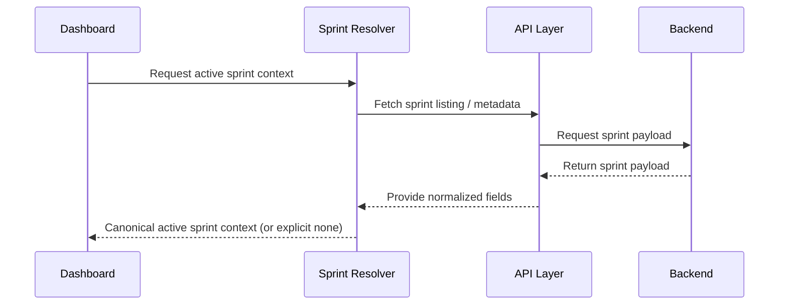

# Module: Sprint and WIP Contract Alignment

## Module Overview

### Module Goal
Align sprint and WIP semantics so the dashboard consistently identifies the "active" sprint context and displays sprint-dependent widgets reliably across environments.

### Position in Project
Sprint/WIP contract stability is required for correct dashboard widgets and for chart correctness (burndown, velocity when sprint-based). It also reduces runtime null/undefined states that lead to blank panels.

---

## Dependencies

### Prerequisites
- **Prerequisite Tasks**: plan_41
- **Prerequisite Data**: Representative sprint payload samples from the environment
- **Prerequisite Environment**: Ability to validate sprint "active" behavior with sample data

### Downstream Impact
- **Downstream Tasks**: plan_53, plan_57
- **Output Data**: Canonical sprint identity and active sprint selection behavior

### External Dependencies
- **Third-Party Services**: Sprint source system (as configured)
- **Database**: Stored sprint metadata and analytics
- **API Interfaces**: Sprint listing and sprint analytics/WIP status endpoints

---

## Subtask Breakdown

- [ ] plan_50 - Unify Sprint Status & Identifier Contract (estimated 120 minutes)
  - Brief: Define canonical sprint identity and "active" semantics across payloads.
- [ ] plan_51 - Stabilize WIP and Sprint-Dependent Widgets (estimated 120 minutes)
  - Brief: Ensure WIP widgets behave deterministically with correct fallbacks.
- [ ] plan_52 - Add Runtime Guards for Contract Drift (estimated 90 minutes)
  - Brief: Prevent regressions by validating payload shape and handling mismatches safely.

---

## Visualization Output

### Module Flowchart


### System Flow ASCII Diagram (Sprint/WIP)
```
+---------------------+       +------------------------+
| Dashboard Widgets   |  -->  | Sprint Context Resolver|
+----------+----------+       +-----------+------------+
           |                              |
           V                              V
 +--------------------+         +----------------------+
 | Sprint/WIP Inputs  |  <----  | Backend Sprint Data  |
 +--------------------+         +----------------------+
```

### Interface Collaboration Diagram


### Core Metrics Mapping (Sprint-Dependent Panels)
| Panel | Requires Sprint Context | Inputs | Fallback | User Signal |
| --- | --- | --- | --- | --- |
| WIP widget | YES | WIP analytics | "not available" | explicit empty state |
| Burndown | YES | timeline analytics | disabled with message | explicit availability |
| Sprint status text | YES | sprint metadata | show "no active sprint" | clarity |

### Resource Allocation Table
| Resource Type | Owner | Time Window | Key Output | Risk/Notes |
| --- | --- | --- | --- | --- |
| Frontend engineer | AI-agent | ~plan execution window | canonical contract mapping | avoid environment drift |
| Backend reviewer | QA engineer | ~plan execution window | validate payload semantics | align with backend truth |

### Inter-Component Contract Dependency
- The canonical sprint contract helper (introduced in plan_50) must be shared by `frontend/src/store/sprintSlice.ts`, `frontend/src/pages/ProjectDetail.tsx`, and `frontend/src/pages/SprintCapacity.tsx`.
- Sprint resolution logic must avoid page-local duplicate implementations to prevent DRY violations.

---

## Acceptance Criteria

### Functional Acceptance
- Active sprint selection is deterministic and consistent across environments.
- Sprint-dependent panels render correctly or explicitly show "not available".
- Reused contract helper is the single source of truth for active sprint context for dashboard and non-dashboard screens.

### Quality Acceptance
- Runtime guards prevent silent breakage when payload fields drift.


