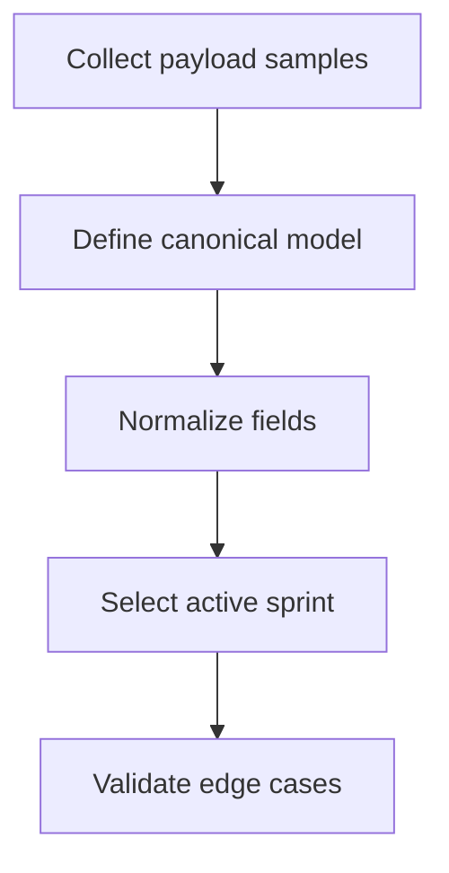
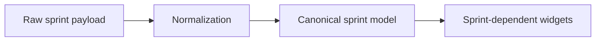

# Task: Unify Sprint Status and Identifier Contract

## Task Overview

### Task Description
Define a canonical sprint identity and status semantics ("active", "closed", etc.) and ensure the dashboard consumes a consistent contract regardless of variations in upstream payload fields.

### Task Purpose
Prevent "active sprint is always null" class failures and ensure sprint-dependent widgets and charts have reliable inputs.

---

## Dependencies

### Prerequisites
- **Prerequisite Tasks**: plan_41
- **Required Resources**: Sprint payload samples from at least one environment
- **Environment Requirements**: Ability to validate sprint status transitions for at least two projects and partial payload samples

### Downstream Impact
- **Downstream Tasks**: plan_51, plan_52, plan_54
- **Provided Output**: Canonical sprint contract and active sprint selection rule

---

## Execution Steps

### Step 1: Collect Contract Samples
- **Action**: Gather payload variants with `state`, with `status`, with missing id, and with date-range-only payloads; document field differences.
- **Input**: Environment payload samples.
- **Output**: Field mapping table and risk list.
- **Notes**: Include both identifier fields and status/state fields.

### Step 2: Define Canonical Identity and Status Model
- **Action**: Define canonical sprint ID selection and status normalization rules.
- **Input**: Field mapping table.
- **Output**: Canonical model definition and normalization rules.
- **Notes**: Prefer explicit precedence rules over heuristics.

### Step 3: Implement Consistent Selection Rules
- **Action**: Ensure the dashboard always uses the canonical sprint model for "active sprint" selection.
- **Input**: Canonical model definition.
- **Output**: Deterministic active sprint selection behavior.
- **Notes**: Ensure behavior is stable per project context.

### Step 4: Validate With Realistic Scenarios
- **Action**: Validate selection when there is no active sprint, multiple candidates, or partial payload fields.
- **Input**: Sample datasets.
- **Output**: Verified behavior with explicit fallbacks.
- **Notes**: Fallback should prefer clarity over hidden assumptions.

### Step 5: Remove Cross-Project Sprint Bootstrap Ambiguity
- **Action**: Make sprint bootstrap deterministic by disallowing global `loadAllSprints()` calls without `projectId`.
- **Input**: current startup flow and `loadAllSprints` thunk.
- **Output**: sprint data is fetched only in project context unless a separate global mode is explicitly introduced.
- **Notes**: Either add a dedicated `loadAllSprintsGlobal` branch, or update startup to skip global sprint preload and rely on project-entry points for sprint data.

---

## Visualization Aids

### Step Flowchart

### Dashboard System Flow (Sprint Contract)

### Core Metrics Mapping (Sprint Contract Inputs)
| Contract Element | Used By | Must Be Stable | Fallback |
| --- | --- | --- | --- |
| Canonical sprint ID | WIP, burndown, sprint widgets | YES | explicit "unavailable" |
| Normalized status/state | active sprint selection | YES | none -> "no active sprint" |

### Risk Monitoring Table
| Risk Item | Level | Trigger Signal | Mitigation Strategy | Owner |
| --- | --- | --- | --- | --- |
| Environment-specific field names | High | sprint widgets always empty | normalization with precedence + mapping tests | AI-agent |
| Multiple candidates for active sprint | Medium | inconsistent selection | deterministic priority rules in shared helper | AI-agent |

### File Operations List

#### Files to Create
- `frontend/src/utils/sprintNormalization.ts`
  - Type: shared normalizer utility
  - Purpose: normalize sprint identity, status/state precedence, and fallback selection
- `frontend/src/utils/__tests__/sprintNormalization.test.ts`
  - Type: unit test
  - Purpose: validate canonicalization and active-sprint tie-breakers

#### Files to Modify
- `frontend/src/store/sprintSlice.ts`
  - Modification Location: contract ingestion and active sprint resolution
  - Modification Content: consume normalizer and maintain `sprintsByProject` with explicit `projectId`
  - Modification Reason: deterministic, per-project sprint selection
- `frontend/src/store/dataThunks.ts`
  - Modification Location: `loadAllSprints` cache and project payload dispatch
  - Modification Content: per-project TTL cache keys (`lastLoadedAtByProject`) and dispatch `{ projectId, sprints }`
  - Modification Content (add): update `initializeAppData` bootstrap path to avoid contextless sprint preloads.
  - Modification Reason: prevent stale cross-project sprint selection and empty sprint contexts after project switches.
- `frontend/src/pages/ProjectDetail.tsx`
  - Modification Location: active sprint/state checks
  - Modification Content: consume normalization helper instead of page-local assumptions
  - Modification Reason: eliminate contract drift across screens
- `frontend/src/pages/SprintCapacity.tsx`
  - Modification Location: sprint state checks and project context mapping
  - Modification Content: consume normalization helper and canonical active sprint mapping
  - Modification Reason: keep sprint context behavior consistent

#### Files to Read
- `frontend/src/services/api/sprints.ts`
  - Read Purpose: derive field mapping rules
  - Usage: validate normalization

## Acceptance Criteria

### Functional Acceptance
- `id` and `sprint_id` both resolve to a deterministic canonical sprint identifier.
- `state` and `status` are normalized via documented precedence and select the same active sprint as:
- `s.state === 'active'`
- fallback to `s.status === 'active'`
- fallback to date-window match
- fallback to latest by date when no explicit active marker exists.
- Active-sprint resolution is scoped by `projectId`; switching projects recomputes from local cached project payload without reusing another project's sprint selection.
- `initializeAppData` or equivalent global bootstrap path does not load projectless sprints unless a separate global mode is intentionally added and documented in this plan.
- `ProjectDetail.tsx` and `SprintCapacity.tsx` derive active sprint and active-state checks through `sprintNormalization.ts`.

### Technical Acceptance
- `sprintsByProject` grouping is keyed by explicit project context passed to the reducer (or caller payload), not by absent `s.project_id`.
- Shared normalization helper has unit-level tests for:
  - missing fields
  - multiple active markers
  - unknown/null states

