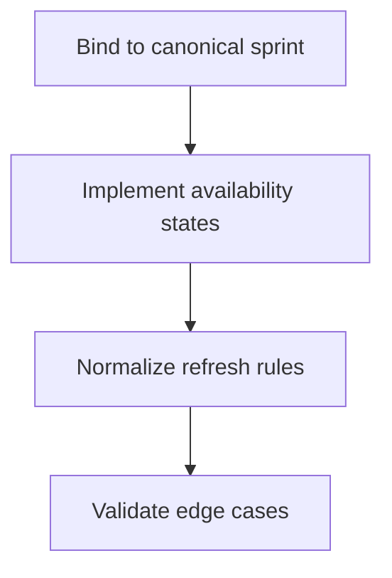
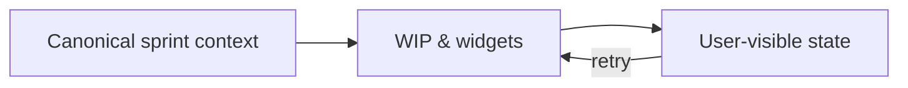

# Task: Stabilize WIP and Sprint-Dependent Widgets

## Task Overview

### Task Description
Ensure WIP and sprint-dependent dashboard widgets use the canonical sprint contract and behave deterministically with explicit empty/error states when sprint data is unavailable.

### Task Purpose
Prevent silent widget failures, reduce undefined/null rendering errors, and ensure users understand availability constraints.

---

## Dependencies

### Prerequisites
- **Prerequisite Tasks**: plan_50
- **Required Resources**: Canonical sprint contract definition and validation checklist
- **Environment Requirements**: Dataset where sprint analytics are available (and where they are not)

### Downstream Impact
- **Downstream Tasks**: plan_52, plan_57
- **Provided Output**: Reliable widget behavior and explicit availability signals

---

## Execution Steps

### Step 1: Bind Widgets to Canonical Sprint Context
- **Action**: Ensure widgets resolve sprint context through the canonical model.
- **Input**: Canonical sprint contract.
- **Output**: Widgets request data with the correct identity inputs.
- **Notes**: Ensure project context changes update sprint context deterministically.

### Step 2: Define and Implement Availability States
- **Action**: Implement loading, not-available, error, and ready states for sprint-dependent widgets.
- **Input**: State matrix patterns from plan_44.
- **Output**: Explicit widget behavior under each state.
- **Notes**: Avoid showing misleading zero values for missing analytics.

### Step 3: Normalize Refresh and Caching Rules
- **Action**: Define how widget data refreshes on context switch and realtime events.
- **Input**: Existing refresh behavior baseline.
- **Output**: Predictable refresh behavior without loops.
- **Notes**: Caching should not hide stale/broken state.

### Step 4: Validate With Edge Cases
- **Action**: Validate behavior for: no active sprint, no analytics, partial analytics, and stale context.
- **Input**: Simulated datasets.
- **Output**: Verified widget resilience.
- **Notes**: Ensure errors do not break unrelated dashboard sections.

---

## Visualization Aids

### Step Flowchart

### Dashboard System Flow (Widget Availability)

### Core Metrics Mapping (WIP Widget)
| Widget Output | Required Inputs | If Missing | User Message |
| --- | --- | --- | --- |
| Active WIP count | WIP analytics | show "not available" | explicit availability |
| WIP limit | policy/setting | show "unknown" | no implied limit |
| Per-assignee breakdown | detailed analytics | hide section | optional UI |

### Risk Monitoring Table
| Risk Item | Level | Trigger Signal | Mitigation Strategy | Owner |
| --- | --- | --- | --- | --- |
| Missing analytics looks like "0 WIP" | High | users think no work in progress | explicit not-available state | AI-agent |
| Refresh loops on realtime events | Medium | repeated network calls | deterministic refresh policy | AI-agent |

### File Operations List

#### Files to Create
 - No new files required (current scope)

#### Files to Modify
- `frontend/src/pages/Dashboard.tsx`
- `frontend/src/store/sprintSlice.ts`
  - Modification Location: sprint-derived selection + project-scoped refresh contract
  - Modification Content: canonical sprint binding only; avoid moving WIP availability/loading/error lifecycle into slice.
  - Modification Reason: prevent silent failures

#### Files to Read
- `frontend/src/utils/sprintNormalization.ts`
  - Read Purpose: ensure widgets use the correct identity and status model
  - Usage: validate behavior

## Acceptance Criteria

### Functional Acceptance
- WIP state handling remains component-local in `Dashboard.tsx` unless additional screens explicitly adopt the shared contract.
- WIP card displays "N/A" / "Not available" when sprint analytics are missing, never silent zero.
- When sprint context changes, WIP widget refreshes once and shows matching values for the selected sprint context.
- Errors from WIP endpoint do not break unrelated dashboard sections.
- WIP availability/error/loading states are defined in Dashboard-local section state unless another screen explicitly requires shared Redux-level WIP storage.

### Technical Acceptance
- Widget availability states are covered by tests for: missing sprint, no `wipStatus` payload, and endpoint failure.

