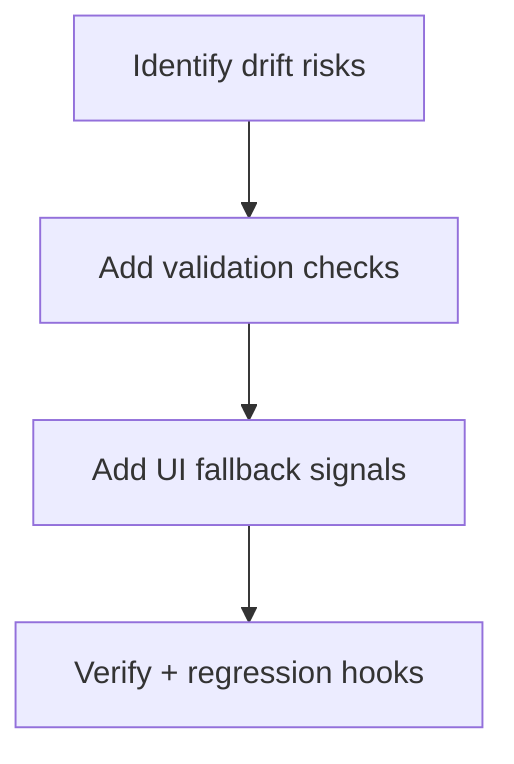
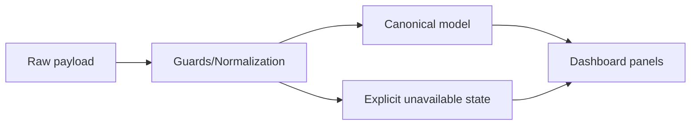

# Task: Add Runtime Guards for Contract Drift

## Task Overview

### Task Description
Introduce runtime guards that detect sprint/WIP contract drift early and degrade safely (with explicit user-visible signals) rather than failing silently or throwing rendering errors.

### Task Purpose
Prevent reintroduction of null/undefined crashes and reduce time-to-diagnosis when upstream payloads change.

---

## Dependencies

### Prerequisites
- **Prerequisite Tasks**: plan_50, plan_51
- **Required Resources**: Canonical model rules and payload validation checklist
- **Environment Requirements**: Ability to simulate invalid or incomplete payloads

### Downstream Impact
- **Downstream Tasks**: plan_57
- **Provided Output**: Safe fallback behavior and early detection signals

---

## Execution Steps

### Step 1: Identify High-Risk Fields
- **Action**: Identify which fields commonly drift and which failures are most harmful.
- **Input**: Field mapping table and past incidents.
- **Output**: Guard priority list.
- **Notes**: Prioritize identity and active-status determination.

### Step 2: Add Validation and Normalization Checks
- **Action**: Add lightweight checks and normalization safeguards at ingestion boundaries.
- **Input**: Canonical contract rules.
- **Output**: Payload normalization with guardrails.
- **Notes**: Prefer safe fallbacks over throwing.

### Step 3: User-Visible Fallback Signals
- **Action**: Ensure the UI explicitly communicates when sprint-dependent data is unavailable due to contract mismatch.
- **Input**: UX patterns from plan_44.
- **Output**: Clear messages without blocking other panels.
- **Notes**: Avoid leaking raw payload details to end users.

### Step 4: Verification and Regression Hooks
- **Action**: Add targeted regression expectations to prevent removing guards accidentally.
- **Input**: Guard scenarios.
- **Output**: Verified safe behavior under drift.
- **Notes**: Coordinate with plan_59 for broader regression scenarios.

---

## Visualization Aids

### Step Flowchart

### Dashboard System Flow (Contract Drift Handling)

### Core Metrics Mapping (Guard Coverage)
| Guarded Area | Failure Prevented | User Impact | Acceptance Signal |
| --- | --- | --- | --- |
| Sprint ID normalization | wrong/missing ID | widgets empty | explicit "not available" |
| Active status normalization | no active sprint selected | widgets/charts missing | deterministic selection |

### Risk Monitoring Table
| Risk Item | Level | Trigger Signal | Mitigation Strategy | Owner |
| --- | --- | --- | --- | --- |
| Guards become noisy and hide true issues | Medium | frequent warnings without action | keep messaging user-friendly + severity tagging | AI-agent |
| Guards removed during future refactors | Medium | regressions reappear | regression tests cover guard behavior | AI-agent |

### File Operations List

#### Files to Create
 - No new files required (current scope)

#### Files to Modify
- `frontend/src/utils/sprintNormalization.ts`
- `frontend/src/store/sprintSlice.ts`
  - Modification Location: payload ingestion/selection
  - Modification Content: validation + safe fallback paths
  - Modification Reason: prevent silent failures

#### Files to Read
- `frontend/src/services/api/sprints.ts`
  - Read Purpose: identify drift patterns
  - Usage: validate guard coverage

## Acceptance Criteria

### Functional Acceptance
- Missing or malformed sprint payload fields do not crash dashboard or sibling components.
- Fallback states are visible, explicit, and avoid blocking unrelated dashboard sections.

### Technical Acceptance
- Add guard logic at shared normalization boundary with structured output for `missingFields` or `isValid`.
- Regression tests confirm a guarded failure path for:
  - payload missing sprint identifier
  - payload missing dates
  - payload missing contract status markers

