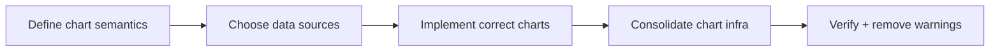
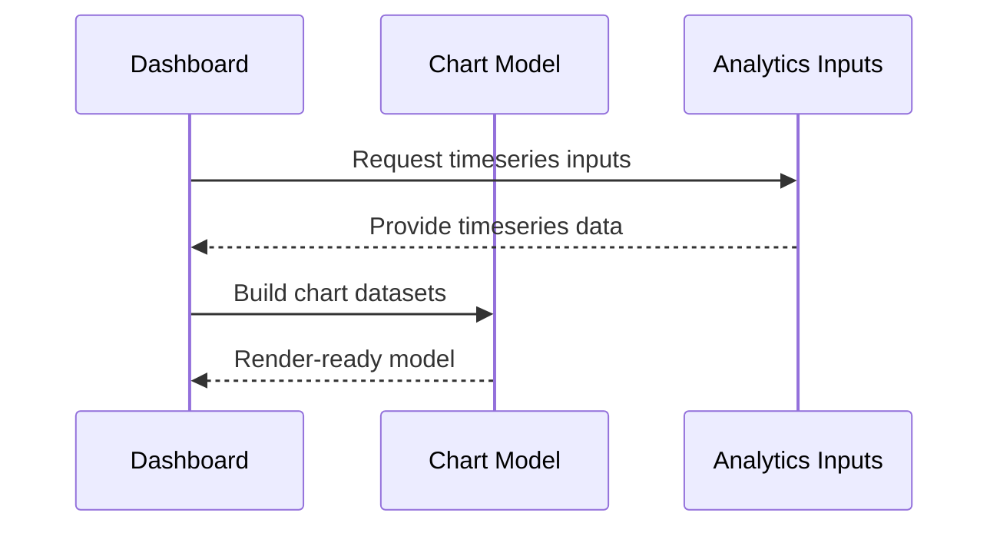

# Module: Chart Data Correctness and Infrastructure Hygiene

## Module Overview

### Module Goal
Ensure velocity and burndown charts reflect correct semantics and data sources, and consolidate chart infrastructure so runtime warnings and text/encoding artifacts are eliminated.

### Position in Project
Charts are highly visible and are a frequent source of user trust issues. Clean chart infrastructure also reduces noisy console output and prevents hidden dependency drift.

---

## Dependencies

### Prerequisites
- **Prerequisite Tasks**: plan_49
- **Prerequisite Data**: Timeseries input availability assessment and fallback policy
- **Prerequisite Environment**: Ability to validate chart rendering against seeded fixtures with at least one full sprint, one partial sprint, and one missing sprint dataset

### Downstream Impact
- **Downstream Tasks**: plan_57
- **Output Data**: Correct charts and stable chart infrastructure contract

### External Dependencies
- **Third-Party Services**: Sprint/task sources as configured
- **Database**: Stored analytics/timestamps
- **API Interfaces**: Analytics endpoints or computed aggregates

---

## Subtask Breakdown

- [x] plan_54 - Replace Synthetic Burndown With Real Timeline (estimated 180 minutes)
  - Brief: Prefer real timeline-based burndown and label fallbacks explicitly.
- [x] plan_55 - Standardize Velocity Computation and Labels (estimated 120 minutes)
  - Brief: Use consistent bucketing and stable labeling for velocity and trend.
- [x] plan_56 - Consolidate Chart Infrastructure and Fix Text Artifacts (estimated 90 minutes)
  - Brief: Ensure plugins/registration are consistent and remove encoding artifacts.

---

## Visualization Output

### Module Flowchart


### Dashboard System Flow (Charts)
```
+-------------------+     +---------------------+     +----------------------+
| Dashboard Charts  | <-- | Derived Computation | <-- | Timeseries Inputs     |
+-------------------+     +---------------------+     +----------+-----------+
                                                             |
                                                             V
                                                    +------------------+
                                                    | Backend / Storage|
                                                    +------------------+
```

### Core Metrics Mapping (Charts)
| Chart | Primary Semantics | Inputs | Fallback | Required Labeling |
| --- | --- | --- | --- | --- |
| Burndown | remaining scope vs time | `/v1/analytics/sprints/{id}/burndown` | "not available" | explicit mode |
| Velocity | completed work per bucket | `/v1/analytics/projects/{projectId}/velocity` (first-class), fallback to task timeline if unavailable | limited data warning + explicit mode label | stable bucket labels |

### Interface Collaboration Diagram


### Resource Allocation Table
| Resource Type | Owner | Time Window | Key Output | Risk/Notes |
| --- | --- | --- | --- | --- |
| Frontend engineer | AI-agent | one execution pass | correct charts + infra cleanup | avoid hidden plugin drift |
| Backend reviewer | QA engineer | one execution pass | validate semantics/data | align on definitions |

---

## Acceptance Criteria

### Functional Acceptance
- Burndown reflects the defined timeline semantics or explicitly shows "not available".
- Velocity uses stable buckets/labels and trend semantics.
- No chart runtime warnings appear in normal dashboard usage.

### Quality Acceptance
- Chart infrastructure is centralized and consistent across the app.


