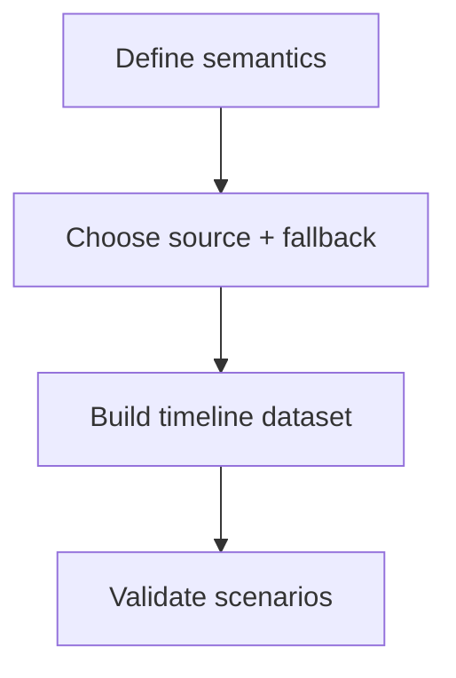
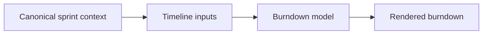

# Task: Replace Synthetic Burndown With Real Timeline

## Task Overview

### Task Description
Replace the synthetic burndown representation with a real timeline-based burndown aligned to sprint context, and provide explicit "not available" behavior when required inputs are missing.

### Task Purpose
Ensure burndown is trustworthy and interpretable rather than a misleading approximation.

---

## Dependencies

### Prerequisites
- **Prerequisite Tasks**: plan_50
- **Required Resources**: Burndown semantics definition and input availability assessment
- **Environment Requirements**: Dataset with at least one sprint that has timeline analytics

### Downstream Impact
- **Downstream Tasks**: plan_59
- **Provided Output**: Timeline-based burndown model and explicit fallback behavior

---

## Execution Steps

### Step 1: Define Burndown Semantics
- **Action**: Define what burndown represents (scope, time granularity, and "remaining" definition).
- **Input**: Analytics requirements and stakeholder expectations.
- **Output**: Burndown semantics spec.
- **Notes**: Include rules for scope changes and carryover.

### Step 2: Select Primary Data Source and Fallback
- **Action**: Use sprint timeline analytics as the primary source for burndown inputs and define explicit fallback modes.
- **Input**: Input availability assessment.
- **Output**: Source selection and fallback policy.
- **Notes**: If fallback is approximate, label it explicitly.

### Step 3: Implement Timeline-Based Dataset Model
- **Action**: Build the chart dataset from timeline inputs with stable labeling.
- **Input**: Timeseries inputs and semantics spec.
- **Output**: Burndown chart model aligned to sprint dates.
- **Notes**: Keep API layer raw/typed; dataset transformation belongs to dashboard derivations/chart layer.
- **Notes**: Handle missing points and gaps gracefully.

### Step 4: Validate Against Known Scenarios
- **Action**: Validate burndown across: normal sprint, mid-sprint scope change, and no active sprint.
- **Input**: Scenario datasets.
- **Output**: Verified correct behavior and clear messaging.
- **Notes**: Ensure the chart never renders misleading linear progress without a label.

---

## Visualization Aids

### Step Flowchart

### Dashboard System Flow (Burndown)

### Core Metrics Mapping (Burndown Inputs)
| Burndown Element | Required Input | Optional Input | If Missing |
| --- | --- | --- | --- |
| Sprint date window | start/end dates | timezone | explicit "not available" |
| Remaining scope series | timeseries points | scope change markers | fallback disabled |
| Ideal line (optional) | computed from commitment | none | omit if misleading |

### Risk Monitoring Table
| Risk Item | Level | Trigger Signal | Mitigation Strategy | Owner |
| --- | --- | --- | --- | --- |
| Missing timeseries data in some environments | High | chart empty or crashes | explicit "not available" mode | AI-agent |
| Approximation mistaken for real burndown | Medium | misinterpretation | explicit labeling of fallback | AI-agent |

### File Operations List

#### Files to Create
 - No new files required (current scope)

#### Files to Modify
- `frontend/src/pages/Dashboard.tsx`
- `frontend/src/pages/dashboard/dashboardDerivations.ts`
  - Modification Location: burndown series transformation
  - Modification Content: timeline-based series + fallback handling
  - Modification Reason: remove synthetic representation while keeping service layer UI-agnostic

#### Files to Read
- `frontend/src/services/api/analytics.ts`
  - Read Purpose: align chart behavior with analytics definitions
  - Usage: validate inputs and outputs
- `frontend/src/services/api/sprints.ts`
  - Read Purpose: confirm API layer remains raw and typed
  - Usage: avoid moving Chart.js-specific transformation into service layer

## Acceptance Criteria

### Functional Acceptance
- Burndown chart uses timeline endpoint when active sprint is present.
- If timeline API returns no `actual_burndown`/`ideal_burndown`, dashboard shows explicit "Not available for this sprint" message.
- X-axis label format is documented and stable.

### Quality Acceptance
- Synthetic "7-day linear" fallback exists only as clearly labeled fallback, never as default data.
- Burndown panel does not emit runtime exceptions when series points are missing or sparse.
- `frontend/src/services/api/sprints.ts` remains free of Chart.js dataset-building concerns.

