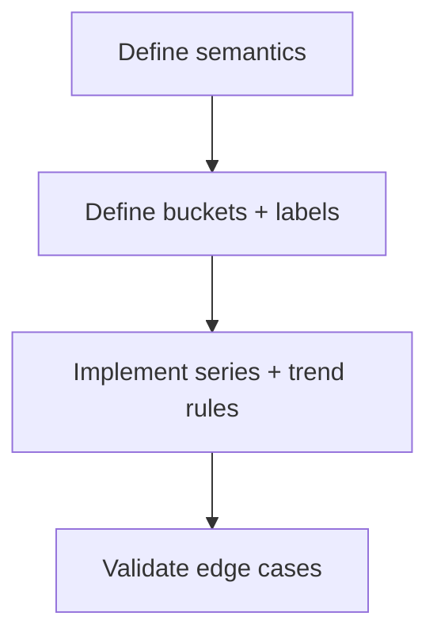

# Task: Standardize Velocity Computation and Labels

## Task Overview

### Task Description
Standardize velocity computation so bucket labeling, time boundaries, and "completed work" semantics are consistent and stable across environments and datasets.

### Task Purpose
Ensure velocity trends are interpretable and prevent label drift or timezone-related bucket errors.

---

## Dependencies

### Prerequisites
- **Prerequisite Tasks**: plan_46
- **Required Resources**: Velocity semantics definition (what counts as completed work)
- **Environment Requirements**: Dataset spanning multiple time buckets

### Downstream Impact
- **Downstream Tasks**: plan_59
- **Provided Output**: Stable velocity series definition and labeling rules

---

## Execution Steps

### Step 1: Define Velocity Semantics
- **Action**: Define whether velocity is sprint-based and lock it to the backend contract.
- **Input**: Stakeholder expectations and data availability.
- **Output**: Velocity semantics statement.
- **Notes**: Backend contract is `sprint_velocities` + `velocity_trend`; no duplicate task-window model is allowed by default.

### Step 2: Define Bucket and Label Rules
- **Action**: Choose bucket granularity and define stable label formatting rules.
- **Input**: Semantics statement.
- **Output**: Bucket and labeling spec mapped to backend `sprint_name` (or `sprint_id` fallback).
- **Notes**: Consider locale and timezone stability.

### Step 3: Implement Series Model and Trend Interpretation
- **Action**: Implement the series model and define trend interpretation rules (up/down/flat).
- **Input**: Bucket spec and dataset.
- **Output**: Velocity series model used consistently in the dashboard.
- **Notes**: Use `velocity_trend` for trend copy (`increasing/decreasing/stable/insufficient_data`) and avoid inferred linear trend when data is sparse.

### Step 4: Validate With Sparse and Noisy Data
- **Action**: Validate behavior for: sparse completion data, missing estimates, and timezone boundary cases.
- **Input**: Scenario datasets.
- **Output**: Verified stable behavior and explicit empty states.
- **Notes**: Avoid silently showing all zeros without explanation.

---

## Visualization Aids

### Step Flowchart

### Dashboard System Flow (Velocity)

### Core Metrics Mapping (Velocity)
| Velocity Mode | Input Signal | Output Unit | Label Example | Empty-State Rule |
| --- | --- | --- | --- | --- |
| Sprint velocity | `/v1/analytics/projects/{projectId}/velocity` | hours or points | `Sprint N` | "no sprint data" |
| Time-window fallback (if required) | task completion timestamps | hours or points | `Week 1`, `Week 2` | "not enough data" |

### Risk Monitoring Table
| Risk Item | Level | Trigger Signal | Mitigation Strategy | Owner |
| --- | --- | --- | --- | --- |
| Buckets shift due to timezone/locale | Medium | inconsistent labels across sessions | stable labeling rules | AI-agent |
| Sparse data misleads trend | Medium | trend shows false signal | require minimum points | AI-agent |

### File Operations List

#### Files to Create
 - No new files required (current scope)

#### Files to Modify
- `frontend/src/components/VelocityChart.tsx`
- `frontend/src/services/api/analytics.ts`
  - Modification Location: velocity computation and labels
  - Modification Content: stable bucket rules + empty-state behavior
  - Modification Reason: improve interpretability
- `frontend/src/services/api/types.ts`
  - Modification Location: `VelocityResponse`
  - Modification Content: align type to backend fields (`average_velocity`, `velocity_trend`, `sprint_velocities`)
  - Modification Reason: stop contract drift between backend and UI.

#### Files to Read
- `frontend/src/pages/dashboard/dashboardContract.ts`
  - Read Purpose: align computation to agreed meaning
  - Usage: validate bucket scope

## Acceptance Criteria

### Functional Acceptance
- `VelocityResponse` is type-safe to backend contract (`sprint_velocities`, `velocity_trend`) and mapped only through this model.
- Missing or sparse values produce explicit empty-state signals, not deceptive flat lines.
- Trend copy uses backend enum (`increasing`, `decreasing`, `stable`, `insufficient_data`) and is deterministic.

### Technical Acceptance
- One authoritative velocity model is used across dashboard and chart helpers.
- Deterministic labels from `sprint_name` or `sprint_id` appear in snapshots and tests.

