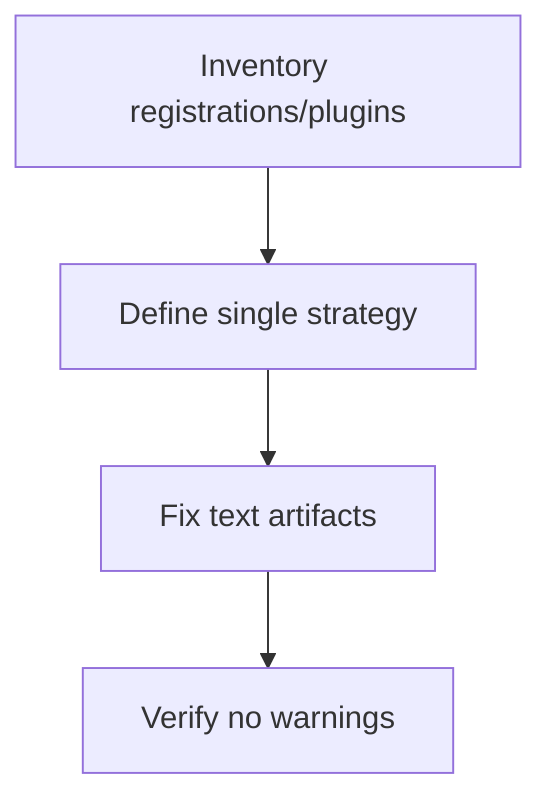
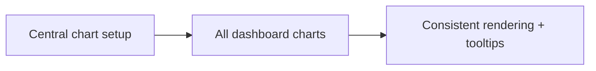

# Task: Consolidate Chart Infrastructure and Fix Text Artifacts

## Task Overview

### Task Description
Consolidate chart registration and plugin configuration to a single consistent approach across the app, and remove text/encoding artifacts in chart tooltips and annotations.

### Task Purpose
Eliminate runtime warnings, avoid inconsistent chart behavior across pages, and ensure UI text renders correctly.

---

## Dependencies

### Prerequisites
- **Prerequisite Tasks**: plan_42
- **Required Resources**: Current chart usage inventory and warning baseline
- **Environment Requirements**: Ability to reproduce chart warnings and verify absence after changes

### Downstream Impact
- **Downstream Tasks**: plan_58, plan_59
- **Provided Output**: Clean chart infrastructure contract and corrected tooltip text

---

## Execution Steps

### Step 1: Inventory Chart Registrations and Plugins
- **Action**: Identify where charts are registered/configured and which plugins are required by each chart.
- **Input**: Current app chart usage.
- **Output**: Plugin and registration inventory.
- **Notes**: Ensure required fill/annotation behavior is accounted for.

### Step 2: Define Single Registration Strategy
- **Action**: Choose and document the single registration strategy used across the app.
- **Input**: Inventory and app initialization flow.
- **Output**: Centralized chart setup contract.
- **Notes**: Avoid per-page registration drift.

### Step 3: Fix Tooltip/Text Encoding Artifacts
- **Action**: Replace corrupted tooltip characters and standardize annotation strings.
- **Input**: Known artifact strings and UX copy style.
- **Output**: Correctly rendered tooltip/annotation strings.
- **Notes**: Prefer plain text over decorative symbols when stability is uncertain.

### Step 4: Verify No-Warning Baseline
- **Action**: Verify charts render without warnings and the tooltip text is correct.
- **Input**: Manual smoke and test runs.
- **Output**: Verified clean console baseline.
- **Notes**: Include at least one chart for each required plugin feature.

---

## Visualization Aids

### Step Flowchart

### Dashboard System Flow (Chart Infra)

### Core Metrics Mapping (Infrastructure Hygiene)
| Concern | Symptom | Mitigation | Acceptance Signal |
| --- | --- | --- | --- |
| Missing plugin registration | runtime warnings | central setup contract | no warnings |
| Duplicate registration | inconsistent behavior | single strategy | consistent charts |
| Encoding artifacts | corrupted tooltip text | standardized strings | clean rendering |

### Risk Monitoring Table
| Risk Item | Level | Trigger Signal | Mitigation Strategy | Owner |
| --- | --- | --- | --- | --- |
| Central setup change affects other charts | Medium | regressions on other pages | validate `Dashboard`, `VelocityChart`, `CapacityChart` render paths | AI-agent |
| Removing symbols changes UX copy expectations | Low | feedback about visuals | use consistent copy standards | AI-agent |

### File Operations List

#### Files to Create
 - No new files required (current scope)

#### Files to Modify
- `frontend/src/chart.ts`
  - Modification Location: app initialization chart configuration
  - Modification Content: unified registration and plugin set
  - Modification Reason: eliminate drift and warnings
- `frontend/src/components/VelocityChart.tsx`
  - Modification Location: chart tooltip/annotation text
  - Modification Content: replace corrupted artifacts with stable text
  - Modification Reason: encoding correctness

#### Files to Read
- `frontend/src/pages/Dashboard.tsx`
  - Read Purpose: confirm which plugins/features are required
  - Usage: avoid breaking other pages

## Acceptance Criteria

### Functional Acceptance
- Warning `filler plugin` no longer appears in dashboard/velocity chart console output.
- Tooltip text contains plain UTF-8 text for all annotation labels.
- No duplicate `ChartJS.register` calls remain in page-level dashboard or velocity-specific files.

### Technical Acceptance
- `frontend/src/chart.ts` becomes authoritative registration module.
- `frontend/src/pages/Dashboard.tsx` imports shared chart setup only.
- Plugin list in `dashboard` and `VelocityChart` aligns with actually used components.

