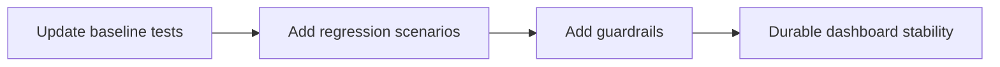

# Module: Regression Coverage and Operational Guardrails (Dashboard)

## Module Overview

### Module Goal
Update and expand automated coverage to validate the stabilized dashboard behavior, and add operational guardrails so future changes do not silently reintroduce duplication, broken filters, contract drift failures, or chart warnings.

### Position in Project
This module ensures the refactor remains durable. It replaces brittle legacy DOM coupling with stable behavior checks and adds guardrails for observability and performance.

---

## Dependencies

### Prerequisites
- **Prerequisite Tasks**: plan_41, plan_45, plan_49, plan_53
- **Prerequisite Data**: Stabilized UI contract and semantics documentation
- **Prerequisite Environment**: Test environment capable of running frontend test suites

### Downstream Impact
- **Downstream Tasks**: Release readiness checks
- **Output Data**: Durable regression expectations and early failure signals

---

## Subtask Breakdown

- [ ] plan_58 - Update Tests to New DOM Contract (estimated 180 minutes)
  - Brief: Move tests to stable identifiers and behavior-driven assertions.
- [ ] plan_59 - Add Regression Scenarios for Filters/Sprints/Charts (estimated 180 minutes)
  - Brief: Cover key regression surfaces end-to-end within the test harness.
- [ ] plan_60 - Add Observability and Performance Guardrails (estimated 120 minutes)
  - Brief: Add guardrails for warnings, refresh loops, and performance degradation.

---

## Visualization Output

### Module Flowchart


### Dashboard System Flow (Stability)
```
+---------------------+     +---------------------+     +----------------------+
| Stabilized UI       | --> | Regression Coverage | --> | Guardrails/Signals    |
+---------------------+     +---------------------+     +----------------------+
```

### Core Metrics Mapping (Regression Focus)
| Surface | Regression Signal | Test Strategy | Guardrail |
| --- | --- | --- | --- |
| Layout | duplicated panels | DOM contract checks | snapshot/structure checks |
| Filters | no visible change | behavior assertions | semantics checklist |
| Sprint/WIP | empty widgets | contract scenario tests | runtime guards |
| Charts | warnings/text artifacts | console assertion | infra consolidation |

### Resource Allocation Table
| Resource Type | Owner | Time Window | Key Output | Risk/Notes |
| --- | --- | --- | --- | --- |
| Frontend engineer | AI-agent | one execution pass | tests + guardrails | avoid brittle assertions |
| QA / reviewer | QA engineer | one execution pass | scenario validation | ensure coverage matches intent |

---

## Acceptance Criteria

### Quality Acceptance
- Tests validate stabilized behavior without relying on legacy-only DOM.
- Guardrails detect duplication, broken filters, and chart warnings early.

### Functional Acceptance
- Regression suite includes scenarios for all modules: layout consolidation, filter semantics, sprint contract, chart source semantics.
- Dashboard can be revalidated end-to-end without any dependency on legacy block selectors.


