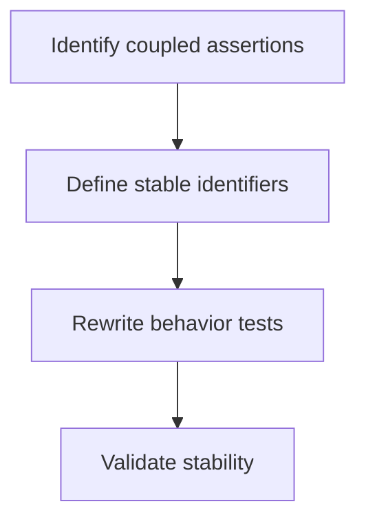
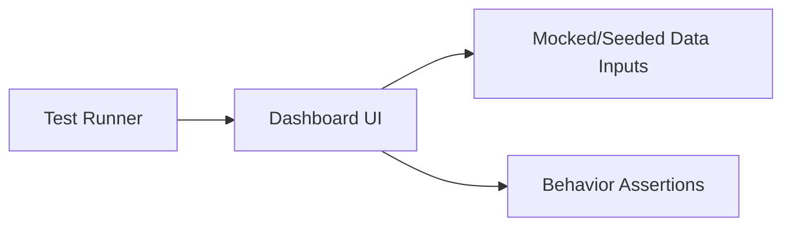

# Task: Update Dashboard Tests to New DOM Contract

## Task Overview

### Task Description
Update existing dashboard automated tests to match the stabilized dashboard UI contract and use stable identifiers and behavior-based assertions rather than legacy-only DOM structure.

### Task Purpose
Ensure the dashboard refactor does not require keeping legacy rendering solely to satisfy tests.

---

## Dependencies

### Prerequisites
- **Prerequisite Tasks**: plan_42, plan_46, plan_50
- **Required Resources**: Stabilized UI contract and filter semantics contract
- **Environment Requirements**: Ability to run the frontend test suite locally/CI

### Downstream Impact
- **Downstream Tasks**: plan_59
- **Provided Output**: Updated test suite aligned to the refactored dashboard

---

## Execution Steps

### Step 1: Identify Legacy-Coupled Assertions
- **Action**: Locate assertions tied to removed/legacy DOM and list the intended behaviors they were validating.
- **Input**: Existing dashboard tests.
- **Output**: Behavior intent map.
- **Notes**: Preserve test intent; change implementation coupling.

### Step 2: Define Stable Test Identifiers
- **Action**: Define stable identifiers for key actionable panels and lists.
- **Input**: Stabilized UI contract.
- **Output**: Identifier list and usage guidelines.
- **Notes**: Avoid over-specifying layout structure.

### Step 3: Rewrite Tests to Validate Behavior
- **Action**: Update tests to validate user-observable behavior: filter changes, drilldowns, and refresh triggers.
- **Input**: Behavior intent map and identifiers.
- **Output**: Updated tests that pass without legacy rendering.
- **Notes**: Prefer assertions on user-visible text and outcomes.

### Step 4: Validate Stability and Maintainability
- **Action**: Ensure tests remain stable under minor UI reshuffles and are fast enough for CI.
- **Input**: Updated tests.
- **Output**: Stable baseline test suite.
- **Notes**: Identify any remaining brittle areas for plan_60 guardrails.

---

## Visualization Aids

### Step Flowchart

### Dashboard System Flow (Test Perspective)

### Core Metrics Mapping (Test Coverage)
| Behavior | Inputs | Expected Output | Test Type |
| --- | --- | --- | --- |
| Filter change affects KPIs/charts | filter selections | updated values | component/integration |
| Drilldown opens and lists items | derived subsets | dialog list | component |
| Refresh on event triggers reload | realtime event | data refresh call | integration |

### Risk Monitoring Table
| Risk Item | Level | Trigger Signal | Mitigation Strategy | Owner |
| --- | --- | --- | --- | --- |
| New tests still coupled to layout | Medium | frequent breakage on UI tweaks | assert behavior not structure | AI-agent |
| Missing identifiers leads to unclear tests | Medium | hard-to-read assertions | define minimal identifier set | AI-agent |

### File Operations List

#### Files to Create
 - No new files required (current scope)

#### Files to Modify
- `frontend/src/pages/__tests__/Dashboard.test.tsx`
  - Modification Location: assertions + selectors
  - Modification Content: align to stable identifiers and behaviors
  - Modification Reason: remove dependency on legacy DOM

#### Files to Read
- `frontend/src/pages/dashboard/dashboardContract.ts`
  - Read Purpose: ensure tests match intended behavior
  - Usage: define acceptance assertions

## Acceptance Criteria

### Functional Acceptance
- Test suite validates:
  - filter changes affect at least one KPI/chart/list output
  - `chartView` toggles control rendered chart surfaces
  - `recent/active` quick filters resolve deterministically
- Legacy selectors tied to removed duplicate blocks are removed.

### Quality Acceptance
- Tests include explicit regression for empty states and WIP-not-available state.
- Test identifiers map one-to-one to dashboard contract sections and remain stable across structural refactors.

