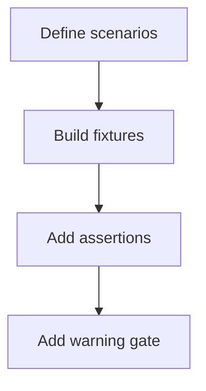
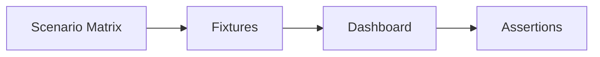

# Task: Add Regression Scenarios for Filters, Sprints, and Charts

## Task Overview

### Task Description
Add targeted regression scenarios that validate the highest-risk dashboard behaviors across filters, sprint/WIP context, and chart rendering, including edge-case datasets.

### Task Purpose
Prevent recurrence of "filters do not work", "active sprint always null", "chart warnings", and "blank panels" regressions.

---

## Dependencies

### Prerequisites
- **Prerequisite Tasks**: plan_58
- **Required Resources**: Scenario matrix and seeded/mocked datasets
- **Environment Requirements**: Ability to run scenarios in CI-friendly time

### Downstream Impact
- **Downstream Tasks**: plan_60
- **Provided Output**: Scenario-based regression coverage

---

## Execution Steps

### Step 1: Define Scenario Matrix
- **Action**: Define scenarios covering: filter changes, no data windows, no active sprint, partial analytics, and multi-project context.
- **Input**: Known risk list and previous incidents.
- **Output**: Scenario matrix.
- **Notes**: Prioritize scenarios that previously caused blank pages or crashes.
- **Notes (recommended baseline scenarios)**:
  - `dateRange` changes KPI + upcoming list
  - `dateRange` does not change burndown sprint timeline
  - `chartView` toggles exact chart panels by test id
  - `quickFilter` active/recent transitions are deterministic
  - partial task scope shows `dashboard-partial-scope` badge

### Step 2: Implement Scenario Fixtures
- **Action**: Create seeded/mocked datasets for each scenario (within the existing test harness).
- **Input**: Scenario matrix.
- **Output**: Reusable fixtures.
- **Notes**: Ensure fixtures are small and deterministic.

### Step 3: Add Assertions for Key Outcomes
- **Action**: Add behavior assertions: correct empty states, correct toggles, and absence of runtime warnings.
- **Input**: Fixtures and stabilized identifiers.
- **Output**: Regression tests that fail fast on drift.
- **Notes**: Keep assertions focused on user-visible outcomes.

### Step 4: Stabilize Runtime Warning Detection
- **Action**: Ensure runtime warnings (e.g., chart warnings) are captured and treated as failures where appropriate.
- **Input**: Warning baseline.
- **Output**: Warning regression gate.
- **Notes**: Avoid false positives by scoping to dashboard-related warnings.

---

## Visualization Aids

### Step Flowchart

### Dashboard System Flow (Scenario Coverage)

### Core Metrics Mapping (Scenario Targets)
| Scenario | Primary Risk | Expected UI Signal | Covered Area |
| --- | --- | --- | --- |
| Date range empty window | blank panels | explicit empty state | KPIs/charts/lists |
| No active sprint | crashes/empty widgets | "no active sprint" | WIP/burndown |
| Partial analytics | inconsistent charts | explicit availability | charts |
| Multi-project context | misleading selection | deterministic context | filters |

### Risk Monitoring Table
| Risk Item | Level | Trigger Signal | Mitigation Strategy | Owner |
| --- | --- | --- | --- | --- |
| Scenario fixtures become large/slow | Medium | CI time increases | keep fixtures minimal | AI-agent |
| Warning gates cause flaky failures | Medium | nondeterministic console output | scope gates narrowly | AI-agent |

### File Operations List

#### Files to Create
- `frontend/src/pages/__tests__/fixtures/dashboard-scenarios.ts`
  - Type: test fixtures
  - Purpose: deterministic datasets for regression scenarios
  - Content: minimal project/task/sprint payloads

#### Files to Modify
- `frontend/src/pages/__tests__/Dashboard.test.tsx`
  - Modification Location: new scenario tests
  - Modification Content: assertions per scenario matrix
  - Modification Reason: prevent regression recurrence

#### Files to Read
- `frontend/src/pages/Dashboard.tsx`
  - Read Purpose: select high-value scenarios
  - Usage: define acceptance assertions

## Acceptance Criteria

### Functional Acceptance
- Regression matrix includes explicit scenarios for:
  - `dateRange` with no matches
  - `dateRange` does not alter burndown sprint-scoped series
  - missing active sprint
  - partial analytics availability
  - quick filter context transitions
- Regression matrix includes one deterministic visibility scenario for each `chartView` mode: `velocity`, `burndown`, `both`, `distribution`.
- Warnings gate is deterministic and scoped to dashboard chart renders.

### Quality Acceptance
- Each scenario fails fast with actionable diff output.
- Total scenario runtime stays within CI budget and avoids network dependence.

