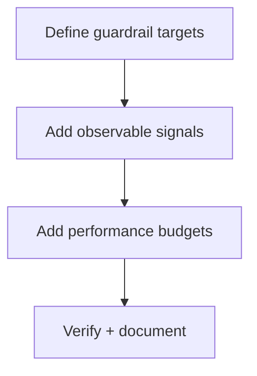
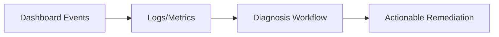

# Task: Add Observability and Performance Guardrails

## Task Overview

### Task Description
Add lightweight observability and performance guardrails for the dashboard to detect refresh loops, slow renders, and reintroduction of noisy warnings or broken data flows.

### Task Purpose
Reduce time-to-diagnosis and prevent gradual degradation of dashboard quality over time.

---

## Dependencies

### Prerequisites
- **Prerequisite Tasks**: plan_59
- **Required Resources**: Current logging/telemetry conventions and performance baseline
- **Environment Requirements**: Ability to measure typical dashboard load and interaction durations

### Downstream Impact
- **Downstream Tasks**: Release readiness checks
- **Provided Output**: Guardrails and signals that detect regressions early

---

## Execution Steps

### Step 1: Define Guardrail Targets
- **Action**: Define which signals matter: repeated refresh loops, slow filter application, and chart warning reappearance.
- **Input**: Known risk list and performance baseline.
- **Output**: Guardrail target list.
- **Notes**: Keep targets minimal and actionable.

### Step 2: Add Observable Signals
- **Action**: Add lightweight signals consistent with existing conventions (logs/metrics/events).
- **Input**: Guardrail target list.
- **Output**: Observable dashboard behavior signals.
- **Notes**: Avoid excessive logging.

### Step 3: Add Performance Budgets
- **Action**: Define and enforce basic performance budgets for key interactions (initial load, filter changes).
- **Input**: Baseline measurements.
- **Output**: Budget thresholds and enforcement approach.
- **Notes**: Prefer trend-based alerts over strict thresholds if variability is high.

### Step 4: Verification and Documentation
- **Action**: Validate signals appear as expected and document how to use them in diagnosis.
- **Input**: Guardrail implementation.
- **Output**: Verified guardrails and usage notes.
- **Notes**: Coordinate with QA and release readiness.

---

## Visualization Aids

### Step Flowchart

### Dashboard System Flow (Observability)

### Core Metrics Mapping (Guardrails)
| Guardrail | Signal | Trigger | Response |
| --- | --- | --- | --- |
| Refresh loop | repeated refresh events | frequency threshold | investigate realtime + refresh rules |
| Slow filter apply | duration metric | exceeds budget | optimize derived computations |
| Chart warnings | warning gate | warning detected | fix plugin/registration drift |

### Risk Monitoring Table
| Risk Item | Level | Trigger Signal | Mitigation Strategy | Owner |
| --- | --- | --- | --- | --- |
| Too much telemetry noise | Low | logs become noisy | keep signals minimal | AI-agent |
| Budgets create flaky gates | Medium | inconsistent timing | use trend-based validation | AI-agent |

### File Operations List

#### Files to Create
- `docs/dashboard-observability.md`
  - Type: documentation
  - Purpose: guide diagnosis using dashboard signals
  - Content: signal definitions and troubleshooting steps

#### Files to Modify
- `frontend/src/pages/Dashboard.tsx`
  - Modification Location: load/refresh/filter pathways
  - Modification Content: emit minimal signals + duration tracking
  - Modification Reason: early regression detection

#### Files to Read
- `frontend/src/pages/ProjectDetail.tsx`
  - Read Purpose: align instrumentation with app standards
  - Usage: avoid creating a parallel telemetry style

## Acceptance Criteria

### Functional Acceptance
- Dashboard exposes consistent signal/trace points for:
  - refresh frequency
  - filter application duration
  - chart render warnings
- Guardrails never break normal interaction flow when events are absent.

### Technical Acceptance
- No new high-volume logs are introduced for every render tick.
- Performance thresholds are documented and reviewed in follow-up release notes.

