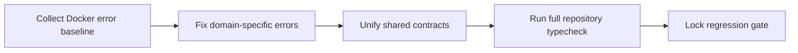
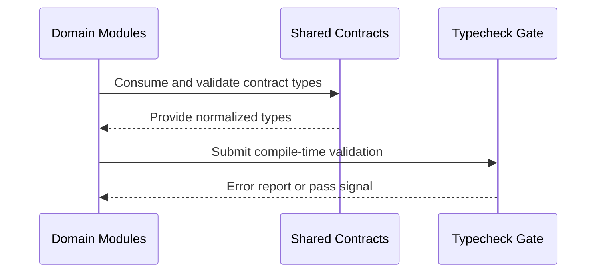

# Module: Repository-Wide Typecheck Zero-Error Program

## Module Overview

### Module Goal
Reach strict zero TypeScript errors for the full repository typecheck pipeline in Docker, without temporary suppressions and without reducing type strictness.

### Position in Project
This module is a stabilization branch of the existing regression program and establishes a single trustworthy compile-time quality gate for all frontend TypeScript domains.

---

## Dependencies

### Prerequisites
- **Prerequisite Tasks**: plan_39
- **Prerequisite Data**: Current full error inventory from repository-wide typecheck in Docker at `artifacts/typecheck/plan_61_full_repository_typecheck.txt`
- **Prerequisite Environment**: Reproducible Node.js + package manager environment inside Docker

### Downstream Impact
- **Downstream Tasks**: Release readiness and next implementation blocks
- **Output Data**: Verified zero-error baseline and reusable triage taxonomy

### External Dependencies
- **Third-Party Services**: None required for planning
- **Database**: Not applicable
- **API Interfaces**: Existing internal contract surfaces consumed by frontend domains

---

## Subtask Breakdown

- [x] plan_62 - Analytics Type Error Remediation
  - Brief: Remove type mismatches in analytics aggregates, chart inputs, and derived selectors.
- [x] plan_63 - Traceability Type Error Remediation
  - Brief: Resolve type drift in trace links, matrix projections, and graph transformations.
- [x] plan_64 - ProjectDetail and SprintCapacity Type Error Remediation
  - Brief: Align panel/page input contracts and eliminate nullable/union ambiguity in UI state.
- [x] plan_65 - Shared Types and API Contract Unification
  - Brief: Normalize shared models and response envelopes used across domains.
- [x] plan_66 - Repository-Wide Typecheck Gate and Regression Lock
  - Brief: Validate strict zero-error gate in Docker and prevent reintroduction.

## Execution Result (Current Pass)

- Updated baseline full repository typecheck artifact:
  - `artifacts/typecheck/plan_61_full_repository_typecheck.txt`
- Result:
  - PASS (`tsc --noEmit` with zero diagnostics in Docker canonical profile).

---

## Visualization Output

### Module Flowchart


### System Flow ASCII Diagram (Typecheck Pipeline)
```
+-----------------------+      +--------------------------+      +----------------------+
| Domain Code Surfaces  | ---> | Shared Type Contracts    | ---> | Repository Typecheck |
| (Analytics/Trace/etc) |      | (Models/DTO/Unions)      |      | Gate (Docker)        |
+-----------+-----------+      +-------------+------------+      +----------+-----------+
            |                                |                              |
            +-------------- feedback ---------+------------- diagnostics ----+
```

### Core Metrics Mapping (Panel and Compile-Time Quality)
| Frontend Area | Contract Focus | Typecheck Success Signal | Gate Risk if Broken |
| --- | --- | --- | --- |
| Analytics panels | Aggregate and series typing | No incompatible union/cast errors | Miscomputed or hidden KPI/chart data |
| Traceability panels | Link/matrix graph typing | No index/signature mismatch errors | Broken trace graphs and invalid matrices |
| ProjectDetail panel | Detail state and derived props | No nullable access/union narrowing errors | Runtime blank states and unstable rendering |
| SprintCapacity panel | Sprint capacity payload typing | No optional field misuse errors | Incorrect capacity totals and invalid status display |
| Shared contracts | Cross-module model consistency | No duplicate or conflicting type definitions | Cascading errors across all modules |

### Interface Collaboration Diagram


---

## Technical Solution

### Architecture Design
Use domain-first remediation with shared-contract convergence before final gate locking. This prevents local fixes from reintroducing repository-wide drift.

### Error Taxonomy
- Domain-local typing issues (narrowing, nullability, index signatures)
- Cross-domain contract drift (same concept, conflicting structure)
- Build-pipeline mismatch (strict mode assumptions vs current contracts)

### Remediation Rule Set
- No temporary suppression mechanisms as acceptance strategy
- No weakening of strict compile options
- Every fixed domain must remain compatible with shared contracts

### Canonical Typecheck Execution Profile (Single Source of Truth)
- Canonical working directory: `frontend`
- Canonical command (reproducible):

```bash
docker run --rm \
  -v "${PWD}:/repo" \
  -w /repo/frontend \
  -e CI=true \
  -e NODE_OPTIONS=--max-old-space-size=4096 \
  node:20-alpine \
  sh -lc "npm ci --no-audit --no-fund && npm run typecheck -- --pretty false"
```

- Canonical diagnostics output artifact:
  - `artifacts/typecheck/plan_61_full_repository_typecheck.txt`
  - Use capture command:

```bash
docker run --rm \
  -v "${PWD}:/repo" \
  -w /repo/frontend \
  -e CI=true \
  -e NODE_OPTIONS=--max-old-space-size=4096 \
  node:20-alpine \
  sh -lc "npm ci --no-audit --no-fund && npm run typecheck -- --pretty false" \
  > artifacts/typecheck/plan_61_full_repository_typecheck.txt 2>&1
```

- Stable run control:
  - The command must be executed from clean git workspace state for each canonical run.
  - Any failure during installation or typecheck is treated as a blocker for module progression.

---

## Acceptance Criteria

### Functional Acceptance
- All planned domains are remediated according to task boundaries.
- Full repository typecheck runs in Docker and returns zero errors.
- Canonical baseline artifact exists at `artifacts/typecheck/plan_61_full_repository_typecheck.txt`.

### Quality Acceptance
- No temporary suppression-based bypass is used as final solution.
- No strictness degradation is introduced to satisfy the gate.
- Regression lock exists to prevent reintroduction in subsequent blocks.
