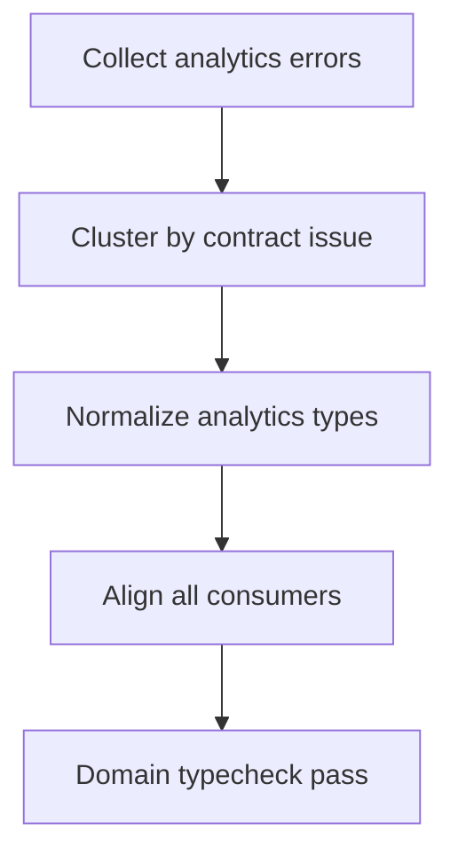

# Task: Analytics Type Error Remediation

## Task Overview

### Task Description
Eliminate TypeScript errors in analytics-centric flows, including aggregate computations, chart transformations, and selector outputs used by dashboard and detail views.

### Task Purpose
Guarantee that analytics rendering and derived metrics are backed by consistent compile-time contracts.

---

## Dependencies

### Prerequisites
- **Prerequisite Tasks**: plan_61 baseline and error taxonomy
- **Required Resources**: Analytics error snapshot from repository typecheck output
- **Environment Requirements**: Docker-based reproducible typecheck run

### Downstream Impact
- **Downstream Tasks**: plan_65, plan_66
- **Provided Output**: Clean analytics contract layer with no unresolved typing drift

---

### Domain Scope Definition
- `src/pages/Analytics*.tsx`
- `src/pages/AnalyticsDashboard.tsx`
- `src/pages/Dashboard.tsx`
- `src/components/VelocityChart.tsx`
- `src/components/DashboardFilters.tsx`
- `src/services/api/analytics.ts`
- `src/services/api/types.ts` (analytics/API shared contract entries)
- `src/services/api/pagination.ts`

### Domain Verification Commands
- Baseline command:

```bash
docker run --rm \
  -v "${PWD}:/repo" \
  -w /repo/frontend \
  -e CI=true \
  -e NODE_OPTIONS=--max-old-space-size=4096 \
  node:20-alpine \
  sh -lc "npm ci --no-audit --no-fund && npm run typecheck -- --pretty false" \
  > artifacts/typecheck/plan_62_full_typecheck.txt 2>&1
```

- Domain pass check:
  - `rg -n "src/(pages/(Analytics|Dashboard|analytics)|components/VelocityChart|components/DashboardFilters|services/api/analytics|services/api/types|services/api/pagination)" artifacts/typecheck/plan_62_full_typecheck.txt` must return 0 lines.

## Execution Steps

### Step 1: Error Cluster Mapping
- **Action**: Group analytics errors by contract mismatch type and usage surface.
- **Input**: Full error baseline for analytics scope.
- **Output**: Prioritized remediation clusters.
- **Notes**: Prioritize high-fanout types first.

### Step 2: Contract Normalization
- **Action**: Align aggregate payload shapes, optional fields, and derived unions.
- **Input**: Clustered mismatch list.
- **Output**: Unified analytics type contracts.
- **Notes**: Avoid local one-off shape variants.

### Step 3: Consumer Alignment
- **Action**: Apply normalized contracts to computations and render adapters.
- **Input**: Unified analytics contracts.
- **Output**: Compatible consumer typing with explicit narrowing.
- **Notes**: Remove implicit `any` and unsafe assumptions.

### Step 4: Domain Verification
- **Action**: Re-run canonical repository typecheck using Domain Verification Commands and confirm analytics-filtered output is empty.
- **Input**: Updated analytics contracts and consumers.
- **Output**: Domain pass report for handoff.
- **Notes**: Preserve compatibility with shared contract module.

### Step 4 Output (Current Pass)

- Domain verification artifact:
  - `artifacts/typecheck/plan_62_full_typecheck.txt`
- Domain pass report:
  - `artifacts/typecheck/plan_62_domain_verification.txt`
- Result:
  - PASS (0 matched diagnostics for analytics domain filter).

---

## Visualization Aids

### Step Flowchart


### Risk Monitoring Table
| Risk Item | Level | Trigger Signal | Mitigation Strategy |
| --- | --- | --- | --- |
| Hidden aggregate variants | High | New errors after local fix | Normalize shape at shared boundary |
| Chart union instability | Medium | Repeated narrowing errors | Introduce explicit discriminators |
| Drift with shared models | Medium | Cross-domain compile failures | Sync with shared contract task |

---

## Acceptance Criteria

### Functional Acceptance
- Analytics scope produces zero TypeScript errors (no matching diagnostics in domain-filtered pass check).
- Aggregate and series contracts are consistent across producers and consumers.

### Quality Acceptance
- No temporary suppression is used as final resolution.
- Analytics fixes do not create new errors in other domains.

