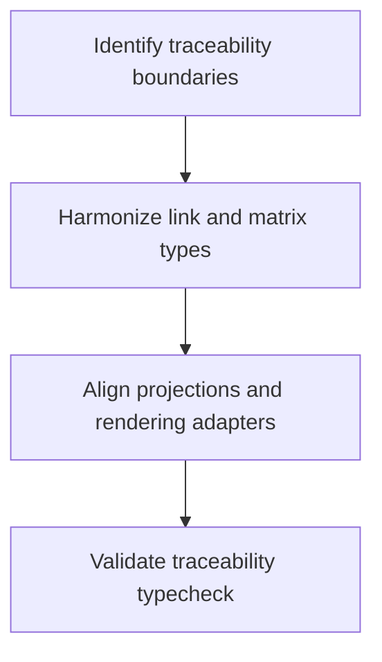

# Task: Traceability Type Error Remediation

## Task Overview

### Task Description
Resolve TypeScript errors in traceability flows, including trace-link entities, matrix projections, and graph-oriented transformation contracts.

### Task Purpose
Protect traceability correctness by enforcing stable type boundaries across link, matrix, and visualization layers.

---

## Dependencies

### Prerequisites
- **Prerequisite Tasks**: plan_61 baseline and plan_62 normalization patterns
- **Required Resources**: Traceability-specific compile error inventory
- **Environment Requirements**: Deterministic repository typecheck execution in Docker

### Downstream Impact
- **Downstream Tasks**: plan_65, plan_66
- **Provided Output**: Traceability contracts with deterministic graph and matrix typing

---

### Domain Scope Definition
- `src/pages/Traceability*.tsx`
- `src/pages/TraceabilityExecutionHistory.tsx`
- `src/pages/TraceabilityFlowBuilder.tsx`
- `src/pages/TraceabilityVisualization.tsx`
- `src/services/api/traceability.ts`
- `src/services/api/types.ts` (canonical transport models)

### Domain Verification Commands
- Canonical typecheck command:

```bash
docker run --rm \
  -v "${PWD}:/repo" \
  -w /repo/frontend \
  -e CI=true \
  -e NODE_OPTIONS=--max-old-space-size=4096 \
  node:20-alpine \
  sh -lc "npm ci --no-audit --no-fund && npm run typecheck -- --pretty false" \
  > artifacts/typecheck/plan_63_full_typecheck.txt 2>&1
```

- Domain pass check:
  - `rg -n "src/(pages/Traceability|services/api/traceability|services/api/types)" artifacts/typecheck/plan_63_full_typecheck.txt` must return 0 lines.

## Execution Steps

### Step 1: Contract Boundary Identification
- **Action**: Identify all traceability boundary types that appear in compile errors.
- **Input**: Error inventory and traceability data path mapping.
- **Output**: Boundary contract list by fanout.
- **Notes**: Focus on types reused across matrix and graph paths.

### Step 2: Type Harmonization
- **Action**: Unify node/link/matrix structures and optional attributes.
- **Input**: Boundary contract list.
- **Output**: Harmonized traceability model set.
- **Notes**: Keep one canonical representation per concept in `src/services/api/types.ts`.

### Step 3: Projection and Rendering Alignment
- **Action**: Align transformation outputs and visual adapters with canonical contracts.
- **Input**: Harmonized traceability models.
- **Output**: Compile-safe projections for all traceability views.
- **Notes**: Enforce explicit nullability behavior.

### Step 4: Domain Verification
- **Action**: Execute canonical repository typecheck and confirm traceability-filtered output is empty.
- **Input**: Updated contracts and consumers.
- **Output**: Traceability domain pass status.
- **Notes**: Escalate any cross-domain type conflicts into plan_65.

### Step 4 Output (Current Pass)

- Domain verification artifact:
  - `artifacts/typecheck/plan_63_full_typecheck.txt`
- Domain pass report:
  - `artifacts/typecheck/plan_63_domain_verification.txt`
- Result:
  - PASS (0 matched diagnostics for traceability domain filter).

---

## Visualization Aids

### Step Flowchart


### System Flow ASCII Diagram (Traceability Typing)
```
+--------------------+      +------------------------+      +----------------------+
| Link Source Models | ---> | Matrix/Graph Contract  | ---> | Traceability Outputs |
+---------+----------+      +-----------+------------+      +----------+-----------+
          |                             |                              |
          +----------- compile feedback -+------------- diagnostics ----+
```

### Risk Monitoring Table
| Risk Item | Level | Trigger Signal | Mitigation Strategy |
| --- | --- | --- | --- |
| Duplicate model semantics | High | Same entity has multiple shapes | Introduce canonical model map in `services/api/types.ts` |
| Graph projection drift | Medium | Adapter errors after harmonization | Contract-first projection validation |
| Nullability regressions | Medium | Non-deterministic optional access | Explicit null guards in model contracts |

---

## Acceptance Criteria

### Functional Acceptance
- Traceability domain has zero TypeScript errors (no diagnostics from traceability-domain filter).
- Matrix and graph contracts are consistent and reusable in all traceability view consumers.

### Quality Acceptance
- No strictness weakening is introduced.
- Changes remain compatible with shared contract unification.

