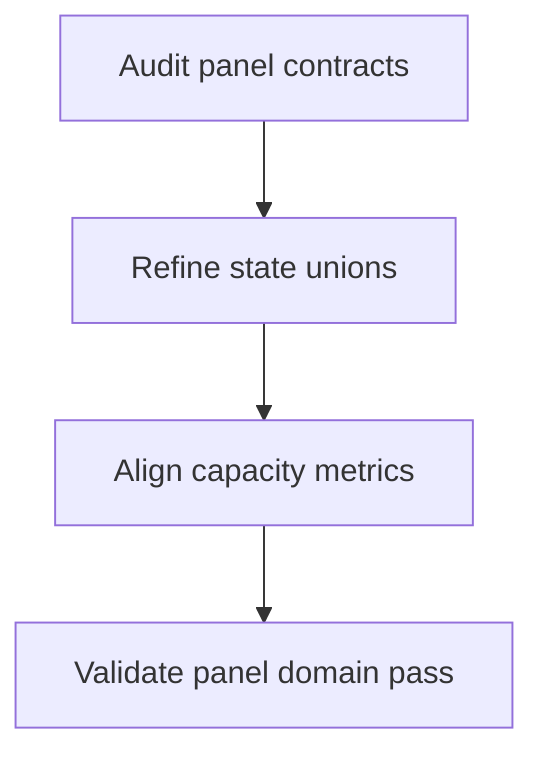
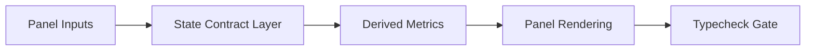

# Task: ProjectDetail and SprintCapacity Type Error Remediation

## Task Overview

### Task Description
Remove TypeScript errors in ProjectDetail and SprintCapacity panel flows, with focus on page-state contracts, sprint-context unions, and derived capacity metrics.

### Task Purpose
Stabilize panel behavior by ensuring compile-time-safe contracts for all panel inputs and UI states.

---

## Dependencies

### Prerequisites
- **Prerequisite Tasks**: plan_61 baseline, plan_63 traceability harmonization patterns
- **Required Resources**: Error inventory for panel pages and sprint-capacity flows
- **Environment Requirements**: Docker typecheck execution with full frontend scope

### Downstream Impact
- **Downstream Tasks**: plan_65, plan_66
- **Provided Output**: Zero-error panel domain with stable capacity and sprint context typing

---

### Domain Scope Definition
- `src/pages/ProjectDetail.tsx`
- `src/pages/SprintCapacity.tsx`
- `src/services/api/sprints.ts`
- `src/store/sprintSlice.ts`
- `src/store/taskSlice.ts`
- `src/store/projectSlice.ts`
- `src/utils/sprintNormalization.ts`

### Domain Verification Commands
- Canonical typecheck command:

```bash
docker run --rm \
  -v "${PWD}:/repo" \
  -w /repo/frontend \
  -e CI=true \
  -e NODE_OPTIONS=--max-old-space-size=4096 \
  node:20-alpine \
  sh -lc "npm ci --no-audit --no-fund && npm run typecheck -- --pretty false" \
  > artifacts/typecheck/plan_64_full_typecheck.txt 2>&1
```

- Domain pass check:
  - `rg -n "src/(pages/(ProjectDetail|SprintCapacity)|services/api/sprints|store/(sprintSlice|taskSlice|projectSlice)|utils/sprintNormalization)" artifacts/typecheck/plan_64_full_typecheck.txt` must return 0 lines.

## Execution Steps

### Step 1: Panel Contract Audit
- **Action**: Map page and panel inputs that trigger current compile errors.
- **Input**: Domain error list and panel data-flow map.
- **Output**: Panel contract gap register.
- **Notes**: Include loading/empty/error states in scope.

### Step 2: State and Union Refinement
- **Action**: Refine state unions and nullable fields for panel lifecycle paths.
- **Input**: Contract gap register.
- **Output**: Deterministic panel-state contracts based on a single discriminated-union pattern (`kind: 'idle' | 'loading' | 'ready' | 'error'`).
- **Notes**: Keep transitions explicit and exhaustive.

### Step 3: Capacity Metric Alignment
- **Action**: Align sprint-capacity derived metrics with canonical typed inputs.
- **Input**: Refined panel-state contracts.
- **Output**: Compile-safe capacity computation contracts.
- **Notes**: Avoid implicit numeric/string coercion paths.

### Step 4: Domain Verification
- **Action**: Validate zero remaining errors using the Domain Verification Commands filter above.
- **Input**: Updated panel and capacity contracts.
- **Output**: Panel domain pass handoff.
- **Notes**: Record cross-domain dependencies for plan_65.

### Step 4 Output (Current Pass)

- Domain verification artifact:
  - `artifacts/typecheck/plan_64_full_typecheck.txt`
- Domain pass report:
  - `artifacts/typecheck/plan_64_domain_verification.txt`
- Result:
  - PASS (0 matched diagnostics for ProjectDetail/SprintCapacity domain filter).

---

## Visualization Aids

### Step Flowchart


### Panel System Flow Diagram


### Core Metrics Mapping (Panel Stability)
| Panel Area | Type Contract Focus | Success Signal | Regression Signal |
| --- | --- | --- | --- |
| ProjectDetail summary | Optional detail fields and lifecycle states | No nullable access errors | Reintroduced union narrowing errors |
| ProjectDetail lists | Item projection and filtering contracts | No index/signature mismatch | Inconsistent item shape assumptions |
| SprintCapacity header | Sprint context status union | No invalid status branch errors | Ambiguous active/no-active state |
| SprintCapacity totals | Capacity and allocation numeric contracts | No numeric coercion/type drift errors | Invalid total computation typing |

### Risk Monitoring Table
| Risk Item | Level | Trigger Signal | Mitigation Strategy |
| --- | --- | --- | --- |
| State branch incompleteness | High | Exhaustiveness errors persist | Enforce explicit union handling |
| Metric input ambiguity | Medium | Capacity calculations fail typecheck | Canonical input contracts for metrics |
| Panel contract drift | Medium | Errors reappear after shared changes | Add panel-focused gate in final task |

---

## Acceptance Criteria

### Functional Acceptance
- ProjectDetail and SprintCapacity scopes report zero TypeScript errors (no diagnostics in domain-filtered output).
- Panel-state and capacity contracts are deterministic and explicit.

### Quality Acceptance
- No temporary suppression is used.
- Contracts remain compatible with shared model unification.

