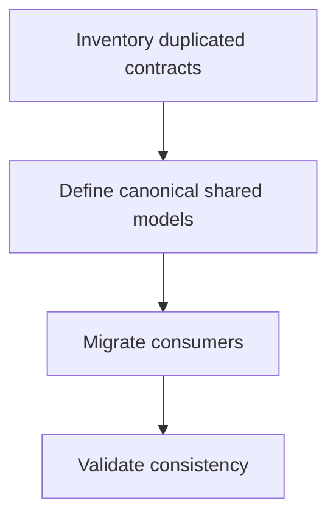

# Task: Shared Types and API Contract Unification

## Task Overview

### Task Description
Consolidate shared type definitions and API response contracts that currently diverge across frontend domains, then align all domain consumers to the canonical set.

### Task Purpose
Prevent recurring cross-module typecheck failures by removing duplicated or inconsistent contract definitions.

---

## Dependencies

### Prerequisites
- **Prerequisite Tasks**: plan_62, plan_63, plan_64
- **Required Resources**: Cross-domain contract mismatch map
- **Environment Requirements**: Full repository typecheck execution in Docker

### Downstream Impact
- **Downstream Tasks**: plan_66
- **Provided Output**: Single-source shared contract model used by all domains

---

### Canonical Contract Location
- Canonical API/domain-shared DTOs must be defined in:
  - `frontend/src/services/api/types.ts`
  - `frontend/src/services/api/index.ts` (single export hub)
- Domain pages must import shared contracts from these canonical files, not local duplicates.

### Shared Type Rules
- Prefer `readonly` fields for immutable API payloads where practical.
- Use explicit `null` vs `undefined` semantics consistently:
  - `undefined` for omitted optional values
  - `null` only if backend contract returns `null` and consumers rely on it
- Reuse existing status/enum types across pages before introducing new literals.
- Avoid broad `as any`/`as unknown as ...` in shared-boundary conversions.
- Use discriminated unions for stateful payloads and view-model wrappers.

### Domain Verification Commands
- Canonical repository check (same command from plan_61 and plan_66):

```bash
docker run --rm \
  -v "${PWD}:/repo" \
  -w /repo/frontend \
  -e CI=true \
  -e NODE_OPTIONS=--max-old-space-size=4096 \
  node:20-alpine \
  sh -lc "npm ci --no-audit --no-fund && npm run typecheck -- --pretty false" \
  > artifacts/typecheck/plan_65_full_typecheck.txt 2>&1
```

- Shared-definition enforcement:
  - Run domain scan:
    `rg -n "^(export\s+)?(type|interface|enum)\s+[A-Za-z_][A-Za-z0-9_]*" frontend/src/pages frontend/src/components frontend/src/services > artifacts/typecheck/plan_65_shared_alias_scan.txt`
  - Confirm every shared entity is imported from `frontend/src/services/api/types.ts` or documented as component-local.
  - Track migration decisions in `artifacts/typecheck/plan_65_migration_log.md` (mandatory artifact).

## Execution Steps

### Step 1: Cross-Domain Contract Inventory
- **Action**: Build inventory of duplicated and conflicting shared types.
- **Input**: Outputs of domain remediation tasks.
- **Output**: Canonicalization backlog.
- **Notes**: Rank by compile fanout and risk.

### Step 2: Canonical Shared Model Definition
- **Action**: Define one canonical structure per shared entity and response envelope.
- **Input**: Canonicalization backlog.
- **Output**: Shared contract baseline.
- **Notes**: Preserve backward-compatible optionality where required.

### Step 3: Consumer Migration
- **Action**: Migrate all dependent domains to canonical shared models.
- **Input**: Shared contract baseline.
- **Output**: Removed duplicates and aligned consumers.
- **Notes**: Reject local alias drift unless justified by boundary rules.

### Step 4: Consistency Validation
- **Action**: Validate no conflicting shared contract definitions remain.
- **Input**: Migrated consumer landscape.
- **Output**: Shared contract consistency pass.
- **Notes**: Hand over to final repository-wide gate.

### Step 4 Output (Current Pass)

- Full check artifact:
  - `artifacts/typecheck/plan_65_full_typecheck.txt`
- Shared-definition enforcement artifacts:
  - `artifacts/typecheck/plan_65_shared_alias_scan.txt`
  - `artifacts/typecheck/plan_65_migration_log.md`
  - `artifacts/typecheck/plan_65_domain_verification.txt`
- Result:
  - PASS (shared contract governance artifacts generated and attached to gate baseline).

---

## Visualization Aids

### Step Flowchart


### Contract Convergence Matrix
| Contract Area | Current Problem | Canonical Target | Migration Status Signal |
| --- | --- | --- | --- |
| Shared entities | Same concept with multiple shapes | One shared structure | No duplicate-type errors |
| API envelopes | Inconsistent payload wrappers | Single normalized envelope policy | No response-shape mismatch errors |
| Enum/status models | Divergent status vocabularies | Unified status domain model | No incompatible status union errors |
| Optional fields | Different null/optional semantics | Explicit optionality rules | No nullable drift errors |

### Risk Monitoring Table
| Risk Item | Level | Trigger Signal | Mitigation Strategy |
| --- | --- | --- | --- |
| Breaking shared change | High | New errors in previously clean domains | Stage migration by fanout |
| Canonical model underfit | Medium | Domain-specific edge cases fail | Add explicit extension strategy |
| Incomplete migration | Medium | Residual duplicate contracts | Enforce inventory closure checklist |

---

## Acceptance Criteria

### Functional Acceptance
- Shared type and API contract surfaces are unified and canonical in `frontend/src/services/api/types.ts`.
- No duplicate or conflicting shared definitions remain in active domain usage, and `artifacts/typecheck/plan_65_migration_log.md` is fully populated.

### Quality Acceptance
- All participating domains remain typecheck-clean after migration.
- Canonical contract policy is stable enough for regression locking.
- Enforcement scan `artifacts/typecheck/plan_65_shared_alias_scan.txt` contains only local component-only types; all cross-domain reusable contracts are imported from canonical file.

