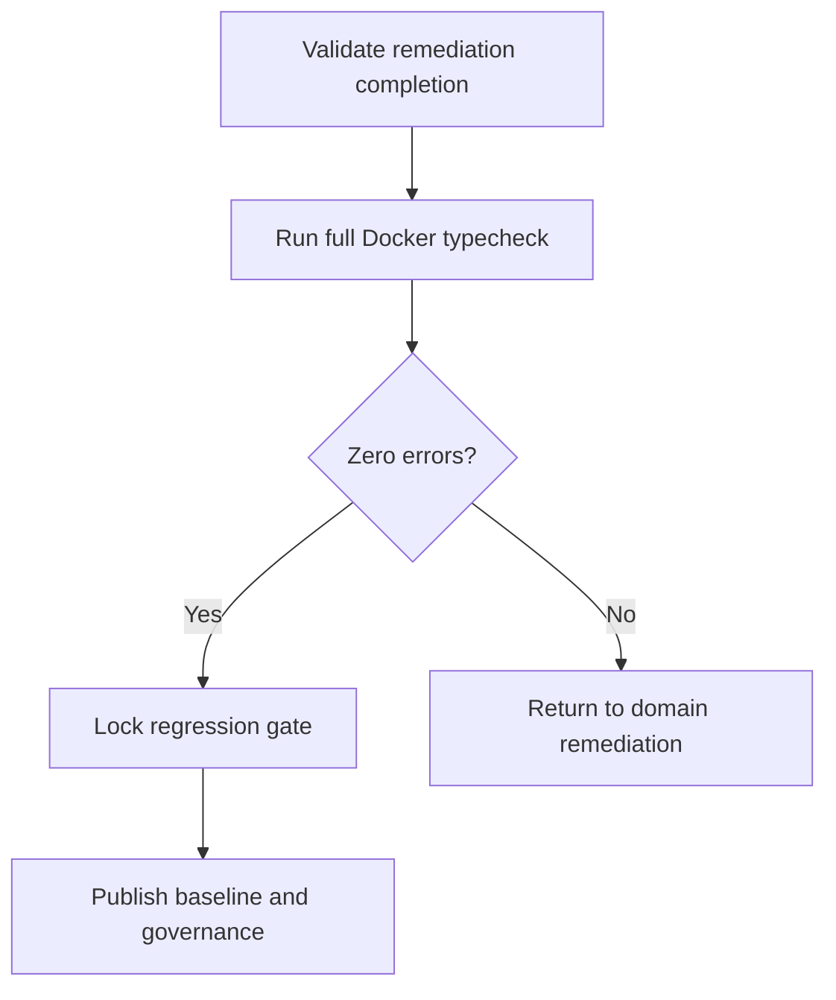

# Task: Repository-Wide Typecheck Gate and Regression Lock

## Task Overview

### Task Description
Run repository-wide TypeScript typecheck in Docker after all remediation tasks, prove strict zero-error state, and define non-bypass regression lock criteria.

### Task Purpose
Convert one-time cleanup into a durable quality gate for subsequent plan blocks.

---

## Dependencies

### Prerequisites
- **Prerequisite Tasks**: plan_62, plan_63, plan_64, plan_65
- **Required Resources**: Clean domain remediation outputs and contract convergence evidence
- **Environment Requirements**: Docker runtime able to execute full repository typecheck command

### Downstream Impact
- **Downstream Tasks**: Next implementation modules under plan_39 program
- **Provided Output**: Verified and enforceable zero-error baseline

### Canonical Verification Contract (Reused from Plan 61)
- Canonical typecheck command (source of truth):

```bash
docker run --rm \
  -v "${PWD}:/repo" \
  -w /repo/frontend \
  -e CI=true \
  -e NODE_OPTIONS=--max-old-space-size=4096 \
  node:20-alpine \
  sh -lc "npm ci --no-audit --no-fund && npm run typecheck -- --pretty false"
```

- Required artifacts:
  - `artifacts/typecheck/plan_61_full_repository_typecheck.txt`
  - `artifacts/typecheck/plan_62_full_typecheck.txt`
  - `artifacts/typecheck/plan_63_full_typecheck.txt`
  - `artifacts/typecheck/plan_64_full_typecheck.txt`
  - `artifacts/typecheck/plan_65_full_typecheck.txt`
  - `artifacts/typecheck/plan_65_shared_alias_scan.txt`
  - `artifacts/typecheck/plan_65_migration_log.md`

---

## Execution Steps

### Step 1: Pre-Gate Integrity Check
- **Action**: Verify all domain tasks are marked complete and required artifacts exist.
- **Input**: Domain pass artifacts and shared-contract pass artifacts from plans 61-65.
- **Output**: Gate-ready baseline.
- **Notes**: Block gate run if unresolved critical mismatches remain.

### Step 2: Full Repository Typecheck in Docker
- **Action**: Execute canonical command twice from a clean repo state and compare outputs.
- **Input**: Gate-ready baseline.
- **Output**: Zero-error pass/fail result with reproducible diagnostics.
- **Notes**:
  - Execute canonical command twice and store outputs:

```bash
docker run --rm \
  -v "${PWD}:/repo" \
  -w /repo/frontend \
  -e CI=true \
  -e NODE_OPTIONS=--max-old-space-size=4096 \
  node:20-alpine \
  sh -lc "npm ci --no-audit --no-fund && npm run typecheck -- --pretty false" \
  > artifacts/typecheck/plan_66_repo_typecheck_run_1.txt 2>&1

docker run --rm \
  -v "${PWD}:/repo" \
  -w /repo/frontend \
  -e CI=true \
  -e NODE_OPTIONS=--max-old-space-size=4096 \
  node:20-alpine \
  sh -lc "npm ci --no-audit --no-fund && npm run typecheck -- --pretty false" \
  > artifacts/typecheck/plan_66_repo_typecheck_run_2.txt 2>&1
```

  - Gate passes only if both runs return exit code 0 and both outputs contain zero TypeScript diagnostics.

### Step 3: Regression Lock Definition
- **Action**: Define and enforce no-bypass rules for suppressions and unsafe casts.
- **Input**: Final diagnostics and remediation taxonomy.
- **Output**: Regression lock checklist and enforcement conditions.
- **Notes**:
  - Hard ban:
    - `@ts-ignore`
    - `@ts-expect-error`
    - `@ts-nocheck`
    - replacement casts that bypass structure (`as unknown as ...`) in shared boundaries
  - Validate via commands:
    - `rg -n "@ts-ignore|@ts-expect-error|@ts-nocheck|as unknown as" frontend/src > artifacts/typecheck/plan_66_bypass_scan.txt`
    - Any result requires immediate remediation before gate closes.

### Step 4: Handover and Governance
- **Action**: Publish zero-error baseline and governance conditions for next plan blocks.
- **Input**: Gate pass result and regression lock checklist.
- **Output**: Reusable quality gate package for future modules.
- **Notes**:
  - Publish:
    - `artifacts/typecheck/plan_66_repo_typecheck_run_1.txt`
    - `artifacts/typecheck/plan_66_repo_typecheck_run_2.txt`
    - `artifacts/typecheck/plan_66_bypass_scan.txt`
  - Ensure future blocks treat this as non-optional quality invariant.

### Execution Result (Current Pass)

- Pre-gate integrity:
  - `artifacts/typecheck/plan_66_pre_gate_integrity_check.md`
  - result: PASS
- Consecutive gate runs:
  - `artifacts/typecheck/plan_66_repo_typecheck_run_1.txt`
  - `artifacts/typecheck/plan_66_repo_typecheck_run_2.txt`
  - summaries:
    - `artifacts/typecheck/plan_66_repo_typecheck_run_1.txt.summary.txt`
    - `artifacts/typecheck/plan_66_repo_typecheck_run_2.txt.summary.txt`
  - result: PASS/PASS with zero TypeScript diagnostics
- Regression lock scan:
  - `artifacts/typecheck/plan_66_bypass_scan.txt`
  - summary: `artifacts/typecheck/plan_66_bypass_scan.summary.txt`
  - result: PASS (0 bypass markers)

---

## Visualization Aids

### Step Flowchart


### Gate Decision Table
| Gate Condition | Required Result | Failure Handling |
| --- | --- | --- |
| Full repository typecheck in Docker | 0 errors | Route to owning domain remediation task |
| Strict mode posture | Unchanged or stronger | Reject gate close |
| Suppression policy | No temporary bypasses in final state | Reject gate close |
| Shared contract consistency | No unresolved cross-domain drift | Route to contract unification |

### Risk Monitoring Table
| Risk Item | Level | Trigger Signal | Mitigation Strategy |
| --- | --- | --- | --- |
| Hidden residual errors | High | Non-deterministic pass/fail runs | Enforce reproducible Docker run profile |
| Fast bypass attempts | High | New suppressions introduced | Hard reject by gate policy |
| Regression in later blocks | Medium | Error class reappears | Apply lock checklist during future reviews |

---

## Acceptance Criteria

### Functional Acceptance
- Repository-wide Docker typecheck completes with zero TypeScript errors on two consecutive clean runs.
- Both run artifacts exist and have matching zero-diagnostic summaries.
- Regression lock policy is defined and adopted for follow-up plan execution.

### Quality Acceptance
- No temporary suppressions are required to keep the gate green; `artifacts/typecheck/plan_66_bypass_scan.txt` must be empty.
- Zero-error baseline is stable across 2 consecutive full Docker typecheck executions.

