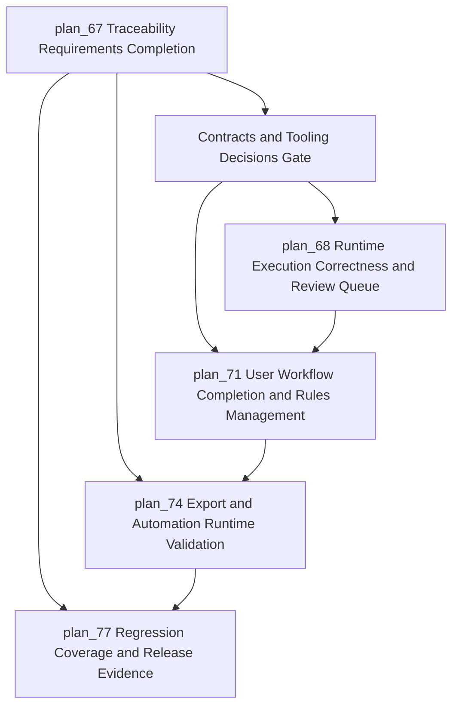
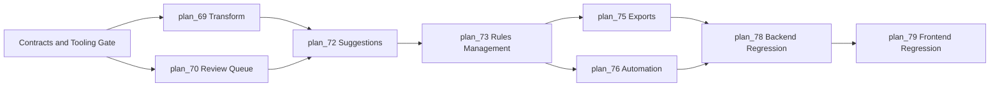
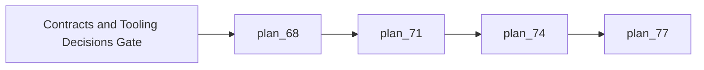

# Overall Plan: Traceability Requirements Completion

## Project Overview

### Project Background
Traceability already has a broad working foundation across data model, rule execution, matrix views, suggestions, exports, scheduling, and visualization. The remaining gap is not basic feature existence, but production confidence: several user-visible paths are partially implemented, lightly validated, or still behave as formal placeholders.

### Project Goals
Complete the remaining traceability production gaps through runtime correctness, operator review workflow completion, rule lifecycle management, export and automation validation, and targeted regression coverage.

### Project Value
The completed capability gives product and delivery teams dependable requirement-to-work-to-test visibility, with fewer silent failures, clearer review ownership, and release evidence for critical traceability workflows.

---

## Visualization Views

### System Logic Diagram


### Module Relationship Matrix
| Module | Main Input | Main Output | Responsible Role | Dependencies |
| --- | --- | --- | --- | --- |
| plan_68 Runtime Execution Correctness and Review Queue | Existing rule execution behavior and review placeholder behavior | Deterministic transform and persisted review work items | Platform owner | plan_67 |
| plan_71 User Workflow Completion and Rules Management | Existing suggestions and builder workflows | Complete suggestion review and standalone rule lifecycle | Product UI owner | plan_68 |
| plan_74 Export and Automation Runtime Validation | Existing export, schedule, and trigger capabilities | Validated rendering and trigger evidence | Runtime reliability owner | plan_71 |
| plan_77 Regression Coverage and Release Evidence | Critical workflows and acceptance scenarios | Release gate evidence and regression safety net | QA owner | plan_74 |

### AI Execution Sequence


---

## Requirements Definition

### Contracts and Tooling Decisions Gate
This gate must be resolved before implementation starts. The blocker is not calendar time; it is unresolved contract and runtime policy.

| Decision | Needed For | Default if Explicitly Approved | Blocker if Unresolved |
| --- | --- | --- | --- |
| Review item persistence shape | plan_70 | Persist review items with artifact, rule, node, status, priority, reason, actor, and audit metadata | High |
| Review item deduplication key | plan_70 | Artifact plus rule plus node while item is unresolved | High |
| Review item status graph | plan_70 | pending -> claimed -> resolved or rejected, with reopen allowed | High |
| Review RBAC matrix | plan_70, plan_73 | View by traceability readers; claim and resolve by traceability managers; override by administrators | High |
| Audit integration | plan_70, plan_72, plan_73 | Reuse existing traceability audit log boundary where possible | High |
| Migration validation boundary | plan_70 | SQLite and offline migration checks inside AI session; PostgreSQL upgrade and rollback validation outside session unless database runtime is provided | High |
| Supported transform types | plan_69 | passthrough only until approved list is provided; unsupported types reject rather than silently pass through | High |
| Bulk suggestion approval semantics | plan_72 | Best-effort batch with item-level partial failure report | Medium |
| Renderer dependency policy | plan_75 | Use renderer libraries already declared in backend requirements; do not add a new PDF or spreadsheet renderer without approval | Medium |
| API contract source of truth | plan_72, plan_73, plan_79 | Backend contract schema is source of truth; frontend mocks must match it | Medium |
| Frontend test runner availability | plan_79 | Verify configured runner first; if local Node runtime is absent, document Docker or user-side green run requirement | Medium |
| D3 regression acceptance | plan_79 | Assert semantic graph state such as node count, edge count, labels, empty state, and error state, not pixel snapshots | Medium |
| Webhook signature policy | plan_76 | HMAC-style signed trigger with timestamp tolerance only if explicitly accepted; otherwise validate current repository policy | High |
| Post-sync idempotency policy | plan_76 | One execution per rule and sync event unless rerun is explicitly requested | High |
| Live automation validation philosophy | plan_76 | Unit and mocked trigger coverage inside this session; live worker, broker, and scheduler validation outside this AI session | High |

### Functional Requirements
- Unsupported transform behavior must be explicit, deterministic, and visible to users.
- Manual review actions must create durable review work items with lifecycle status and audit context.
- Suggested link generation, approval, rejection, and bulk approval must work end to end.
- Rule management must support list, create, open, edit, enable, disable, duplicate, and delete outside the visual canvas.
- Matrix exports must produce valid downloadable content for all advertised formats.
- Scheduled, post-sync, and webhook-triggered execution must be validated through runtime scenarios.
- Critical backend and frontend workflows must have focused regression coverage.

### Non-Functional Requirements
- Performance Requirements: Large matrix and graph operations remain bounded and observable.
- Security Requirements: Review, export, rule, and webhook actions respect authorization and audit boundaries.
- Availability: Background execution and export paths fail with recoverable status instead of stalled state.
- Maintainability: Runtime node behavior, UI controls, and API contracts stay aligned.
- Compatibility: Current frontend and backend stack remains unchanged unless required by acceptance criteria.

---

## Task Decomposition Tree

```text
plan_67 Overall Plan
|-- Contracts and Tooling Decisions Gate (blocking pre-step)
|-- plan_68 Runtime Execution Correctness and Review Queue
|   |-- plan_69 Transform Behavior Contract Completion (complexity: blocked-on-decision)
|   `-- plan_70 Review Queue Persistence and Operator Workflow (complexity: blocked-on-decision)
|-- plan_71 User Workflow Completion and Rules Management
|   |-- plan_72 Suggestions Review End-to-End Workflow (complexity: blocked-on-decision)
|   `-- plan_73 Rules Management Page and Lifecycle (complexity: standard)
|-- plan_74 Export and Automation Runtime Validation
|   |-- plan_75 Matrix Export Rendering and Download Validation (complexity: blocked-on-decision)
|   `-- plan_76 Scheduled and Webhook Execution Validation (complexity: blocked-on-decision)
`-- plan_77 Regression Coverage and Release Evidence
    |-- plan_78 Backend Contract and Service Regression Coverage (complexity: standard)
    `-- plan_79 Frontend Panel and Visualization Regression Coverage (complexity: blocked-on-decision)
```

## Task List (by execution order)
- Contracts and Tooling Decisions Gate - resolve DDL, RBAC, audit, migration validation, transform, bulk, renderer, API contract, frontend runner, graph acceptance, webhook, idempotency, and live runtime validation policy.
- plan_68 - Runtime execution correctness and review queue stabilization.
- plan_69 - Transform behavior contract completion.
- plan_70 - Review queue persistence and operator workflow.
- plan_71 - User workflow completion and rules management.
- plan_72 - Suggestions review end-to-end workflow.
- plan_73 - Rules management page and lifecycle.
- plan_74 - Export and automation runtime validation.
- plan_75 - Matrix export rendering and download validation.
- plan_76 - Scheduled and webhook execution validation.
- plan_77 - Regression coverage and release evidence.
- plan_78 - Backend contract and service regression coverage.
- plan_79 - Frontend panel and visualization regression coverage.

---

## Dependencies

### Inter-Module Dependencies
- Contracts and Tooling Decisions Gate -> plan_68 (implementation should not start from guessed architecture)
- plan_68 -> plan_71 (user workflows depend on reliable runtime behavior)
- plan_71 -> plan_74 (operational validation depends on complete user workflows)
- plan_74 -> plan_77 (release evidence depends on validated runtime scenarios)

### Critical Path
plan_68 -> plan_71 -> plan_74 -> plan_77



---

## Tech Stack

### Programming Languages
The current typed frontend language and service-side language used by the platform.

### Frameworks/Libraries
The current UI framework, API framework, background task framework, graph visualization layer, and testing tools.

### Database
The existing relational persistence layer for artifacts, links, rules, executions, review state, and export state.

### Tools
- Development tools: static checking, linting, and local test runners.
- Testing tools: backend service tests, API contract tests, frontend component tests, and targeted integration checks.
- Deployment tools: existing release and runtime orchestration.
- Tooling constraint: frontend checks require local Node/npm or the documented Docker tooling container.
- Runtime constraint: live scheduled execution requires a worker, broker, and scheduler runtime outside a pure unit-test session.

### Third-Party Services
Existing issue, documentation, test management, and source control integrations.

---

## Data Flow

### Input Sources
- Artifact sources: synchronized requirements, work items, tests, documentation, and code references.
- Rule sources: visual rule definitions, schedules, post-sync triggers, and webhook events.
- Operator input: review decisions, rule lifecycle actions, and export requests.

### Processing Flow
- Normalize artifacts and rule inputs.
- Execute rule graph nodes with explicit behavior and status.
- Persist links, suggestions, review work items, exports, and audit records.
- Present matrix, graph, workflow, and history views to users.

### Output Targets
- Traceability links and review decisions.
- Matrix, visualization, and export outputs.
- Execution, audit, and release readiness evidence.

---

## Acceptance Criteria

### Functional Acceptance
- Transform configuration cannot silently produce incorrect passthrough behavior.
- Review queue actions produce durable operator-visible work items.
- Suggested link approval and rejection are validated end to end.
- Standalone rules management is usable without opening the visual canvas.
- Export and automation paths are validated with realistic runtime scenarios.
- AI-session automation acceptance is limited to unit and mocked trigger validation unless a live worker and broker environment is provided.

### Performance Acceptance
- Large graph, matrix, export, and review lists use bounded retrieval and predictable feedback.
- Background work reports terminal success or failure states.

### Quality Acceptance
- Critical backend paths have service or contract tests.
- Critical frontend panels have component or interaction tests.
- Known gaps are documented as explicit residual risks before release.

---

## Risk Assessment

### Technical Risks
- Risk 1: Hidden contract drift between UI rule configuration and runtime execution.
  - Impact: High
  - Mitigation: Contract tests and shared acceptance scenarios.
- Risk 2: Large matrix or graph data causes slow UI or export failures.
  - Impact: Medium
  - Mitigation: Bounded queries, pagination, and format-specific validation.

### Resource Risks
- Risk 1: Review workflow ownership spans product, backend, and frontend.
  - Impact: Medium
  - Mitigation: Assign one module owner per workflow and define handoff criteria.

### Time Risks
- Risk 1: Treating AI execution as a calendar estimate hides contract and runtime blockers.
  - Impact: Medium
  - Mitigation: Use the Contracts and Tooling Decisions Gate before implementation.
- Risk 2: Runtime validation uncovers data migration or permissions gaps.
  - Impact: Medium
  - Mitigation: Validate persistence and authorization early in plan_68 and plan_71.

---

## Project Statistics
- Total plan files: 13
- Level 2 tasks (modules): 4
- Level 3 tasks (specific tasks): 8
- Complexity distribution: 3 standard tasks and 5 blocked-on-decision tasks
- Execution metric: tool-call iterations and validation gates, not calendar time
- Runtime validation outside this AI session: frontend green runs without available Node/npm, live worker and broker scheduling, and production database rollback validation

---

## Next Steps
- Review the appended plan sequence plan_67 through plan_79.
- Confirm owners and acceptance thresholds.
- Begin execution after prioritizing blockers in plan_68.
