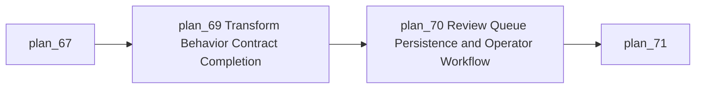
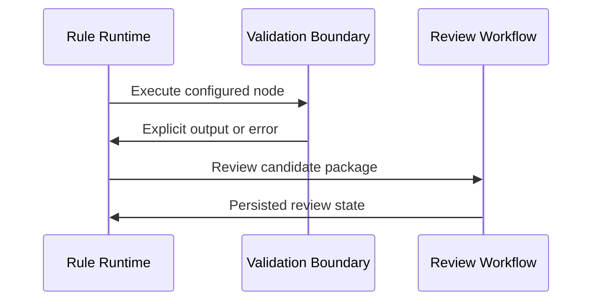

# Module: Runtime Execution Correctness and Review Queue

## Module Overview

### Module Goal
Remove runtime ambiguity from partially implemented traceability rule nodes and convert manual review actions from warnings into durable workflow state.

### Position in Project
This module is the first production-readiness gate because downstream user workflows cannot be trusted while runtime behavior can silently diverge from user configuration.

---

## Dependencies

### Prerequisites
- **Prerequisite Tasks**: plan_67
- **Prerequisite Data**: Current node catalog, execution results, review expectations, and rule examples.
- **Prerequisite Environment**: Local backend, database, and test environment.

### Downstream Impact
- **Downstream Tasks**: plan_71, plan_72, plan_73
- **Output Data**: Reliable execution behavior and persisted review state.

### External Dependencies
- **Third-Party Services**: Existing artifact source systems used by traceability rules.
- **Database**: Persistence structures for execution state and review state.
- **API Interfaces**: Rule execution and review workflow boundaries.

---

## Subtask Breakdown

- [x] plan_69 - Transform Behavior Contract Completion (complexity: blocked-on-decision)
  - Brief: Make transform behavior explicit, validated, and testable.
- [x] plan_70 - Review Queue Persistence and Operator Workflow (complexity: blocked-on-decision)
  - Brief: Persist review items and expose their lifecycle to operators.

---

## Visualization Output

### Module Flowchart


### System Flow ASCII Diagram
```text
+----------------------------+
| Rule Execution Request     |
+-------------+--------------+
              | Flow and artifacts
              V
+----------------------------+
| Runtime Node Contract Gate |
+-------------+--------------+
              |
      +-------+--------+
      |                |
      V                V
+------------+   +----------------+
| Transform  |   | Review Action  |
+-----+------+   +-------+--------+
      |                  |
      V                  V
+---------------------------------+
| Outputs, Review State, Audit    |
+---------------------------------+
```

### Interface Collaboration Diagram


### Resource Allocation Table
| Resource Type | Owner | Time Window | Key Output | Risk/Notes |
| --- | --- | --- | --- | --- |
| Runtime design | Platform owner | Week 1 | Explicit node behavior policy | Contract drift |
| Persistence design | Backend owner | Week 1-2 | Review lifecycle state | Migration impact |
| QA | QA owner | Week 2 | Runtime and review coverage | Edge cases |

---

## Technical Solution

### Architecture Design
Use explicit runtime contracts for all configurable node behavior and introduce a durable review workflow boundary for operator decisions.

### Core Technology Selection
- Technology 1: Existing rule execution runtime
  - Selection Reason: Preserves current architecture and limits blast radius.
  - Alternative: Separate workflow engine, deferred unless current runtime cannot satisfy acceptance.
- Technology 2: Existing persistence and API layer
  - Selection Reason: Review state belongs with traceability audit and rule execution data.
  - Alternative: External task queue, deferred unless operator workflow requires cross-product routing.

### Data Model
Use normalized review work item state linked to artifacts, rule executions, operator actions, priority, reason, and audit metadata.

### Interface Design
Expose review list, review detail, status transition, and rule execution feedback through stable request and response contracts.

---

## Execution Summary

### Input
- Current rule node catalog and execution records.
- User expectations for transform and manual review behavior.

### Processing
- Define supported transform policies.
- Reject, warn, or execute unsupported behavior according to explicit policy.
- Persist review work items and expose review transitions.

### Output
- Deterministic transform behavior.
- Durable review queue workflow.
- Tests and acceptance evidence for runtime correctness.

---

## Risks and Challenges

### Technical Challenges
- Unsupported transform modes may already exist in saved rules; mitigate with compatibility validation and migration guidance.

### Time Risks
- Review workflow scope can expand into general task management; mitigate by limiting scope to traceability review items.

### Dependency Risks
- Review decisions may depend on authorization policy; mitigate by aligning permissions during acceptance definition.

---

## Acceptance Criteria

### Functional Acceptance
- Unsupported transform configuration cannot silently pass data through.
- Supported transform behavior is documented by behavior tests.
- Review action creates visible, durable review work items.
- Review items support status transitions and audit context.

### Performance Acceptance
- Review item listing supports bounded retrieval.
- Rule execution overhead remains acceptable for normal flows.

### Quality Acceptance
- Runtime behavior and review transitions have focused tests.
- Existing working node behavior remains unchanged unless explicitly scoped.

---

## Deliverables List

### Code Files
- Runtime behavior updates: minimal changes in existing execution areas.
- Review workflow updates: persistence, API, and UI-facing contract additions.

### Configuration Files
- No deployment configuration changes planned.

### Documentation
- Review workflow and transform behavior acceptance notes.

### Test Files
- Backend runtime, review lifecycle, and contract tests.
