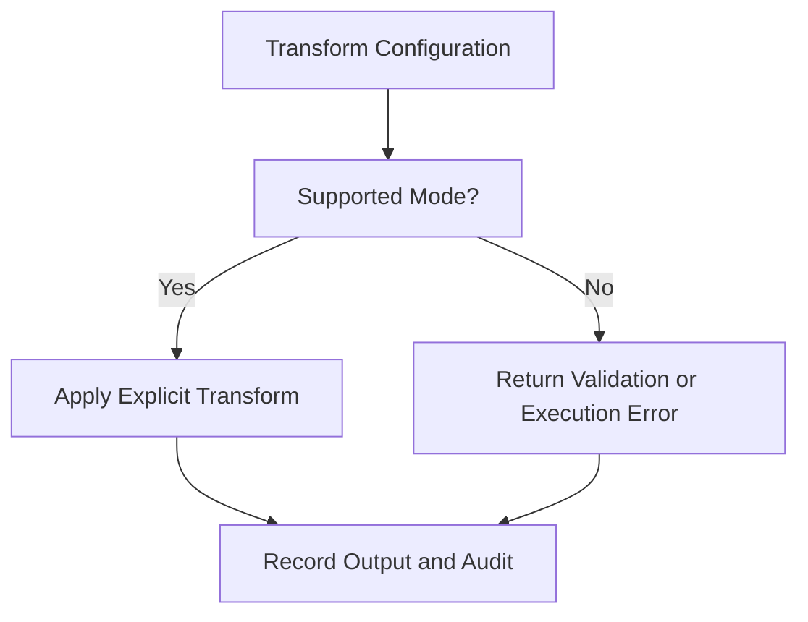

# Task: Transform Behavior Contract Completion

## Task Overview

### Task Description
Define and implement an explicit transform behavior contract so selected transform options either perform the intended transformation or fail visibly with actionable feedback.

### Task Purpose
This removes silent data passthrough behavior from production traceability rule execution and makes user configuration trustworthy.

### AI Executor Constraint
Implementation is blocked until the supported transform type list is confirmed. The safe default is to keep only explicit passthrough enabled and reject unsupported transform types instead of warning and passing data through.

---

## Dependencies

### Prerequisites
- **Prerequisite Tasks**: plan_68
- **Required Resources**: Current node catalog, saved rule samples, execution history examples.
- **Environment Requirements**: Backend local test environment and rule execution test harness.

### Downstream Impact
- **Downstream Tasks**: plan_70, plan_71, plan_78
- **Provided Output**: Explicit transform policy, runtime behavior, validation rules, and regression scenarios.

---

## Execution Steps

### Step 0: Legacy Rule Scan and Deprecation Decision
- **Action**: Scan saved rules for transform nodes whose transform type is not explicit passthrough.
- **Input**: Persisted rule flow definitions.
- **Output**: Blast-radius report and deprecation decision.
- **Notes**: Decide whether each legacy transform type is migrated into the supported whitelist, rewritten to passthrough with explicit acknowledgement, or allowed to fail after the validation flag flips.

### Step 1: Contract Definition
- **Action**: Define supported transform modes, unsupported behavior policy, and compatibility handling.
- **Input**: Current UI controls and saved rule examples.
- **Output**: Accepted transform behavior matrix.
- **Notes**: Treat silent passthrough as unacceptable unless the selected mode is explicitly passthrough; unsupported modes should reject by default unless a deprecation window is approved.

### Step 2: Validation Alignment
- **Action**: Align save-time and execute-time validation with the accepted transform behavior matrix.
- **Input**: Transform behavior matrix.
- **Output**: Consistent validation results before runtime execution.
- **Notes**: Validation must be clear enough for a user to correct the rule.

### Step 3: Runtime Behavior
- **Action**: Implement selected transform behavior or produce terminal execution feedback.
- **Input**: Validated rule flow and artifacts.
- **Output**: Transformed artifacts or explicit execution failure.
- **Notes**: Runtime feedback must preserve audit context.

### Step 4: Regression Coverage
- **Action**: Add focused tests for passthrough, supported transforms, unsupported transforms, and legacy saved rules.
- **Input**: Runtime behavior and validation policy.
- **Output**: Test evidence for transform behavior.
- **Notes**: Tests should cover both valid and invalid configuration paths.

---

## Visualization Aids

### Step Flowchart

### Risk Monitoring Table
| Risk Item | Level | Trigger Signal | Mitigation Strategy | Owner |
| --- | --- | --- | --- | --- |
| Legacy rules rely on implicit passthrough | High | Saved rules contain unsupported values | Compatibility scan and migration note | Platform owner |
| UI and runtime drift | Medium | UI offers a mode runtime rejects | Shared acceptance matrix | UI owner |
| Error feedback too vague | Medium | User cannot correct configuration | Include field and mode context | API owner |
| Transform list guessed by implementer | High | Implementation chooses modes without product confirmation | Require transform list before coding | Product owner |
| Deprecation breaks saved rules silently | High | Existing non-passthrough saved rule fails after flag flip | Run legacy scan and record migration decision before enforcement | Platform owner |

### File Operations List

#### Files to Create
- Planned test artifact
  - Type: Test source
  - Purpose: Cover transform behavior contract.
  - Content: Valid, invalid, and compatibility scenarios.

#### Files to Modify
- Existing runtime behavior artifact
  - Modification Location: Transform behavior path.
  - Modification Content: Explicit supported behavior and unsupported policy.
  - Modification Reason: Remove silent failure.
- Existing validation artifact
  - Modification Location: Rule validation boundary.
  - Modification Content: Transform mode validation.
  - Modification Reason: Catch invalid configuration before execution.

#### Files to Read
- Existing UI configuration artifact
  - Read Purpose: Determine available transform controls.
  - Usage: Align UI options with runtime support.

---

## Implementation List

### Functional Modules
- Transform contract module
  - Functionality: Validates and applies transform behavior.
  - Interface: Rule validation and execution feedback.
  - Responsibility: Prevent silent transform mismatch.

### Data Structures
- Transform behavior matrix
  - Purpose: Defines supported modes and expected outcomes.
  - Fields: Mode, input requirement, output shape, error policy.

### Algorithm Logic
- Mode dispatch
  - Purpose: Select explicit transform behavior.
  - Input: Transform mode and artifact list.
  - Output: Transformed artifact list or terminal error.
  - Complexity: Linear in processed artifacts for supported transformations.

### Interface Definitions
- Rule validation boundary
  - Type: API contract
  - Parameters: Rule flow payload.
  - Return: Validation result with errors and warnings.
  - Description: Reports unsupported transform configuration.

---

## Execution Summary

### Input
- Rule flow configuration.
- Candidate artifacts.
- Accepted transform policy.

### Processing
- Validate transform mode.
- Apply supported behavior.
- Return explicit error for unsupported behavior.

### Output
- Runtime output artifacts.
- Validation and execution feedback.
- Regression evidence.

---

## Testing Requirements

### Unit Tests
- Test Scope: Transform behavior and validation policy.
- Test Cases: Passthrough, supported transformation, unsupported mode, empty input, legacy configuration.
- Coverage Requirement: Critical branch coverage for transform decisions.

### Integration Tests
- Test Scope: Rule execution path containing transform behavior.
- Test Scenarios: Save and execute valid flow; reject invalid flow.

### Manual Tests
- Test Point 1: User sees clear feedback when unsupported mode is selected.
- Test Point 2: Valid transform produces expected downstream artifacts.

---

## Acceptance Criteria

### Functional Acceptance
- Legacy rules with non-passthrough transform types are scanned and assigned an explicit migration or deprecation outcome.
- Unsupported transform mode no longer silently passes artifacts through.
- Supported transform behavior is deterministic.
- Validation and runtime feedback agree.

### Quality Acceptance
- Test coverage protects the behavior contract.
- Existing unrelated nodes remain unchanged.

### Documentation Acceptance
- Transform behavior policy is captured in release notes or internal planning notes.

---

## Notes

### Technical Notes
- Prefer the smallest behavior set that can be confidently supported.

### Security Notes
- Transform logic must not expose sensitive artifact content in logs.

### Performance Notes
- Transform processing should remain bounded by artifact count.

### References
- Existing traceability rule builder and runtime behavior documentation.
