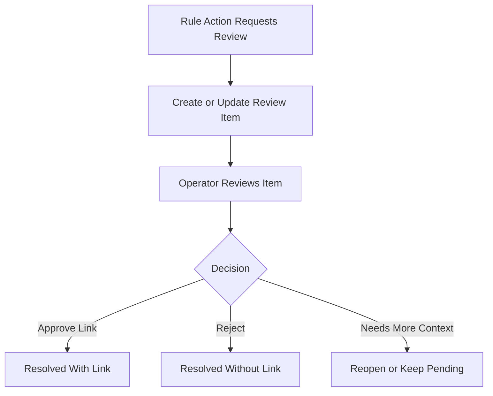

# Task: Review Queue Persistence and Operator Workflow

## Task Overview

### Task Description
Convert manual review actions from transient execution warnings into persisted review work items with status, priority, reason, assignee context, audit data, and operator transitions.

### Task Purpose
Manual review is a core safety valve for low-confidence or ambiguous traceability. It must produce durable user-visible work, not only execution logs.

### AI Executor Constraint
Implementation is blocked until the review item persistence contract, deduplication key, status graph, RBAC matrix, audit integration policy, and migration validation boundary are confirmed. Without those decisions, the implementation would encode architecture guesses.

---

## Dependencies

### Prerequisites
- **Prerequisite Tasks**: plan_69
- **Required Resources**: Review states, permission rules, operator workflow expectations.
- **Environment Requirements**: Backend persistence and frontend review list environment.

### Downstream Impact
- **Downstream Tasks**: plan_71, plan_72, plan_79
- **Provided Output**: Review queue lifecycle usable by UI and tests.

---

## Execution Steps

### Step 1: Review Lifecycle Definition
- **Action**: Define review item states, transition rules, priority semantics, and audit fields.
- **Input**: Product review expectations and current execution metadata.
- **Output**: Review workflow contract.
- **Notes**: Default proposal for confirmation is pending -> claimed -> resolved or rejected, with reopen allowed only by a privileged actor.

### Step 2: Persistence Boundary
- **Action**: Add durable review item storage and deduplication rules.
- **Input**: Review workflow contract.
- **Output**: Persisted review items linked to execution and artifacts.
- **Notes**: Default proposal for confirmation is a deduplication key based on artifact, rule, and node while the review item is unresolved.

### Step 2B: DDL Draft and Rollback Strategy
- **Action**: Confirm the table shape, indexes, and downgrade behavior before implementation.
- **Input**: Review workflow contract, deduplication policy, and audit requirements.
- **Output**: Migration-ready DDL draft and rollback checklist.
- **Notes**: Downgrade must drop indexes before the table and must be validated in SQLite or offline migration mode inside this session; PostgreSQL upgrade and rollback validation is handed off unless a PostgreSQL runtime is provided.

```sql
CREATE TABLE traceability_review_items (
  id BIGSERIAL PRIMARY KEY,
  tenant_id VARCHAR NULL,
  project_id INTEGER NULL REFERENCES projects(id),
  artifact_id INTEGER NOT NULL REFERENCES artifacts(id),
  rule_id INTEGER NULL REFERENCES traceability_rules(id) ON DELETE SET NULL,
  rule_execution_id INTEGER NULL REFERENCES traceability_rule_executions(id) ON DELETE SET NULL,
  node_id VARCHAR(128) NOT NULL,
  status VARCHAR(32) NOT NULL DEFAULT 'pending',
  priority VARCHAR(32) NOT NULL DEFAULT 'normal',
  reason TEXT NULL,
  assigned_to_id INTEGER NULL REFERENCES users(id),
  created_by_id INTEGER NULL REFERENCES users(id),
  resolved_by_id INTEGER NULL REFERENCES users(id),
  resolved_at TIMESTAMPTZ NULL,
  metadata JSONB NULL,
  created_at TIMESTAMPTZ NOT NULL DEFAULT now(),
  updated_at TIMESTAMPTZ NOT NULL DEFAULT now()
);
CREATE UNIQUE INDEX uq_traceability_review_items_open
  ON traceability_review_items(project_id, artifact_id, rule_id, node_id)
  WHERE status IN ('pending', 'claimed');
CREATE INDEX ix_traceability_review_items_status_project
  ON traceability_review_items(project_id, status, priority);
```

### Step 2A: Permission and Audit Boundary
- **Action**: Confirm who can view, claim, resolve, reject, reopen, and override review items, and how each transition is audited.
- **Input**: Review workflow contract and existing permission model.
- **Output**: RBAC and audit matrix.
- **Notes**: Default proposal for confirmation is read access for traceability viewers, transitions for traceability managers, and override for administrators.

### Step 3: Operator Actions
- **Action**: Expose list, detail, claim, resolve, reject, and reopen operations as needed for the lifecycle.
- **Input**: Persisted review items.
- **Output**: Operator-visible review workflow.
- **Notes**: Each transition must be auditable.

### Step 4: Review UI Integration
- **Action**: Connect review queue state to the relevant traceability views.
- **Input**: Review API contract.
- **Output**: User can find and act on queued review work.
- **Notes**: Prioritize dense operational UI over decorative layout.

---

## Visualization Aids

### Step Flowchart


### Risk Monitoring Table
| Risk Item | Level | Trigger Signal | Mitigation Strategy | Owner |
| --- | --- | --- | --- | --- |
| Review items duplicate on rerun | High | Same artifact appears repeatedly | Deduplication key and status policy | Backend owner |
| Workflow scope grows too broad | Medium | General task management requested | Limit to traceability review states | Product owner |
| Audit is incomplete | High | Status changes lack actor or reason | Required transition metadata | Security owner |
| RBAC guessed by implementer | High | User cannot access expected review action or gains too much access | Confirm RBAC matrix before coding | Product owner |
| PostgreSQL rollback unvalidated | High | AI session lacks production-like database runtime | Run SQLite and offline checks in-session; hand off PostgreSQL upgrade and rollback validation | Database owner |
| DDL shape remains implicit | High | Migration implementation chooses different fields or indexes | Treat DDL draft as contract before coding | Database owner |

### File Operations List

#### Files to Create
- Planned persistence artifact
  - Type: Data model change
  - Purpose: Store review work items.
  - Content: Review state, references, and audit fields.
- Planned test artifact
  - Type: Test source
  - Purpose: Cover review lifecycle.
  - Content: Queue creation, deduplication, transitions, and permissions.

#### Files to Modify
- Existing runtime action artifact
  - Modification Location: Manual review action path.
  - Modification Content: Persist review items instead of warning-only output.
  - Modification Reason: Complete workflow behavior.
- Existing UI artifact
  - Modification Location: Traceability review surface.
  - Modification Content: Review list and actions.
  - Modification Reason: Make queued work visible.

#### Files to Read
- Existing audit and permission artifacts
  - Read Purpose: Reuse current authorization and audit conventions.
  - Usage: Align review workflow with existing governance.

---

## Implementation List

### Functional Modules
- Review queue module
  - Functionality: Creates and manages traceability review items.
  - Interface: Review list, detail, and transition contracts.
  - Responsibility: Preserve operator decision workflow.

### Data Structures
- Review item
  - Purpose: Stores manual traceability review work.
  - Fields: Artifact references, reason, priority, status, actor, timestamps, execution context.

### Algorithm Logic
- Review deduplication
  - Purpose: Prevent repeated review noise for the same unresolved item.
  - Input: Rule execution context and artifact identifiers.
  - Output: Existing review item update or new review item.
  - Complexity: Bounded by review candidates in one execution.

### Interface Definitions
- Review transition boundary
  - Type: API contract
  - Parameters: Review item identifier, target status, reason.
  - Return: Updated review item state.
  - Description: Moves review work through the operator lifecycle.

---

## Execution Summary

### Input
- Rule action output.
- Artifact candidates.
- Operator decisions.

### Processing
- Persist review items.
- Surface queue state.
- Apply audited transitions.

### Output
- Durable review workflow.
- Operator-visible status.
- Test and audit evidence.

---

## Testing Requirements

### Unit Tests
- Test Scope: Review item creation, deduplication, and state transitions.
- Test Cases: Empty input, first queue, rerun duplicate, resolve, reject, reopen.
- Coverage Requirement: Critical transition coverage.

### Integration Tests
- Test Scope: Rule execution creates review items and UI-facing API returns them.
- Test Scenarios: Low-confidence artifacts route to review; operator resolves item.

### Manual Tests
- Test Point 1: Operator can find newly queued review item.
- Test Point 2: Resolved review item leaves active queue and remains auditable.

---

## Acceptance Criteria

### Functional Acceptance
- Manual review action creates durable review items.
- Review items support agreed lifecycle transitions.
- Review decisions are auditable and permission-protected.
- PostgreSQL migration upgrade and rollback are either validated in a provided runtime or explicitly handed off as unvalidated.

### Quality Acceptance
- Tests protect creation, deduplication, and transition behavior.
- No unrelated rule execution behavior changes.

### Documentation Acceptance
- Review lifecycle is documented for operators and maintainers.

---

## Notes

### Technical Notes
- Review state should be optimized for operator workflows and later reporting.

### Security Notes
- Review item content must follow existing access boundaries.

### Performance Notes
- Queue listing should support filtering and pagination.

### References
- Existing audit, permission, and traceability workflow conventions.
