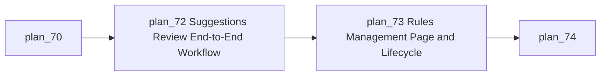
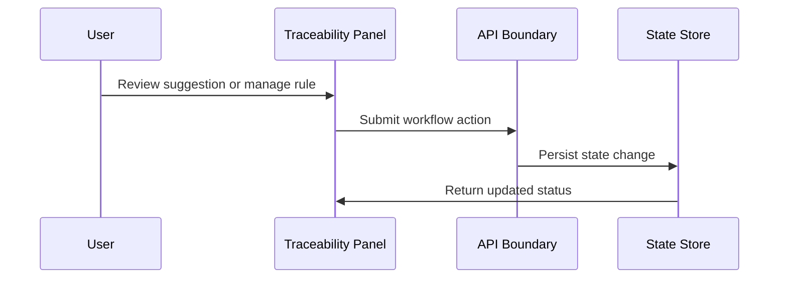

# Module: User Workflow Completion and Rules Management

## Module Overview

### Module Goal
Complete the user-facing traceability workflows for suggested link review and standalone rule management, reducing dependence on the visual builder for routine rule operations.

### Position in Project
This module turns the existing technical capability into a complete operator workflow with clear entry points, predictable status, and actionable controls.

---

## Dependencies

### Prerequisites
- **Prerequisite Tasks**: plan_70
- **Prerequisite Data**: Suggestion states, rule metadata, execution summaries, and user permissions.
- **Prerequisite Environment**: Frontend application, backend API, and seeded workflow data.

### Downstream Impact
- **Downstream Tasks**: plan_74, plan_75, plan_76, plan_79
- **Output Data**: Completed review and rules management workflows.

### External Dependencies
- **Third-Party Services**: Existing artifact source integrations that feed suggestions and rules.
- **Database**: Suggestion, link, rule, and execution state.
- **API Interfaces**: Suggestion review and rule lifecycle boundaries.

---

## Subtask Breakdown

- [x] plan_72 - Suggestions Review End-to-End Workflow (complexity: blocked-on-decision)
  - Brief: Validate and harden generation, approval, rejection, and bulk approval.
- [x] plan_73 - Rules Management Page and Lifecycle (complexity: standard)
  - Brief: Provide standalone rules management outside the visual canvas.

---

## Visualization Output

### Module Flowchart


### System Flow Diagram
```text
+---------------------------+
| User Workflow Entry       |
+-------------+-------------+
              |
              V
+---------------------------+
| Suggestions and Rules UI  |
+-------------+-------------+
              |
              V
+---------------------------+
| API Contract Boundary     |
+-------------+-------------+
              |
              V
+---------------------------+
| Persisted Workflow State  |
+-------------+-------------+
              |
              V
+---------------------------+
| Matrix, Graph, History    |
+---------------------------+
```

### Interface Collaboration Diagram


### Core Metrics Mapping Table
| Frontend Area | Data Source | Core Metric | Decision Use |
| --- | --- | --- | --- |
| Suggestions Panel | Suggestion review state | Approval and rejection rate | Suggestion quality and review throughput |
| Rules List | Rule lifecycle state | Enabled rules and recent failures | Operational readiness |
| Rule Detail | Execution summaries | Last run outcome | Rule health decision |
| Review Controls | Operator actions | Action success ratio | UI and API reliability |

### Resource Allocation Table
| Resource Type | Owner | Time Window | Key Output | Risk/Notes |
| --- | --- | --- | --- | --- |
| Product UX | Product owner | Week 2 | Complete workflow requirements | Scope creep |
| Frontend | UI owner | Week 2-3 | Rules and suggestions UI | State complexity |
| Backend | API owner | Week 2-3 | Stable workflow contracts | Permission edge cases |

---

## Technical Solution

### Architecture Design
Expose suggestion and rule lifecycle as first-class workflows with predictable state transitions and compact operational screens.

### Core Technology Selection
- Technology 1: Existing frontend application framework
  - Selection Reason: Reuses current navigation, state, and component patterns.
  - Alternative: Separate admin console, rejected for unnecessary fragmentation.
- Technology 2: Existing API and persistence layer
  - Selection Reason: Current backend already owns suggestions, links, rules, and executions.
  - Alternative: External workflow service, deferred.

### Data Model
Use existing suggestion, link, rule, and execution state, with additions only if the review workflow requires durable operator state.

### Interface Design
Provide stable list, detail, action, status, and refresh contracts for suggestions and rules.

---

## Execution Summary

### Input
- Existing suggestions and rule definitions.
- User review and lifecycle operations.

### Processing
- Present actionable suggestions.
- Apply approval and rejection decisions.
- Present standalone rule list and lifecycle operations.

### Output
- Complete suggestion review workflow.
- Standalone rules management workflow.
- Workflow tests and usability evidence.

---

## Risks and Challenges

### Technical Challenges
- UI may expose operations that backend contracts do not fully support; mitigate with contract-first acceptance.

### Time Risks
- Standalone rules page may duplicate builder scope; mitigate by limiting it to lifecycle management and routing to builder for visual editing when needed.

### Dependency Risks
- Suggestion quality depends on backend scoring; mitigate by separating review workflow correctness from model quality.

---

## Acceptance Criteria

### Functional Acceptance
- Users can complete suggestion review without hidden backend steps.
- Users can manage rules without opening the visual builder for every lifecycle action.
- Workflow status updates are visible and recoverable.

### Performance Acceptance
- Lists are paginated or bounded.
- Refresh and action feedback remains responsive for normal data sets.

### Quality Acceptance
- Critical UI interactions have component tests.
- API behavior has contract or integration tests.

---

## Deliverables List

### Code Files
- UI workflow additions for suggestions and rules.
- API contract hardening for workflow actions.

### Configuration Files
- No deployment configuration changes planned.

### Documentation
- Operator workflow notes and acceptance checklist.

### Test Files
- Frontend interaction tests and backend workflow tests.
