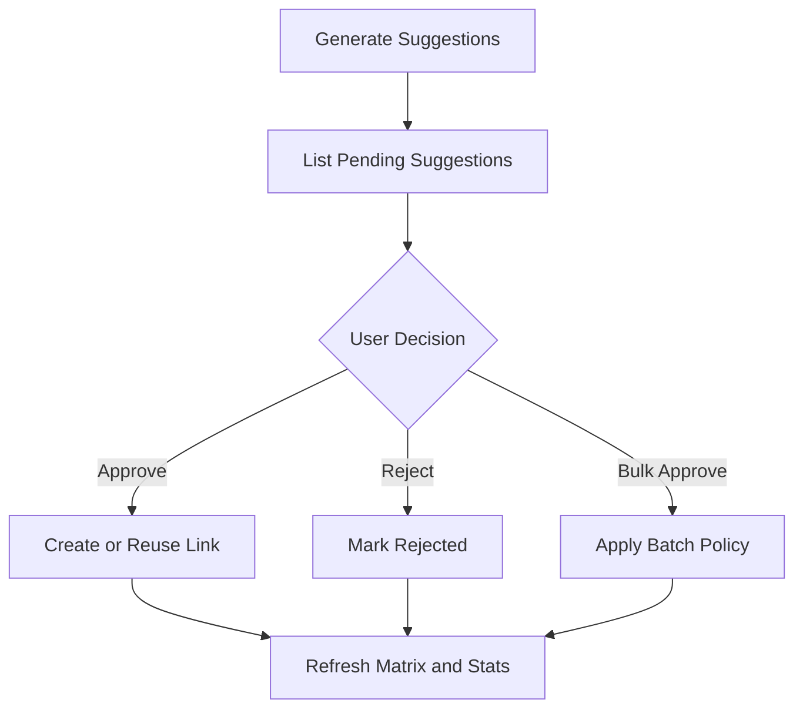

# Task: Suggestions Review End-to-End Workflow

## Task Overview

### Task Description
Validate and harden the complete suggested link workflow: generation, listing, filtering, approval, rejection, bulk approval, link creation, duplicate handling, cycle prevention, audit, and UI refresh.

### Task Purpose
Suggestions already exist as a concept, but production readiness requires proof that review decisions create correct traceability outcomes and visible status updates.

### AI Executor Constraint
Implementation is blocked until bulk approval semantics are confirmed. The safe default is best-effort processing with item-level partial failure reporting; all-or-nothing transaction semantics require explicit approval.

---

## Dependencies

### Prerequisites
- **Prerequisite Tasks**: plan_70
- **Required Resources**: Suggestion examples, link policy, permission rules, and scoring thresholds.
- **Environment Requirements**: Backend and frontend test environments with representative artifacts.

### Downstream Impact
- **Downstream Tasks**: plan_73, plan_75, plan_78, plan_79
- **Provided Output**: Verified suggestion review workflow and tests.

---

## Execution Steps

### Step 1: Workflow Contract Review
- **Action**: Define expected behavior for each suggestion status and user action.
- **Input**: Current suggestion model and UI workflow.
- **Output**: Suggestion workflow state matrix.
- **Notes**: Separate suggestion quality from workflow correctness and explicitly decide transactional versus best-effort batch behavior.

### Step 2: Backend Workflow Validation
- **Action**: Validate generation, approval, rejection, duplicate handling, and cycle prevention.
- **Input**: State matrix and artifact fixtures.
- **Output**: Contract and service test coverage.
- **Notes**: Approval must create or reference the correct link outcome.

### Step 3: Frontend Interaction Validation
- **Action**: Validate list filters, score controls, note dialog, single actions, and bulk actions.
- **Input**: API contract and UI scenarios.
- **Output**: Component interaction coverage.
- **Notes**: Error states must be visible and recoverable.

### Step 4: Audit and Metrics Review
- **Action**: Confirm review outcomes update audit and summary metrics consistently.
- **Input**: Approved and rejected examples.
- **Output**: Acceptance evidence for review reporting.
- **Notes**: Metrics must not count stale or duplicated outcomes incorrectly.

---

## Visualization Aids

### Step Flowchart

### Risk Monitoring Table
| Risk Item | Level | Trigger Signal | Mitigation Strategy | Owner |
| --- | --- | --- | --- | --- |
| Approval creates duplicate links | High | Repeated approval returns multiple links | Duplicate contract test | Backend owner |
| Bulk action hides partial failure | High | Batch result lacks item-level status | Structured batch result | API owner |
| UI shows stale status | Medium | Approved item remains pending | Refetch and state invalidation tests | UI owner |
| Batch semantics guessed | High | Product expects all-or-nothing but implementation returns partial success | Confirm bulk approval policy before coding | Product owner |

### File Operations List

#### Files to Create
- Planned backend test artifact
  - Type: API and service test source
  - Purpose: Cover suggestion review lifecycle.
  - Content: Generate, approve, reject, duplicate, cycle, and bulk scenarios.
- Planned frontend test artifact
  - Type: Component test source
  - Purpose: Cover user review interactions.
  - Content: Filters, actions, notes, loading, and error states.

#### Files to Modify
- Existing suggestion workflow artifact
  - Modification Location: Review action handling.
  - Modification Content: Contract hardening and consistent status feedback.
  - Modification Reason: End-to-end reliability.
- Existing suggestion UI artifact
  - Modification Location: Review panel behavior.
  - Modification Content: Refresh, error, and partial-result handling.
  - Modification Reason: Prevent stale or misleading UI state.

#### Files to Read
- Existing scoring and link policy artifacts
  - Read Purpose: Understand suggestion generation and approval semantics.
  - Usage: Build realistic acceptance scenarios.

---

## Implementation List

### Functional Modules
- Suggestion review workflow
  - Functionality: Converts candidate relationships into approved or rejected decisions.
  - Interface: Generate, list, approve, reject, bulk approve, stats.
  - Responsibility: Maintain correct suggestion and link state.

### Data Structures
- Suggestion state matrix
  - Purpose: Defines allowed states and transitions.
  - Fields: Status, action, required permission, output, audit effect.

### Algorithm Logic
- Batch approval policy
  - Purpose: Process multiple suggestions while preserving item-level outcome.
  - Input: Suggestion identifiers and optional review note.
  - Output: Counts and per-item errors.
  - Complexity: Linear in selected suggestions.

### Interface Definitions
- Suggestion action boundary
  - Type: API contract
  - Parameters: Suggestion identifier, optional note.
  - Return: Action result and updated workflow state.
  - Description: Applies a review decision.

---

## Execution Summary

### Input
- Candidate suggestions.
- User review decisions.
- Artifact and link state.

### Processing
- Validate action permissions.
- Apply duplicate and cycle policies.
- Update suggestion status and link state.
- Refresh UI and metrics.

### Output
- Approved links or rejected suggestions.
- Accurate suggestion stats.
- Test evidence.

---

## Testing Requirements

### Unit Tests
- Test Scope: State transitions, duplicate checks, batch results.
- Test Cases: Approve, reject, already processed, cycle blocked, partial bulk success.
- Coverage Requirement: Critical state transition coverage.

### Integration Tests
- Test Scope: API workflow from suggestion to link state.
- Test Scenarios: Generate, approve, refresh matrix; reject and verify stats.

### Manual Tests
- Test Point 1: User approves a suggestion and sees updated link state.
- Test Point 2: User rejects a suggestion and it leaves the pending queue.

---

## Acceptance Criteria

### Functional Acceptance
- Single and bulk review actions produce correct persisted outcomes.
- Cycle and duplicate cases are handled visibly.
- UI status and stats refresh after review actions.

### Quality Acceptance
- Backend and frontend workflow tests exist.
- Error states are user-visible and recoverable.

### Documentation Acceptance
- Suggestion review lifecycle is documented in acceptance notes.

---

## Notes

### Technical Notes
- Keep scoring changes out of scope unless workflow correctness depends on them.

### Security Notes
- Review actions require traceability management permission.

### Performance Notes
- Bulk approval should enforce a bounded batch size.

### References
- Existing traceability suggestion, link, and matrix workflow documentation.
