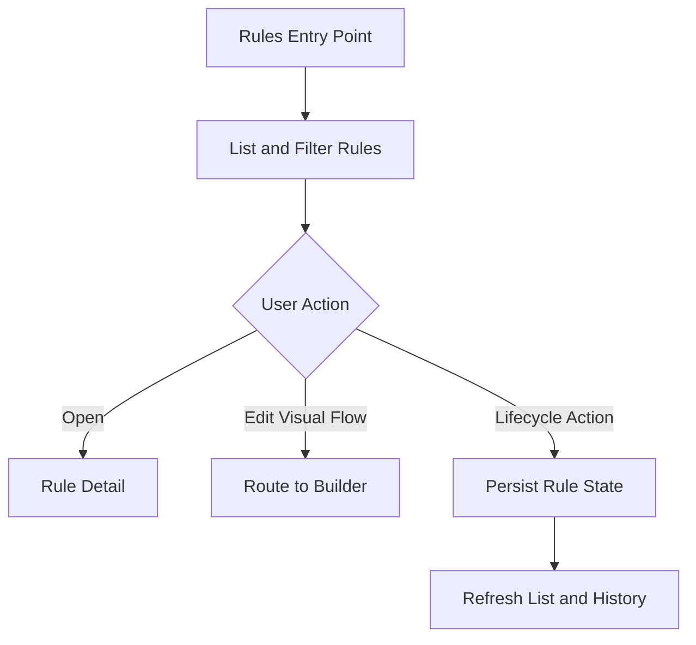

# Task: Rules Management Page and Lifecycle

## Task Overview

### Task Description
Create a standalone rules management workflow that supports operational rule lifecycle actions without requiring users to enter the visual builder for routine management.

### Task Purpose
Rules are currently manageable through the builder path, but production operations need a faster list-first workflow for discovery, status, ownership, automation state, and lifecycle actions.

### AI Executor Constraint
This task is implementable after current rule contracts are read. Open decisions such as bulk enable or disable and clone depth should be scoped conservatively unless the user expands the lifecycle. Current backend routes already provide the main rule lifecycle endpoints; the standalone page must bind to those contracts or explicitly document any missing endpoint.

---

## Dependencies

### Prerequisites
- **Prerequisite Tasks**: plan_72
- **Required Resources**: Rule metadata, execution history, automation state, and permission policy.
- **Environment Requirements**: Frontend routing, backend rule contracts, seeded rules.

### Downstream Impact
- **Downstream Tasks**: plan_74, plan_76, plan_79
- **Provided Output**: Standalone rules management workflow and tests.

---

## Execution Steps

### Step 1: Lifecycle Scope Definition
- **Action**: Define rule list, search, status filters, create, open, edit, duplicate, enable, disable, delete, and execute actions.
- **Input**: Current builder capabilities and operator needs.
- **Output**: Rules management acceptance matrix.
- **Notes**: Visual editing can still route to the existing builder; bulk enable or disable is out of scope unless explicitly approved.

### Step 1A: Endpoint Contract Table
- **Action**: Bind each standalone rule lifecycle action to a backend method, path, payload, and expected status behavior.
- **Input**: Existing traceability rule API contract.
- **Output**: Rule management endpoint matrix.
- **Notes**: The table below reflects the current rule API shape and must be rechecked during implementation if the backend contract changes.

| UI Action | Method and Path | Payload or Query | Success | Failure States |
| --- | --- | --- | --- | --- |
| Validate flow | POST /traceability/rules/validate | flow_json | 200 validation result | 400 invalid payload, 403 forbidden |
| List rules | GET /traceability/rules | skip, limit, enabled, category, project_id | 200 paged list | 403 forbidden |
| Get rule | GET /traceability/rules/{rule_id} | none | 200 rule detail | 403 forbidden, 404 not found |
| Create rule | POST /traceability/rules | rule definition and automation fields | 201 created rule | 400 invalid contract, 403 forbidden |
| Update rule | PUT /traceability/rules/{rule_id} | partial rule update | 200 updated rule | 400 invalid contract, 403 forbidden, 404 not found |
| Delete rule | DELETE /traceability/rules/{rule_id} | none | 204 no content | 403 forbidden, 404 not found, 409 unresolved dependent workflow |
| List executions | GET /traceability/rules/{rule_id}/executions | skip, limit | 200 execution list | 403 forbidden, 404 not found |
| Execute rule | POST /traceability/rules/{rule_id}/execute | none | 200 execution result | 400 disabled or invalid flow, 403 forbidden, 404 not found |
| Get schedule | GET /traceability/rules/{rule_id}/schedule | none | 200 schedule state | 403 forbidden, 404 not found |
| Update schedule | PUT /traceability/rules/{rule_id}/schedule | cron and enabled fields | 200 schedule state | 400 invalid cron, 403 forbidden, 404 not found |
| Get webhook | GET /traceability/rules/{rule_id}/webhook | none | 200 webhook state | 403 forbidden, 404 not found |
| Enable webhook | POST /traceability/rules/{rule_id}/webhook/enable | optional regeneration flag | 200 webhook state | 403 forbidden, 404 not found |
| Disable webhook | POST /traceability/rules/{rule_id}/webhook/disable | none | 200 webhook disabled state | 403 forbidden, 404 not found |

### Step 1B: Delete Cascade Contract
- **Action**: Confirm what is deleted, preserved, or blocked when a rule is deleted.
- **Input**: Current rule model relationship behavior and future review queue contract.
- **Output**: Delete cascade acceptance contract.
- **Notes**: Proposed contract: deleting a rule deletes the rule definition and its rule execution rows to match current rule execution relationship behavior; it does not delete artifact links or suggested links; unresolved review items block deletion with 409; terminal review items preserve history by clearing rule reference and retaining a rule snapshot; sync task history preserves rows by clearing rule reference if present.

### Step 2: List and Detail UX
- **Action**: Build dense operational views for rule discovery, status, automation, and recent execution outcomes.
- **Input**: Rule metadata and execution summaries.
- **Output**: Standalone rule list and detail workflow.
- **Notes**: Prioritize scanability and low-latency interaction.

### Step 3: Lifecycle Actions
- **Action**: Connect create, update, duplicate, enable, disable, execute, and delete actions to backend contracts.
- **Input**: Rules management acceptance matrix.
- **Output**: Operational rule management behavior.
- **Notes**: Destructive actions need confirmation and clear feedback.

### Step 4: Validation and Tests
- **Action**: Add frontend interaction tests and backend contract checks for lifecycle actions.
- **Input**: Completed UI and API behavior.
- **Output**: Regression evidence for rule management.
- **Notes**: Include empty, loading, error, and permission states.

---

## Visualization Aids

### Step Flowchart

### Risk Monitoring Table
| Risk Item | Level | Trigger Signal | Mitigation Strategy | Owner |
| --- | --- | --- | --- | --- |
| Page duplicates builder complexity | Medium | Full visual editing requested inside list page | Route visual edits to builder | Product owner |
| Destructive action errors | High | Delete or disable lacks confirmation | Confirmation and rollback feedback | UI owner |
| Automation state hidden | Medium | User cannot see schedule or trigger state | Include automation columns and detail | Runtime owner |
| Clone behavior too broad | Medium | Duplicate copies runtime or execution history unintentionally | Clone rule definition only unless approved | Product owner |
| Endpoint contract remains implicit | High | UI calls drift from backend route behavior | Use endpoint matrix as acceptance source | Frontend owner |
| Delete cascade is ambiguous | High | Deleting a rule loses or preserves unexpected data | Confirm delete cascade contract and test it | Backend owner |

### File Operations List

#### Files to Create
- Planned frontend workflow artifact
  - Type: Page or route source
  - Purpose: Standalone rules management.
  - Content: List, filters, details, and lifecycle actions.
- Planned frontend test artifact
  - Type: Component test source
  - Purpose: Cover rule lifecycle interactions.
  - Content: List, action, confirmation, routing, and error scenarios.

#### Files to Modify
- Existing navigation artifact
  - Modification Location: Traceability navigation surface.
  - Modification Content: Add rules management entry point.
  - Modification Reason: Make workflow discoverable.
- Existing rule API consumption artifact
  - Modification Location: Rule lifecycle client boundary.
  - Modification Content: Add missing lifecycle calls or normalize responses.
  - Modification Reason: Support standalone workflow.

#### Files to Read
- Existing visual builder workflow artifact
  - Read Purpose: Reuse rule loading and save semantics.
  - Usage: Avoid conflicting lifecycle behavior.

---

## Implementation List

### Functional Modules
- Rules management workflow
  - Functionality: Presents and manages traceability rules outside visual editing.
  - Interface: List, detail, lifecycle actions, and builder routing.
  - Responsibility: Operational control of rule state.

### Data Structures
- Rule list item
  - Purpose: Compact operational summary.
  - Fields: Rule identity, status, automation state, last run, failure signal, ownership marker.

### Algorithm Logic
- Rule list filtering
  - Purpose: Help users find operationally relevant rules.
  - Input: Search text, status, automation state, execution state.
  - Output: Bounded list of matching rules.
  - Complexity: Depends on backend query strategy and pagination.

### Interface Definitions
- Rule lifecycle boundary
  - Type: API contract
  - Parameters: Rule identifier and action payload.
  - Return: Updated rule state or action result.
  - Description: Applies lifecycle changes.
- Rule deletion boundary
  - Type: API contract
  - Parameters: Rule identifier and no body.
  - Return: No content on success or dependency conflict when unresolved workflow exists.
  - Description: Deletes rule lifecycle state according to the delete cascade contract.

---

## Execution Summary

### Input
- Rule metadata.
- User lifecycle actions.
- Execution history summaries.

### Processing
- List and filter rules.
- Apply lifecycle actions.
- Route visual editing to builder.
- Refresh operational status.

### Output
- Standalone rules management workflow.
- User-visible action feedback.
- Regression tests.

---

## Testing Requirements

### Unit Tests
- Test Scope: Rule list rendering, filters, actions, and state refresh.
- Test Cases: Empty list, load failure, enable, disable, duplicate, delete confirmation, execute, route to builder.
- Coverage Requirement: Critical lifecycle interaction coverage.

### Integration Tests
- Test Scope: Rule lifecycle API and UI contract.
- Test Scenarios: Create or duplicate rule, change status, execute, delete with no unresolved dependencies, delete blocked by unresolved review work, verify list update.

### Manual Tests
- Test Point 1: User can manage rules without entering builder.
- Test Point 2: User can open builder only when visual editing is needed.

---

## Acceptance Criteria

### Functional Acceptance
- Standalone rule list is discoverable from traceability navigation.
- Routine lifecycle actions are available outside the visual builder.
- Action results update visible rule status.
- Rule lifecycle UI calls match the endpoint matrix.
- Delete behavior matches the delete cascade contract.

### Quality Acceptance
- Component tests cover list, actions, and error states.
- Backend contracts are stable for lifecycle operations.

### Documentation Acceptance
- Rules management workflow is described in release notes or internal docs.

---

## Notes

### Technical Notes
- Keep page focused on operational management, not full visual editing.

### Security Notes
- Management actions require appropriate permissions and confirmations.

### Performance Notes
- Rule list should use bounded retrieval and avoid loading full visual definitions unless needed.

### References
- Existing traceability builder and execution history workflows.
