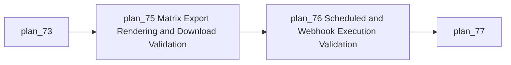
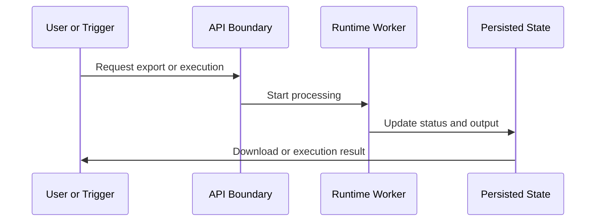

# Module: Export and Automation Runtime Validation

## Module Overview

### Module Goal
Validate the operational paths that convert traceability data into downloadable outputs and automated executions.

### Position in Project
This module checks production behavior beyond static contracts: exports must render valid content, and automated execution must run reliably through scheduled, post-sync, and webhook paths.

---

## Dependencies

### Prerequisites
- **Prerequisite Tasks**: plan_73
- **Prerequisite Data**: Matrix datasets, rule examples, trigger examples, and background processing configuration.
- **Prerequisite Environment**: Local runtime with backend, frontend, worker mode or synchronous fallback, and representative artifacts.

### Downstream Impact
- **Downstream Tasks**: plan_77, plan_78, plan_79
- **Output Data**: Runtime validation evidence for exports and automation.

### External Dependencies
- **Third-Party Services**: Existing sync and webhook-capable integrations.
- **Database**: Export task, rule execution, schedule, trigger, and audit state.
- **API Interfaces**: Export, download, schedule, webhook, and execution status boundaries.

---

## Subtask Breakdown

- [x] plan_75 - Matrix Export Rendering and Download Validation (complexity: blocked-on-decision)
  - Brief: Verify CSV, spreadsheet, and PDF outputs with realistic matrix data.
- [x] plan_76 - Scheduled and Webhook Execution Validation (complexity: blocked-on-decision)
  - Brief: Validate automated execution paths and terminal status behavior.

---

## Visualization Output

### Module Flowchart


### System Flow ASCII Diagram
```text
+----------------------------+
| User or Trigger Input      |
+-------------+--------------+
              | Export request or execution trigger
              V
+----------------------------+
| Operational Runtime Path   |
+-----+----------------------+
      |
+-----+----------------------+       +----------------------------+
| Export Processing          |  ...  | Automation Execution       |
+-----+----------------------+       +-------------+--------------+
      V                                            V
+---------------------------------------------------------------+
| Downloadable Content, Execution Status, Audit Evidence        |
+---------------------------------------------------------------+
```

### Interface Collaboration Diagram


### Resource Allocation Table
| Resource Type | Owner | Time Window | Key Output | Risk/Notes |
| --- | --- | --- | --- | --- |
| Backend runtime | Runtime owner | Week 3 | Export and automation validation | Worker parity |
| QA | QA owner | Week 3 | Runtime scenario evidence | Environment setup |
| Frontend | UI owner | Week 3 | Download and status feedback | Polling edge cases |

---

## Technical Solution

### Architecture Design
Validate existing operational paths using realistic datasets, terminal status checks, and content-level assertions for generated outputs.

### Core Technology Selection
- Technology 1: Existing export pipeline
  - Selection Reason: Already owns matrix rendering and download behavior.
  - Alternative: New reporting service, out of scope for production completion.
- Technology 2: Existing scheduler and trigger runtime
  - Selection Reason: Already integrated with rule execution.
  - Alternative: External scheduler, deferred.

### Data Model
Use existing export task, rule execution, schedule, trigger, and audit state, adding only fields required for terminal status reliability.

### Interface Design
Ensure export status, download, trigger execution, and history responses provide enough information for UI and support diagnostics.

---

## Execution Summary

### Input
- Matrix export requests.
- Scheduled, post-sync, and webhook triggers.
- Rule definitions and artifacts.

### Processing
- Generate export content.
- Execute triggered rules.
- Persist terminal status and audit evidence.

### Output
- Valid downloadable files.
- Reliable automated execution records.
- Runtime validation checklist.

---

## Risks and Challenges

### Technical Challenges
- Synchronous fallback and worker mode may diverge; mitigate with shared acceptance scenarios.

### Time Risks
- PDF and large matrix rendering can uncover layout limits; mitigate with small, medium, and large fixture levels.

### Dependency Risks
- Trigger validation may depend on external webhook systems; mitigate with local signed or tokenized trigger simulations.

---

## Acceptance Criteria

### Functional Acceptance
- All advertised export formats produce valid content or explicit unsupported errors.
- Triggered executions produce terminal status and visible history.
- Download and status polling behavior is recoverable after failures.

### Performance Acceptance
- Export size limits and large matrix behavior are bounded.
- Trigger processing does not block unrelated user interactions.

### Quality Acceptance
- Export and automation runtime checks are represented in regression coverage.
- Worker and fallback paths share the same expected outcomes.

---

## Deliverables List

### Code Files
- Minimal runtime and UI updates needed for validation findings.

### Configuration Files
- No planned deployment configuration changes.

### Documentation
- Export and automation runtime validation checklist.

### Test Files
- Export content tests and automation trigger tests.
