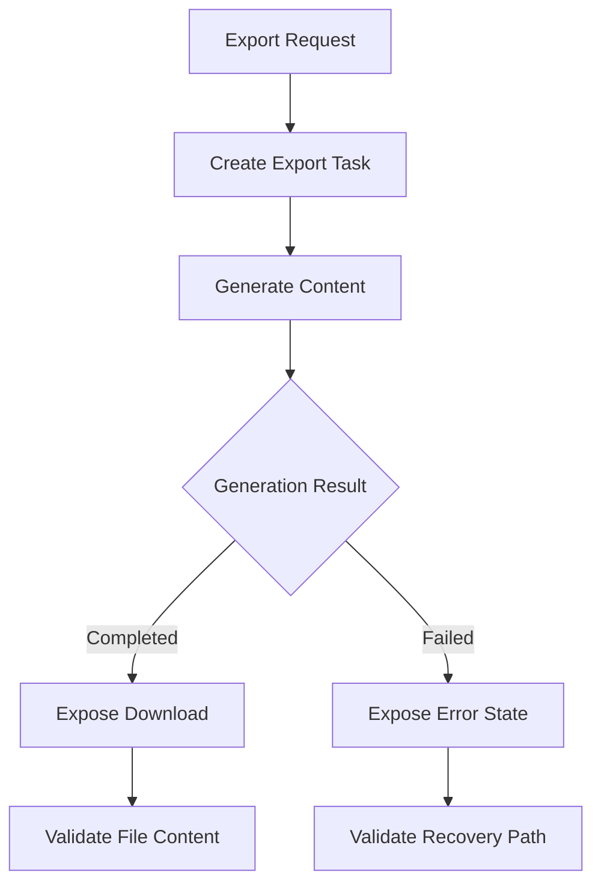

# Task: Matrix Export Rendering and Download Validation

## Task Overview

### Task Description
Validate that traceability matrix exports produce correct, downloadable content for each advertised format, including non-empty data, empty data, filtered data, and larger matrix scenarios.

### Task Purpose
Export structures exist, but production readiness requires content-level validation and consistent behavior across status, download, and failure paths.

### AI Executor Constraint
Renderer choice is a dependency policy, not an implementation guess. Current backend dependency profiles already declare spreadsheet and PDF renderer libraries; the default is to reuse those declared dependencies and avoid adding a new renderer unless the user approves it. The current backend requirements profile declares openpyxl, xlsxwriter, and reportlab.

---

## Dependencies

### Prerequisites
- **Prerequisite Tasks**: plan_73
- **Required Resources**: Matrix data scenarios, export format expectations, and download acceptance criteria.
- **Environment Requirements**: Backend test environment with declared export dependencies available or explicit skip policy.

### Downstream Impact
- **Downstream Tasks**: plan_76, plan_77, plan_78
- **Provided Output**: Export validation coverage and known format limitations.

---

## Execution Steps

### Step 1: Export Acceptance Matrix
- **Action**: Define expected output for each format and data scenario.
- **Input**: Current export capabilities and user reporting expectations.
- **Output**: Export acceptance matrix.
- **Notes**: Include empty matrix, filtered matrix, linked matrix cases, and normalization strategy for non-deterministic document metadata.

### Step 1A: Renderer Dependency Policy
- **Action**: Confirm that the implementation should use spreadsheet and PDF renderer libraries already declared in backend requirements, or explicitly approve an alternative renderer.
- **Input**: Current dependency profiles and export format expectations.
- **Output**: Renderer policy for spreadsheet and PDF output.
- **Notes**: Default proposal is to reuse openpyxl or xlsxwriter for spreadsheet output and reportlab for PDF output from the existing backend requirements profile; no new dependency is added without approval.

### Step 2: Content Validation
- **Action**: Validate generated content contains expected headers, rows, links, confidence markers, and summary metrics.
- **Input**: Export acceptance matrix and fixture data.
- **Output**: Content-level export tests.
- **Notes**: Download response alone is not enough.

### Step 3: Failure and Dependency Handling
- **Action**: Validate unsupported dependency, large matrix, missing file, failed task, and not-ready task paths.
- **Input**: Export task states and dependency conditions.
- **Output**: Failure-mode evidence.
- **Notes**: Failures must be terminal and user-readable.

### Step 4: Frontend Download Flow
- **Action**: Validate export dialog, progress polling, success state, failure state, and download link behavior.
- **Input**: Export API contract.
- **Output**: UI interaction tests or manual validation record.
- **Notes**: Avoid stale polling and misleading completion status.

---

## Visualization Aids

### Step Flowchart

### Risk Monitoring Table
| Risk Item | Level | Trigger Signal | Mitigation Strategy | Owner |
| --- | --- | --- | --- | --- |
| Format returns wrong content type | High | Download extension and content mismatch | Format-specific assertions | Backend owner |
| Large matrix exhausts resources | High | Export stalls or process memory spikes | Hard limits and failure tests | Runtime owner |
| UI polls forever | Medium | Task never reaches terminal state | Terminal status contract | UI owner |
| Renderer dependency guessed | Medium | Implementation adds or switches renderer without approval | Reuse declared backend dependencies unless approved | Backend owner |
| PDF content is non-deterministic | Medium | Timestamp or metadata breaks tests | Normalize metadata or assert stable text and file signature | QA owner |

### File Operations List

#### Files to Create
- Planned export test artifact
  - Type: Backend test source
  - Purpose: Validate export content and failures.
  - Content: Format, filter, empty, linked, and failure scenarios.
- Planned frontend test artifact
  - Type: Component test source
  - Purpose: Validate export dialog behavior.
  - Content: Polling, completion, failure, and download states.

#### Files to Modify
- Existing export behavior artifact
  - Modification Location: Export status or rendering path.
  - Modification Content: Fix validation findings only.
  - Modification Reason: Align output with advertised behavior.
- Existing export UI artifact
  - Modification Location: Export dialog status handling.
  - Modification Content: Terminal and error state improvements.
  - Modification Reason: Prevent misleading user feedback.

#### Files to Read
- Existing matrix and export artifacts
  - Read Purpose: Understand current filtering and rendering semantics.
  - Usage: Build realistic content assertions.

---

## Implementation List

### Functional Modules
- Export validation module
  - Functionality: Produces and verifies downloadable matrix output.
  - Interface: Export request, status, download.
  - Responsibility: Ensure export content matches matrix data.

### Data Structures
- Export scenario matrix
  - Purpose: Maps data scenario to expected output.
  - Fields: Format, filters, row count, column count, expected summary, expected failure.

### Algorithm Logic
- Export content verification
  - Purpose: Assert generated files reflect matrix data.
  - Input: Generated file and fixture matrix.
  - Output: Pass or failure evidence.
  - Complexity: Bounded by fixture size.

### Interface Definitions
- Export status boundary
  - Type: API contract
  - Parameters: Export task identifier.
  - Return: Status, progress, download link, or error.
  - Description: Reports export lifecycle state.

---

## Execution Summary

### Input
- Matrix export request.
- Matrix filters.
- Artifact and link fixtures.

### Processing
- Generate content.
- Validate response headers and file content.
- Validate terminal failure paths.

### Output
- Verified export behavior.
- Test evidence for advertised formats.
- Known limitations if any dependency is unavailable.

---

## Testing Requirements

### Unit Tests
- Test Scope: Format rendering helpers and status transitions.
- Test Cases: Empty data, linked data, filtered data, unsupported format, missing dependency.
- Coverage Requirement: Critical format and failure branches.

### Integration Tests
- Test Scope: Export request to download.
- Test Scenarios: Create export, poll status, download content.

### Manual Tests
- Test Point 1: User exports current matrix filters and downloads valid content.
- Test Point 2: User sees clear failure when export cannot be generated.

---

## Acceptance Criteria

### Functional Acceptance
- Each advertised format produces valid content for representative data.
- Failed exports reach terminal failure state with a readable message.
- Download headers and content match the selected format.

### Quality Acceptance
- Export tests assert file content, not only status code.
- UI handles completed and failed states.

### Documentation Acceptance
- Export format limits and dependency assumptions are documented.

---

## Notes

### Technical Notes
- Keep fixture sizes small for automated checks and reserve large checks for targeted performance validation.

### Security Notes
- Export downloads must respect project and user access boundaries.

### Performance Notes
- Validate row, column, and cell limits for large matrices.

### References
- Existing traceability matrix and export workflow documentation.
