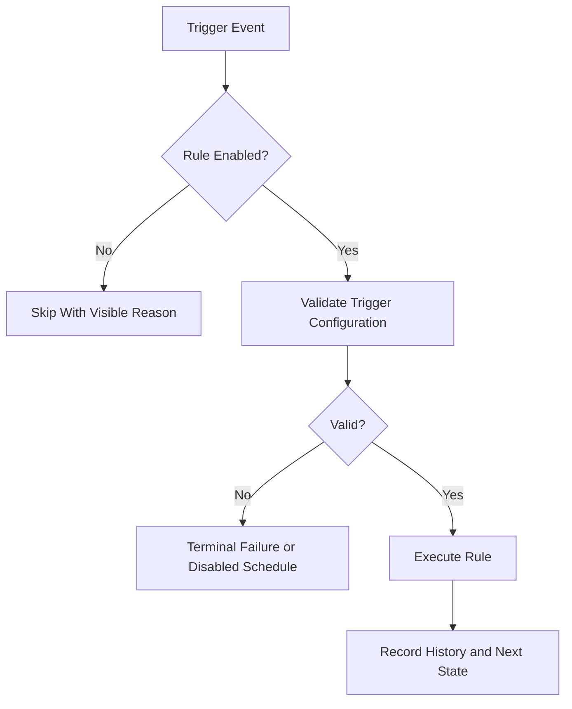

# Task: Scheduled and Webhook Execution Validation

## Task Overview

### Task Description
Validate scheduled execution, post-sync execution, webhook-triggered execution, manual execution, error handling, and execution history consistency.

### Task Purpose
Automation is only production-ready when triggers reliably produce visible terminal outcomes and do not create duplicate or stalled execution state.

### AI Executor Constraint
Live scheduled execution validation requires a running worker, broker, and scheduler runtime. Inside this AI session, acceptance is limited to unit-level schedule logic, mocked trigger execution, and documented live-runtime validation steps unless the runtime environment is provided. Webhook signature and post-sync idempotency policies must be confirmed or read from existing repository behavior before implementation.

---

## Dependencies

### Prerequisites
- **Prerequisite Tasks**: plan_73, plan_75
- **Required Resources**: Rule examples, trigger configurations, schedule policy, and execution history expectations.
- **Environment Requirements**: Backend unit-test runtime for controlled trigger simulation; live worker, broker, and scheduler runtime for final end-to-end validation outside this AI session.

### Downstream Impact
- **Downstream Tasks**: plan_77, plan_78, plan_79
- **Provided Output**: Automation validation evidence and regression scenarios.

---

## Execution Steps

### Step 1: Trigger Matrix Definition
- **Action**: Define trigger types, required configuration, expected execution state, and failure behavior.
- **Input**: Current automation capabilities and operator expectations.
- **Output**: Automation trigger acceptance matrix.
- **Notes**: Include disabled rules, invalid schedules, and whether mocked coverage is acceptable for AI-session completion.

### Step 1A: Signature and Idempotency Policy
- **Action**: Confirm webhook signature validation and post-sync idempotency semantics.
- **Input**: Current repository webhook behavior and sync event model.
- **Output**: Trigger security and idempotency policy.
- **Notes**: Default proposal is signed trigger validation with bounded timestamp tolerance and one execution per rule and sync event unless explicit rerun is requested. Cron schedules are interpreted as UTC unless an existing rule timezone field is discovered; adding a new per-rule timezone field is out of scope for this plan.

### Step 2: Scheduled Execution Validation
- **Action**: Validate schedule calculation, due-rule selection, execution, retry behavior, and next-run updates.
- **Input**: Trigger acceptance matrix.
- **Output**: Scheduled execution evidence.
- **Notes**: Invalid schedules must not create repeated error loops.

### Step 3: Webhook and Post-Sync Validation
- **Action**: Validate tokenized webhook execution and post-sync rule execution.
- **Input**: Rule and trigger fixtures.
- **Output**: Webhook and post-sync execution evidence.
- **Notes**: Unauthorized triggers must fail safely.

### Step 4: History and Observability
- **Action**: Confirm execution history captures status, errors, warnings, link counts, and trigger source.
- **Input**: Successful and failed trigger runs.
- **Output**: History and observability acceptance evidence.
- **Notes**: Users need enough information to diagnose failed automation.

### Step 5: Live Runtime Validation Handoff
- **Action**: Document manual or environment-backed live validation for worker, broker, scheduled execution, and webhook trigger behavior.
- **Input**: Mocked validation results and runtime deployment assumptions.
- **Output**: Runtime validation handoff checklist.
- **Notes**: This is outside this AI session unless a live worker and broker are available.

---

## Visualization Aids

### Step Flowchart

### Risk Monitoring Table
| Risk Item | Level | Trigger Signal | Mitigation Strategy | Owner |
| --- | --- | --- | --- | --- |
| Repeated invalid schedule loop | High | Same invalid rule fails each interval | Disable or quarantine invalid schedule | Runtime owner |
| Webhook token exposure | High | Trigger works without valid token | Strict token validation tests | Security owner |
| Post-sync duplicate execution | Medium | Same sync completion runs rule multiple times | Idempotency and source tracking | Backend owner |
| Live runtime cannot run in session | High | No worker, broker, or scheduler available | Accept mocked coverage plus external runtime checklist | Runtime owner |
| Signature policy guessed | High | Trigger auth algorithm differs from platform expectation | Confirm or read current webhook policy before coding | Security owner |
| Timezone policy ambiguous | Medium | Scheduled rule fires at unexpected local time | Interpret cron as UTC unless existing rule timezone support is found | Runtime owner |

### File Operations List

#### Files to Create
- Planned automation test artifact
  - Type: Backend test source
  - Purpose: Validate schedules, webhooks, and post-sync execution.
  - Content: Success, failure, disabled, invalid, unauthorized, and duplicate scenarios.

#### Files to Modify
- Existing automation behavior artifact
  - Modification Location: Trigger handling and status updates.
  - Modification Content: Fix validation findings only.
  - Modification Reason: Ensure reliable terminal outcomes.
- Existing history UI artifact
  - Modification Location: Execution history display.
  - Modification Content: Show trigger source and diagnostics if missing.
  - Modification Reason: Improve operator diagnosis.

#### Files to Read
- Existing scheduler, trigger, and execution history artifacts
  - Read Purpose: Understand current trigger flow.
  - Usage: Build acceptance matrix and tests.

---

## Implementation List

### Functional Modules
- Automation trigger workflow
  - Functionality: Runs rules through schedule, webhook, post-sync, and manual entry points.
  - Interface: Trigger request, execution status, history.
  - Responsibility: Produce reliable terminal execution records.

### Data Structures
- Trigger acceptance matrix
  - Purpose: Defines expected behavior per trigger type.
  - Fields: Trigger, required config, success output, failure output, history signal.

### Algorithm Logic
- Due-rule selection
  - Purpose: Identify rules eligible for scheduled execution.
  - Input: Schedule state and current time.
  - Output: Eligible rule set and next schedule state.
  - Complexity: Bounded by enabled scheduled rules.

### Interface Definitions
- Webhook trigger boundary
  - Type: API contract
  - Parameters: Trigger token and optional payload.
  - Return: Execution accepted or rejected result.
  - Description: Starts a rule execution through webhook configuration.

---

## Execution Summary

### Input
- Schedule state.
- Webhook event.
- Sync completion event.
- Manual execution request.

### Processing
- Validate trigger and rule state.
- Execute eligible rule.
- Persist terminal history and next-run state.

### Output
- Execution records.
- Trigger status feedback.
- Automation regression evidence.

---

## Testing Requirements

### Unit Tests
- Test Scope: Schedule selection, trigger validation, status updates.
- Test Cases: Enabled, disabled, invalid schedule, expired schedule, unauthorized webhook, duplicate post-sync.
- Coverage Requirement: Critical trigger and failure branches.

### Integration Tests
- Test Scope: Trigger request to execution history.
- Test Scenarios: Webhook success, webhook unauthorized, scheduled run, post-sync run.

### Manual Tests
- Test Point 1: User enables automation and sees a triggered execution in history.
- Test Point 2: User receives clear failure for invalid automation configuration.

---

## Acceptance Criteria

### Functional Acceptance
- Unit and mocked scheduled, webhook, post-sync, and manual paths produce terminal execution records inside this AI session.
- Live worker, broker, and scheduler validation is explicitly handed off when runtime is unavailable in-session.
- Invalid or unauthorized triggers fail safely.
- Execution history shows enough diagnostics for operators.

### Quality Acceptance
- Automation tests cover success and failure paths.
- Trigger behavior is stable across reruns.

### Documentation Acceptance
- Automation trigger assumptions and limitations are documented.

---

## Notes

### Technical Notes
- Prefer deterministic trigger simulation for tests.

### Security Notes
- Webhook tokens and sensitive payload values must not be logged.

### Performance Notes
- Trigger execution should avoid blocking request handling longer than necessary.

### References
- Existing traceability automation, scheduling, and execution history documentation.
